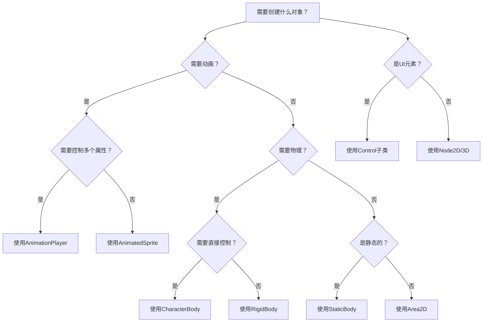

# Godot节点选型详细指南

## 概述

在Godot中，选择正确的节点类型对于游戏性能和开发效率至关重要。本指南提供了详细的节点选择建议和最佳实践。

## 动画节点选择

### AnimationPlayer vs AnimatedSprite2D/3D

**优先选择：AnimationPlayer**

原因：
1. **更灵活的动画控制**：可以控制场景中的任何属性
2. **支持复杂动画**：不仅仅是精灵动画，还可以控制位置、缩放、颜色等
3. **更好的重用性**：一个AnimationPlayer可以控制整个场景的动画
4. **支持动画混合**：可以使用AnimationTree实现复杂的动画状态机

**使用场景：**
```gdscript
# 好的实践：使用AnimationPlayer
Player (CharacterBody2D)
├── Sprite2D
├── AnimationPlayer  # 控制所有动画
├── CollisionShape2D
└── StateMachine
```

**AnimatedSprite2D仅适用于：**
- 简单的精灵序列动画
- 不需要复杂动画逻辑的对象
- UI中的简单动画元素

## 物理节点选择

### 2D物理节点

#### CharacterBody2D
**用途**：玩家角色、NPC等需要直接控制移动的对象
**特点**：
- 提供move_and_slide()方法
- 自动处理碰撞响应
- 适合平台跳跃游戏

```gdscript
# 玩家角色示例
extends CharacterBody2D

func _physics_process(delta):
    var input = Input.get_axis("ui_left", "ui_right")
    velocity.x = input * speed
    move_and_slide()
```

#### RigidBody2D
**用途**：需要物理模拟的对象（箱子、球体、抛射物等）
**特点**：
- 受力和速度影响
- 自动物理模拟
- 适合需要真实物理行为的对象

```gdscript
# 可交互的箱子
extends RigidBody2D

@export var weight: float = 1.0

func _ready():
    mass = weight
```

#### StaticBody2D
**用途**：静态的碰撞对象（墙壁、平台、障碍物等）
**特点**：
- 不会移动
- 提供碰撞检测
- 适合地形和环境对象

#### Area2D
**用途**：非物理碰撞检测区域（触发器、拾取物、伤害区域等）
**特点**：
- 只检测重叠，不产生物理反应
- 可以检测进入/退出
- 适合游戏逻辑触发

### 3D物理节点

3D物理节点的选择与2D类似，只是对应3D版本：
- CharacterBody3D
- RigidBody3D
- StaticBody3D
- Area3D

## 控制节点选择

### UI控制

#### Control节点基类
**基础UI节点**，所有UI节点的父类
**特点**：
- 提供布局和锚点系统
- 支持输入事件处理
- 适合创建自定义UI组件

#### 常用UI节点

1. **Button**
   - 用途：可点击的按钮
   - 信号：pressed, button_down, button_up
   - 适合：菜单选项、确认对话框

2. **Label**
   - 用途：显示静态文本
   - 特点：支持富文本、自动换行
   - 适合：分数显示、提示文本

3. **LineEdit**
   - 用途：单行文本输入
   - 特点：支持占位符文本
   - 适合：玩家姓名输入、密码输入

4. **TextEdit**
   - 用途：多行文本输入
   - 特点：支持滚动、富文本
   - 适合：聊天框、文本编辑器

5. **Panel/PanelContainer**
   - 用途：UI容器和背景
   - 特点：提供背景样式
   - 适合：窗口框架、分组UI

### 场景组织

#### Node2D/Node3D
**用途**：场景的组织节点
**特点**：
- 不提供渲染或物理功能
- 可以挂载脚本
- 适合：逻辑管理器、场景根节点

#### Marker2D/3D
**用途**：标记位置点
**特点**：
- 仅提供位置信息
- 不可见（编辑器中可见）
- 适合：生成点、路径点、参考位置

## 容器节点选择

### 2D容器

#### Node2D
- 基础2D容器，提供变换功能
- 适合组织2D场景层级

#### CanvasLayer
- UI渲染层控制
- 可以设置不同的渲染层级
- 适合：分离游戏UI和游戏世界

#### YSort
- 根据Y坐标自动排序子节点
- 适合：2.5D游戏、等距视角游戏

### 3D容器

#### Node3D
- 基础3D容器
- 提供3D变换功能

#### Spatial (Node3D的别名)
- 与Node3D相同，旧版本名称

## 特殊功能节点

### 音频节点

#### AudioStreamPlayer2D/3D
**用途**：2D/3D空间音效
**特点**：
- 支持音量衰减
- 适合：游戏音效、环境音

#### AudioStreamPlayer
**用途**：非空间音效
**特点**：
- 全局播放，无位置感
- 适合：背景音乐、UI音效

### 相机节点

#### Camera2D
**用途**：2D游戏摄像机
**特点**：
- 支持多相机切换
- 可以跟随目标
- 适合：平台游戏、俯视角游戏

#### Camera3D
**用途**：3D游戏摄像机
**特点**：
- 支持透视和正交投影
- 可以设置视锥和近远平面
- 适合：3D游戏

### 光照节点

#### 2D光照
- **Light2D**：2D光照效果
- **PointLight2D**：点光源
- **DirectionalLight2D**：方向光

#### 3D光照
- **Light3D**：基础3D光源
- **OmniLight3D**：点光源
- **SpotLight3D**：聚光灯
- **DirectionalLight3D**：平行光

## 节点组合模式

### 标准玩家结构
```
Player (CharacterBody2D)
├── Sprite2D                    # 视觉表现
├── AnimationPlayer            # 动画控制
├── CollisionShape2D           # 碰撞体
├── Camera2D                   # 视角跟随
├── AudioStreamPlayer2D        # 音效
└── StateMachine               # 状态管理
```

### 标准敌人结构
```
Enemy (CharacterBody2D/RigidBody2D)
├── Sprite2D
├── AnimationPlayer
├── CollisionShape2D
├── Area2D                     # 攻击检测
│   └── CollisionShape2D
├── HealthBar (ProgressBar)    # 血条UI
└── AIController (Node)        # AI逻辑
```

### 可收集物品结构
```
Collectible (Area2D)
├── Sprite2D
├── CollisionShape2D
├── AnimationPlayer
├── AudioStreamPlayer2D        # 拾取音效
└── ParticleSystem2D           # 拾取特效
```

### UI窗口结构
```
Window (PanelContainer)
├── VBoxContainer             # 垂直布局
│   ├── Label                 # 标题
│   ├── HBoxContainer         # 按钮行
│   │   ├── Button            # 确认
│   │   └── Button            # 取消
│   └── LineEdit              # 输入框
└── AudioStreamPlayer         # UI音效
```

## 性能优化建议

### 节点数量控制
- **避免过深的节点树**：尽量保持节点层级在合理深度
- **合并静态对象**：将多个静态对象合并为一个大对象
- **使用对象池**：频繁创建销毁的对象使用对象池

### 渲染优化
- **使用SpriteFrames替代多个Sprite2D**：减少draw call
- **批处理UI元素**：使用合适的容器节点
- **启用视锥剔除**：3D场景中启用相机剔除

### 物理优化
- **简化碰撞形状**：使用简单的几何形状
- **禁用不需要的物理**：静态对象使用StaticBody
- **合理设置物理层**：避免不必要的碰撞检测

## 常见错误和解决方案

### 错误1：混淆Control和Node2D
**问题**：在2D游戏场景中使用Control节点
**解决**：游戏世界使用Node2D，UI使用Control

### 错误2：过度使用RigidBody
**问题**：所有移动物体都使用RigidBody
**解决**：直接控制的对象使用CharacterBody

### 错误3：忽略节点组织
**问题**：所有节点都在根节点下
**解决**：使用节点组织场景，保持清晰的层级

### 错误4：不必要的节点
**问题**：添加不必要的中间节点
**解决**：精简节点结构，只在需要时添加

## 决策流程图



## 最佳实践总结

1. **保持简单**：选择满足需求的最简单的节点
2. **考虑未来**：选择支持未来扩展的节点
3. **性能优先**：了解不同节点的性能影响
4. **组织清晰**：使用合理的节点层级结构
5. **遵循约定**：使用社区认可的节点模式

通过遵循这些指导原则，你可以创建更高效、更易维护的Godot游戏场景。记住，选择正确的节点是成功的第一步！