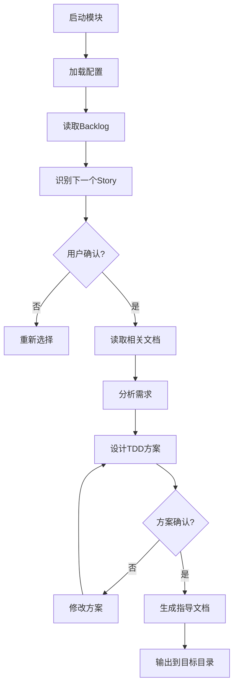

# Story开发指导生成器

## 功能概述

该模块负责读取backlog中的下一个Story，分析需求，并生成详细的TDD开发指导文档。

## 主要功能

### 1. Backlog分析与Story选择
- 自动读取backlog文档
- 识别下一个待开发的Story
- 提供用户确认机制

### 2. 需求分析
- 读取Story文档内容
- 结合游戏设计文档(GDD)和架构设计
- 分析技术要求和依赖关系

### 3. TDD方案设计
- 设计详细的测试用例
- 定义接口和类结构
- 规划开发步骤

### 4. 指导文档生成
- 生成手把手开发指导
- 标注责任人(AI助手/用户)
- 输出到指定目录

## 使用流程

## 配置要求

需要确保以下路径配置正确：
- backlog路径
- GDD路径
- 架构设计路径
- Story文件夹路径
- 输出文件夹路径

## 输出格式

生成的指导文档包含：
1. Story概述
2. 技术需求分析
3. TDD测试用例设计
4. 详细开发步骤
5. 责任分工表