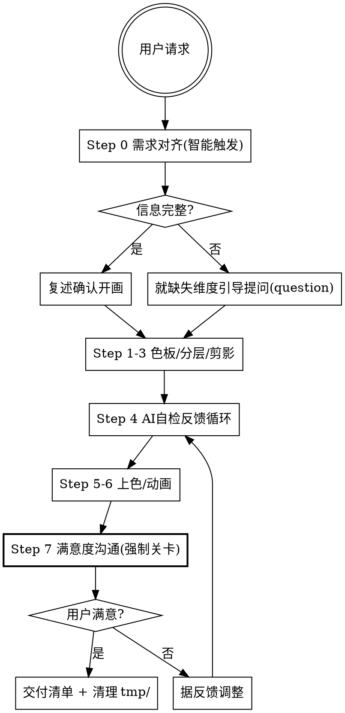

# Draw Aseprite

通过 `aseprite` MCP 工具集（104 个工具）绘制像素艺术精灵图。核心是**引导式交互工作流**：AI 画完后无法直接"看见"渲染结果，且像素艺术风格主观性强——故采用「智能需求对齐 → 绘制 → 满意度沟通迭代」的协作闭环，靠 `export_frame` 放大预览 + 用户反馈来收敛到满意结果。

## 0. 核心交互原则（最高优先级）

> 本 skill 采用**引导式沟通**，禁止"闷头画完一次性交付"。所有与用户的沟通**必须**用 `question` 工具以选项形式呈现（遵从全局 AGENTS.md §1.5），发出后**立即停止**等待反馈（§1.6）。

**三大原则：**

1. **智能触发**：用户请求明确（已给主体/尺寸/风格/色板等关键维度）→ 跳过前置提问，复述确认即开画；信息缺失 → 仅就**缺失维度**引导提问，不重复问已明确的内容。
2. **满意度强制关卡**：无论请求多明确，**每次**绘制完成后**必须**执行 §4 满意度沟通（导出预览图 + 选项 + 自由补充），用户确认满意前**禁止**宣告完成。
3. **会话内记忆**：本次会话内主动记住用户表达的偏好（如尺寸习惯、是否描边、色调倾向），后续绘制自动复用；但**不落盘**、不跨会话——新会话重新对齐。

## 1. 前置约定（项目强制）

**产物路径与清单**（遵从项目 AGENTS.md P0-07 / 详 D1，违反即阻断）：

每次绘制任务**必须**交付下列产物（#3 仅动画任务强制）：

| # | 产物 | 生成工具 | 存放路径 | 是否必须 |
|---|------|---------|---------|:-------:|
| 1 | `.aseprite` 工程源文件 | `create_canvas`/`copy_sprite` 的 `filename` | `aseprite-assets/source/` | ✅ 总是 |
| 2 | 导出 PNG（静态帧 / 关键帧） | `export_sprite`/`export_frame` 的 `output_filename` | `aseprite-assets/export/` | ✅ 总是 |
| 3 | 动画 GIF | `export_tag`（`output_filename` 取 `.gif`） | `aseprite-assets/export/` | 🎬 仅绘制动画时 |

> 静态精灵交付 #1+#2；动画精灵交付 #1+#2+#3。精灵表（`export_spritesheet`+JSON）按需补充。

| 临时产物 | 路径 | 说明 |
|---------|------|------|
| **满意度沟通用预览图**（scale 8-10） | `tmp/` | 仅供用户视觉反馈，满意后**必删**，禁止落入 `aseprite-assets/` |

> 游戏场景引用导出的 PNG/GIF 时直接 `load("res://aseprite-assets/...")`，无需复制到 `assets/sprites/`。

## 2. 引导式工作流总览



---

## Step 0 — 需求对齐（智能触发，绘制前）

**目的**：在画第一笔前对齐需求和标准，避免方向性返工。

### 0.1 必备维度清单（用于检测请求完整性）

| 维度 | 说明 | 典型值 |
|------|------|--------|
| **主体** | 画什么 | 角色/物品/场景元素/特效/UI图标 |
| **尺寸** | 像素尺寸 | 16/24/32/64 平方；物品图标常 16/32 |
| **风格** | 复古限制色 vs 自由色；色调 | 明快/暗黑/柔和/赛博朋克 |
| **色板** | 指定预设 或 主色调+色数上限 | pico8/dawnbringer16；或"≤16色，暖色调" |
| **视角/朝向** | 正面/侧面/45°/俯视/四方向 | 角色常侧面或四方向 |
| **用途** | 静态/动画；游戏内/UI/插画 | 决定是否需要精灵表、描边强度 |
| **细节偏好** | 描边/阴影/对称/动画帧数 | 是否 1px 描边、是否对称翻转 |

### 0.2 触发逻辑

1. **扫描请求**：对照上表逐项检查用户已给/缺失的信息。
2. **信息完整**（关键维度齐备）→ 用一句话**复述确认**理解（"我将绘制：32×32 侧面复古骑士，dawnbringer16 色板，1px 描边，静态。"），可用 `question` 给两选项：①✅确认开画 ②✏️补充调整。确认后进入 Step 1。
3. **信息缺失** → **仅就缺失维度**用 `question` 引导提问（选项化，给合理默认值降低用户负担），**禁止**重复问已明确的内容。收到反馈后回到 0.2 重新评估，直到关键维度齐备。

> **会话内记忆**：用户本次表达的偏好（如"以后都画 32 尺寸""不要描边"）后续自动套用，无需重复问。

---

## Step 1 — 规划调色板（先色后形）

调色板是像素艺术的灵魂。**画第一笔前必须先定色板**。

- **复古风**：`apply_palette_preset`（`pico8`/`gameboy`/`dawnbringer16`/`dawnbringer32` 等）→ 全局限制色。
- **写实/多材质**：为**每种材质**调一条渐变（`generate_color_ramp`，带 hue shifting）：
  - 角色：皮肤 / 头发 / 衣服 / 金属 / 皮甲 各一条
  - 物品：主体材质 / 高光 / 阴影
- 用 `set_palette` 写入色板。**色数控制**：16×16 精灵建议 ≤ 16 色，32×32 建议 ≤ 32 色。
- 详见 [references/pixel-art-techniques.md](references/pixel-art-techniques.md) 的「调色板设计」。

## Step 2 — 分层构建（独立可编辑）

**始终分层绘制**，让各部件可独立动画/修改。推荐分层（自下而上）：

```
Background（背景/底色）
  └─ Body（身体剪影/肤色）
      └─ Clothing（衣服）
          └─ Equipment（武器/盔甲/道具）
              └─ Details（细节纹样）
                  └─ Effects（发光/特效，叠加层）
                      └─ Outline（轮廓，可选独立层）
```

用 `add_layer`/`add_group` 建层。每个材质对应一个层，方便后续 `adjust_hsl` 整体调色。

## Step 3 — 由粗到细（剪影先行）

**先画对的大形状，再画细节。** 不要一上来逐像素。

1. **剪影/底色**：`fill_area_at` 填主色块 → `draw_ellipse_at`（头/关节）/`draw_rectangle_at`（躯干/四肢）搭出剪影。
2. **修轮廓**：用 `draw_pixels_at` 逐像素修出干净的像素轮廓（避免锯齿，详见技法文档「轮廓法则」）。
3. **加内部细节**：`draw_pixels_at` 点出五官、纹路、高光。

> 优先用 `_at` 变体工具（指定 layer + frame，自动建 cel），坐标均为 sprite 全局坐标。

## Step 4 — AI 自检反馈循环（画-看-修，反复迭代）

**AI 看不到渲染结果，这是 AI 侧自检手段，禁止跳过。**（注意：这是 AI 内部迭代，与 §Step 7 用户满意度关卡不同。）

```
画一批 → export_frame(8×) 到 tmp/ → 读图自检 → 修正 → 再 export → 收敛
```

- **形态检查**：`export_frame` scale 8 放大，确认比例/对称/剪影可读。
- **调色板纪律**：`get_color_stats` 看是否冒出计划外的颜色（near-duplicate 是常见错误），多了就 `quantize_to_palette` 收敛。
- **像素卫生**：检查有无无意锯齿、脏点、半透明残留。

## Step 5 — 刻意上色（光影/质感/可读性）

- **光影分层**：复制身体层 → `adjust_hsl`（降亮度+偏冷色相）做阴影层，用 `set_layer_blend_mode`（multiply/overlay）叠加。
- **渐变与混色**：`apply_dither_gradient`（天空/金属渐变）、`apply_dither_pattern`（纹理质感，如石头/草地）。
- **轮廓提可读性**：`outline_cel`（1px 描边）让精灵在任何背景上都清晰；可选 `outline_native`（更高质量）。
- **色相替换**：`replace_color` 微调某个具体色，`adjust_hsl` 批量色相位移（夜场景偏蓝）。

## Step 6 — 动画（可选，仅当需要动起来）

1. **建帧**：`add_frames`（设好每帧 ms，如 100-150ms）；`set_tag` 标记动画段落（idle/walk/attack）+ direction（forward/pingpong）。
2. **关键帧先行**：在首/末关键帧画好姿态，`propagate_cels` 把基础帧铺开。
3. **补间**：`tween_cel_positions_eased`（位移，带缓动）、`oscillate_cel_positions`（呼吸/漂浮/待机摇摆）、`tween_cel_opacity_eased`（淡入淡出）、`tween_cel_scale_eased`（缩放）。
4. **验证运动连续**：`render_onion_skin`（叠前后帧残影检查连贯性）+ `compare_frames`（量化帧间差异，确认中间帧确实有变化）。
5. **导出**：`export_tag`（GIF 动画 / PNG 序列）、`export_spritesheet`（精灵表 + JSON 数据，供游戏引擎切帧）。

---

## Step 7 — 满意度沟通与迭代（强制关卡，绘制后）

> **用户确认满意前禁止宣告完成，禁止用 AI 自检替代用户判断**（像素艺术风格主观，AI 自检形态无误 ≠ 用户满意）。遵从项目 AGENTS.md P0-27 / 详 C2 精神。

### 7.1 导出预览图供用户查看

- `export_frame` scale 8-10 导出当前帧到 `tmp/preview_<sprite>.png`（动画可额外 `export_tag` 导 GIF）。
- **告知用户预览图路径**，请用户查看。

### 7.2 用 `question` 发起满意度沟通（选项 + 自由补充）

发起 `question`，单题，选项如下（可按场景裁剪，但"满意"与"自由补充"必备）：

| 选项 | 含义 | AI 后续动作 |
|------|------|------------|
| ✅ 满意，收尾交付 | 认可当前结果 | 进入 §3 交付清单，清理 `tmp/` |
| 🎨 调整配色 | 颜色/光影/饱和度方向不对 | 追问具体方向（偏冷/暖/降饱和…）→ Step 5 调色 → 回 Step 4 自检 → 回 Step 7 |
| ✏️ 调整造型比例 | 轮廓/比例/姿态需改 | 追问具体（头大/腿短/姿态僵…）→ Step 3 修形 → 回 Step 4 → 回 Step 7 |
| 🔧 调整细节 | 五官/纹样/装备等局部 | 追问哪个细节 → Step 3/5 微调 → 回 Step 7 |
| 🔁 推翻重画 | 方向性错误 | 回 Step 0 重新对齐风格/参考 → 全流程重走 |

> **必须**开启 `question` 的自由输入（custom），让用户能精确描述不满之处。收到具体反馈后，**精确调整**对应部分，**禁止**无差别重画浪费迭代。

### 7.3 迭代收敛

- 用户不满意 → 按 7.2 表格动作精确调整 → 重新 `export_frame` 预览 → 再次 `question`。
- 循环直到用户选"✅满意"。**禁止**自行宣布"应该可以了"。
- **会话内记忆**：把本次用户纠正的偏好（如"以后角色都不要描边"）记到本次会话上下文，后续绘制自动套用。

---

## 3. 工具选用速查

| 任务场景 | 首选工具 |
|---------|---------|
| 新建精灵 | `create_canvas`（尺寸→存 `aseprite-assets/source/`）|
| 单点像素 | `draw_pixels_at` |
| 直线/矩形/圆/椭圆/多边形 | `draw_*_at` 系列（指定层帧）|
| 填色 | `fill_area_at`（油漆桶）|
| 材质渐变色板 | `generate_color_ramp` |
| 限制全局色 | `apply_palette_preset` + `quantize_to_palette` |
| 阴影/夜色调色 | `duplicate_layer` → `adjust_hsl` → 改 blend mode |
| 纹理质感 | `apply_dither_pattern` |
| 平滑渐变 | `apply_dither_gradient`（Bayer 抖动）/ `apply_gradient_rect` |
| 描边提可读性 | `outline_cel`（1px）/ `outline_native`（高质量）|
| 换某颜色 | `replace_color` |
| **自检形态 / 满意度预览** | `export_frame`(8×) → tmp/ |
| **自检色板** | `get_color_stats` |
| **自检动画连贯** | `render_onion_skin` / `compare_frames` |
| 静态导出 | `export_sprite`（PNG）→ `aseprite-assets/export/` |
| 动画导出 | `export_tag`（GIF）/ `export_spritesheet`（表+JSON）|
| 查看精灵信息 | `get_sprite_info` |
| 读像素校验 | `get_pixel_color` / `get_pixels_rect` |
| 与用户沟通确认 | `question` 工具（选项化，§0 核心原则）|
| 工具不覆盖的需求 | `run_lua_script`（逃生舱，可批量操作）|

## 4. 像素艺术核心法则（速览）

> 详见 [references/pixel-art-techniques.md](references/pixel-art-techniques.md)。

- **网格对齐**：所有边缘对齐像素网格，坐标取整数。
- **无抗锯齿**：像素艺术禁止平滑边缘，轮廓必须是硬边。
- **有限的色数**：色数越少越有风格；阴影/高光用色板内已有色，不冒新色。
- **轮廓法则**：外轮廓干净（1px），内部可省略；Jaggies（无意锯齿）要修。
- **对称用翻转**：左右对称部件画一半 → `flip_layer` 翻转，省时且对齐。
- **hue shifting 上色**：阴影偏冷（蓝/紫），高光偏暖（黄/橙），比单纯变暗/变亮更立体。

## 5. 交付清单

**用户在 Step 7 确认满意后**再执行：

- [ ] `.aseprite` 源文件存 `aseprite-assets/source/`（产出物 #1，**必须**）
- [ ] 导出 PNG 存 `aseprite-assets/export/`（产出物 #2，**必须**）
- [ ] （若为动画）导出 GIF 存 `aseprite-assets/export/`（产出物 #3，动画时**必须**）
- [ ] 已用 `get_color_stats` 核验色板无冗余色
- [ ] 已用 `export_frame` 8× 预览形态无误（且用户已确认满意）
- [ ] （动画）已用 `render_onion_skin` + `compare_frames` 验证连贯
- [ ] **`tmp/` 下的满意度沟通预览图已删除**
- [ ] 若供游戏场景使用，已确认 `load("res://aseprite-assets/...")` 路径正确

## 6. 进阶参考

需要深入的像素艺术技法（调色板设计、形状构建、轮廓与抗锯齿、抖动应用、动画原则、常见角色模板）时，读 [references/pixel-art-techniques.md](references/pixel-art-techniques.md)。

## 7. 参考

- MCP项目: [aseprite-mcp](https://github.com/diivi/aseprite-mcp)
