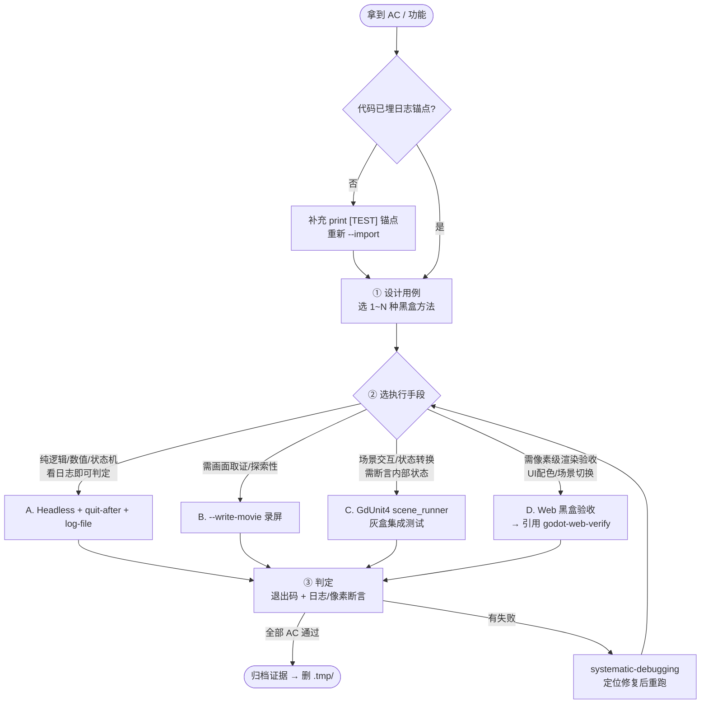

# Godot 黑盒测试框架

把**黑盒测试理论**（不读源码、只看输入与可观察输出）应用到 Godot 游戏，用 **Godot CLI 原生命令**做可自动化、可取证、可复现的执行。覆盖全链路：**设计用例 → 选执行手段 → 执行取证 → 判定 → 归档**。

> 核心价值：AI 看不到画面，但可通过「**游戏主动 print 的状态日志锚点** + **退出码** + **录屏/像素**」客观断言行为，替代玩家手工试玩（宪法阶段 10 / C2）。

## 适用边界

- ✅ **适用**：游戏功能黑盒验收、逐条 AC 验证、阶段 10 端到端验收、跨平台行为一致性、数值系统/状态机/规则组合的正确性验证
- ❌ **不适用**：纯逻辑模块的内部正确性（→ `03_TDD测试规范.md` + GdUnit4 单元测试，白盒）；代码风格/语法（→ `gdlint`/`--check-only`）；性能/帧率压测
- ⚠️ **硬前置**：被测功能必须在代码里**埋可观察日志锚点**（如 `print("[TEST] hp=%d state=%s" % [hp, state])`），否则 headless 模式无观察点、无法断言。黑盒 ≠ 不需要任何观察通道，只是不读源码逻辑。

## 与现有测试体系的关系（必读，避免混用）

| 层次 | 工具 / 文档 | 测什么 | 视角 |
|------|------------|--------|------|
| **白盒单元** | `03_TDD测试规范.md` + GdUnit4 + `test-driven-development` Skill | 内部逻辑/类的正确性 | 读源码、断言内部值 |
| **灰盒集成** | GdUnit4 `scene_runner`（03 规范 §16） | 多模块协作、场景交互 | 部分黑盒 |
| **黑盒功能（本 skill）** | Godot CLI 运行 + 日志/录屏 + 理论用例设计 | 可观察行为、AC | **不读源码**，只看输入输出 |
| **黑盒渲染验收** | `godot-web-verify` Skill | web 端渲染/配色/交互像素级核验 | 黑盒，web 平台 |

> 本 skill 在 **web 渲染验收** 环节**引用** `godot-web-verify`（它提供导出→https→playwright→像素采样的完整技术链），不重复其细节。

---

## 一、前置：Godot CLI 执行原则（来自 09 手册 §7.1）

调用任何 Godot CLI 前必须遵守（命令语法细节回查 `specs/09_Godot环境与命令手册.md`）：

1. **退出码判定**：成功只看退出码（POSIX `$?` / PowerShell `$LASTEXITCODE` = 0），**禁止**靠 stdout 文本猜「成功」
2. **无头优先**：自动化一律 `--headless`（不弹窗、不依赖 GPU）
3. **路径先解析**：会话首次按 09 手册 §一 三级定位解析 `$GODOT`（`GODOT_HOME` → PATH → 常见路径），含空格路径**必须双引号**
4. **禁止交互式**：禁用 `-e`/`-p`；长跑命令加 `--quit-after N` 兜底，防挂起
5. **及时导入**：被测代码/资源有新增改动，验收前先 `--headless --import`
6. **临时文件入 `.tmp/`**：日志/录屏/截图统一存 `.tmp/`，验收通过后删除（宪法 §1.7）

---

## 二、核心：5 种黑盒理论 × 游戏适配 × CLI 执行

> 每种方法：**理论一句话 → 游戏适配 → 用例示例 → Godot CLI 执行方式**。一个用例可同时用多种方法（如边界值 + 状态转换）。

### 方法 1 · 等价类划分（Equivalence Partitioning）

**理论**：把输入域按「系统对此输入的行为是否等价」划分成若干类，每类取**一个代表值**测试（有效类 + 无效类）。前提：同类输入应触发相同处理路径。

**游戏适配**：
- 生命值：`>0`（存活）/ `==0`（死亡）/ `<0`（无效，应钳制）→ 3 类
- 难度：简单 / 普通 / 困难 → 3 类
- 玩家输入：合法指令 / 非法指令

**用例示例**（生命值）：
| 类 | 代表输入 | 期望行为 |
|----|---------|---------|
| 有效·存活 | `take_damage(5)`，原 hp=10 | hp=5，存活 |
| 有效·致死 | `take_damage(10)`，原 hp=10 | hp=0，触发 died |
| 无效·负溢出 | `take_damage(99)`，原 hp=10 | hp 钳制为 0，不报错 |

**CLI 执行**：用 `--` 透传注入参数（09 手册 §3.7，游戏内 `OS.get_cmdline_user_args()` 读取），headless 跑 + `--log-file` 落锚点日志：
```bash
"$GODOT" --headless --log-file .tmp/eq.log --quit-after 30 -- --test damage --amount 5
"$GODOT" --headless --log-file .tmp/eq.log --quit-after 30 -- --test damage --amount 10
"$GODOT" --headless --log-file .tmp/eq.log --quit-after 30 -- --test damage --amount 99
# 断言：grep 日志锚点
grep -E "\[TEST\] hp=(5|0) state=(alive|dead)" .tmp/eq.log
```

### 方法 2 · 边界值分析（Boundary Value Analysis）

**理论**：bug 集中在边界，对每个等价类边界测 **边界值 ± 1**。常与等价类划分联用（等价类找类，边界值精打边界）。

**游戏适配**（高频边界）：
- 数值：血量 `0 / 1 / max-1 / max`；等级 `1 / 满级`；金币 `0`
- 容量：背包 `N-1 / N / N+1`（满、刚好满、溢出）
- 计时：计时器 `到期-1 / 到期 / 到期+1`；冷却结束瞬间
- 索引：数组/关卡 `首位 / 末位 / 越界`

**用例示例**（背包容量 max=5）：
| 输入 | 期望 |
|------|------|
| 已有 4，拾取 1（→5） | 成功，刚好满 |
| 已有 5，拾取 1（→6） | 拒绝/堆叠，不丢档 |
| 已有 5，拾取后丢弃 1 再拾取 | 状态正确 |

**CLI 执行**：边界值参数注入 + 批量跑 + 退出码/日志判定：
```bash
for n in 4 5 6; do
  "$GODOT" --headless --quit-after 20 -- --test inventory --start $((n-1)) --pickup 1 \
    || echo "边界 n=$n 失败（退出码 $?)"
done
```

### 方法 3 · 状态转换测试（State Transition Testing）

**理论**：系统是有状态机，测**合法转换**（覆盖所有状态与迁移边）+ **非法转换**（不应发生的迁移被正确拒绝）。先画状态图，再遍历边。

**游戏适配**：
- 角色 FSM：待机 ⇄ 跑 / 跳 / 攻击；受伤 → 击退；hp==0 → 死亡（终态）
- UI 流程：标题 → 主菜单 → 游戏 → 暂停 ⇄ 游戏 → 结算 → 主菜单
- 回合：玩家回合 → 敌人回合 → 玩家回合

**用例设计步骤**：
1. 列出所有状态与迁移（或要求 `godot-architect` Skill 产出状态机图）
2. 每条迁移 = 一个合法转换用例（触发事件 → 断言新状态）
3. 对"不应发生"的迁移设计非法转换用例（如死亡后能否攻击？应拒绝）

**CLI 执行**：
- **首选 GdUnit4 `scene_runner`**（03 规范 §16-17）：加载场景、触发转换、推进帧、断言状态，属灰盒集成，最快（写法以 03 规范与 GdUnit4 实际版本为准）：
```gdscript
func test_idle_to_attack_on_command() -> void:
    var runner := scene_runner("res://scenes/actors/player.tscn")
    var player := runner.find_child("Player")
    player.attack()   # 触发 待机 → 攻击 转换
    await runner.simulate_frames(2)
    assert_str(player.state).is_equal("attack")
```
- **纯黑盒**：触发事件后跑 `--quit-after` + 日志锚点 `[TEST] state=attack` 断言

### 方法 4 · 决策表测试（Decision Table Testing）

**理论**：多条件**组合**决定结果时，用决策表穷举条件组合（每行一组条件 → 一个动作），避免遗漏组合。适合「规则复杂、条件多」的系统。

**游戏适配**：
- 伤害计算：`命中? × 暴击? × 元素克制?` → 最终伤害倍率
- 解锁条件：`通关A && 金币≥N || VIP` → 是否解锁
- 战斗判定：`攻击力 vs 防御力 × 闪避?` → 结算

**用例设计步骤**：
1. 列条件（C1/C2/C3…）与动作（A1/A2…）
2. 列所有条件组合（n 个布尔条件 → 2ⁿ 行；条件多时用化简/等价类缩减）
3. 每行填对应动作 → 每行一个测试用例

**决策表示例**（伤害 = 命中 ∧ 暴击？）：
| | T1 | T2 | T3 | T4 |
|--|----|----|----|----|
| C1 命中 | N | Y | Y | Y |
| C2 暴击 | - | N | Y | Y |
| C3 克制 | - | - | N | Y |
| → 倍率 | 0× | 1× | 2× | 3× |

**CLI 执行**：条件组合参数化注入 + 批量 headless 跑 + 日志收集倍率断言：
```bash
for combo in "0 0 0" "1 0 0" "1 1 0" "1 1 1"; do
  "$GODOT" --headless --quit-after 20 -- --test damage --hit $(echo $combo|cut -d' ' -f1) \
    --crit $(echo $combo|cut -d' ' -f2) --counter $(echo $combo|cut -d' ' -f3) \
    --log-file .tmp/decision_$combo.log
done
```

### 方法 5 · 错误猜测 / 探索性测试（Error Guessing / Exploratory）

**理论**：**错误猜测**＝凭经验列「易错清单」（空/零/负/极大/特殊字符/并发/中断）；**探索性**＝边设计边执行、随机探索，记录发现。两者互补，覆盖前 4 种方法的盲区。

**游戏适配 · 易错清单**：
- 输入：空字符串玩家名、超长名、特殊字符、负数金币、极大数（溢出）
- 时序：快速连点按钮（双触发？）、同时按多键、切屏瞬间操作
- 中断：存档写到一半断电、断网重连、后台被杀
- 资源：贴图缺失、配置非法、空存档加载
- 边角：满级再升级、0 金币购买、死亡瞬间拾取

**CLI 执行**：
- 异常参数注入 + `--write-movie` 录屏取证（探索性）：
```bash
"$GODOT" --headless --write-movie .tmp/guess.avi --quit-after 120 --fixed-fps 60 \
  -- --test edgecase --name "" --gold -1
```
- 探索性发现异常 → 沉淀为回归用例（补进方法 1-4 的形式化用例）

---

## 三、全链路工作流



### 选哪种执行手段？（决策依据）

| AC 类型 | 首选手段 | 理由 |
|---------|---------|------|
| 数值计算、规则判定、参数边界 | **A. Headless + 日志** | 最快、最稳、CI 友好 |
| 角色/场景状态机转换 | **C. GdUnit4 scene_runner** | 能直接断言状态，灰盒高效 |
| UI 布局、配色、场景视觉切换 | **D. Web 验收** | 必须看像素，headless 无画面 |
| 交互手感、探索性、偶发 bug | **B. 录屏** | 留视频证据便于人眼复核 |
| 纯逻辑无 UI（数学库） | GdUnit4 单测（→ 03 规范） | 白盒更快，不归本 skill |

---

## 四、Godot CLI 执行手段速查（命令全部来自 09 手册）

| 手段 | 目的 | 命令（`$GODOT` 已解析） | 取证 | 成功判定 |
|------|------|----------------------|------|---------|
| **A. Headless 跑帧** | 验证逻辑/数值，看日志锚点 | `"$GODOT" --headless --quit-after 60` | stdout / `--log-file` | 退出码=0 + 日志含预期锚点 |
| **A+. 参数注入** | 注入测试输入（等价类/边界/决策表） | `"$GODOT" --headless --quit-after N -- --test ... ` | 同上 | 同上 |
| **B. 录屏** | 留视频证据（探索性/交互） | `"$GODOT" --write-movie .tmp/out.avi --quit-after 120 --fixed-fps 60` | `.tmp/out.avi` | 退出码=0 + 视频生成 |
| **C. GdUnit4 集成** | 场景状态机转换断言 | `"$GODOT" --headless -s res://addons/gdunit4/GdUnitCmdTool.gd -a directory test/integration/` | 测试报告 | 报告无失败用例 |
| **D. Web 验收** | 像素级渲染/配色/交互 | `"$GODOT" --headless --export-release "Web" build/index.html` → **交 `godot-web-verify`** | 截图 + 像素采样 + console | 见 godot-web-verify |

> 退出码判定（09 手册 §7.6）：POSIX `$?`、PowerShell `$LASTEXITCODE`；`0`=成功。

### 手段 A · Headless 逻辑验证（最常用）

```bash
# 基础：跑 60 帧退出，日志落盘
"$GODOT" --headless --quit-after 60 --log-file .tmp/run.log
# 退出码判定
if [ $? -ne 0 ]; then echo "FAIL: 退出码非0"; fi
# 日志锚点断言（游戏内须 print("[TEST] ...")）
grep -E "\[TEST\] hp=[0-9]+ state=\w+" .tmp/run.log
```

### 手段 A+ · 参数注入（关键技巧）

`--` 之后的参数整段透传给游戏（09 手册 §3.7），游戏内用 `OS.get_cmdline_user_args()` 解析。这是黑盒测试**驱动不同输入**的核心手段：
```bash
# 透传测试指令（等价类/边界值/决策表批量用例靠它参数化）
"$GODOT" --headless --quit-after 30 -- --test damage --amount 5 --crit 1
```
> ⚠️ `--` 是引擎约定分隔符；漏写 `--` 会被引擎当引擎参数吞掉（09 手册 §7.5 红黑表）。

### 手段 B · 录屏取证

```bash
# 强制固定帧率 + 录屏（headless 无画面，录屏需有显示环境；CI 用 A，本地用 B）
"$GODOT" --write-movie .tmp/play.avi --quit-after 120 --fixed-fps 60
```
> `--write-movie` 自动强制 `--fixed-fps`；`.avi`/`.png` 序列均可。

### 手段 C · GdUnit4 集成测试（灰盒，引用 03 规范）

状态转换/场景交互用 `scene_runner` 写集成测试（写法见 `specs/03_TDD测试规范.md` §16-17），归 `test/integration/`，headless 跑：
```bash
"$GODOT" --headless -s res://addons/gdunit4/GdUnitCmdTool.gd -a directory test/integration/
```
> 这一层是「灰盒」（能断言内部状态），介于白盒单测与纯黑盒之间。本 skill 用它测**可观察的状态转换**，纯逻辑单测仍归 03 规范。

### 手段 D · Web 黑盒验收（引用 godot-web-verify）

需要像素级渲染/配色/UI 交互验收时：先导出 web（09 手册 §3.4），**其余全链路（https 服务 → playwright → 像素采样 → 清理）交给 `godot-web-verify` Skill**：
```bash
# 仅导出（本 skill 负责）
"$GODOT" --headless --export-release "Web" build/index.html
# 产物校验：index.wasm 存在且 >10MB
test -f build/index.wasm && [ $(stat -f%z build/index.wasm) -gt 10485760 ] && echo "导出OK"
```
随后调用 `godot-web-verify` 完成渲染验收（不在此重复其流程）。

---

## 五、AC → 测试用例映射模板

每个 AC 用此表沉淀（归档到 `docs/08_验收/`）：

| AC | 黑盒方法 | 执行手段 | 注入输入 | 期望观察（日志/像素/退出码） | 证据 | 结果 |
|----|---------|---------|---------|---------------------------|------|:---:|
| AC1 玩家受伤扣血 | 等价类 | A. Headless | `-- --test damage --amount 5` | `[TEST] hp=5` | `.tmp/run.log` | ✅ |
| AC2 血量为零死亡 | 边界值 | A. Headless | `--amount 10`（原 hp=10） | `[TEST] state=dead` + 退出码0 | `.tmp/run.log` | ✅ |
| AC3 状态机待机→跑 | 状态转换 | C. GdUnit4 | scene_runner 模拟 move_right | `state==run` 断言通过 | 测试报告 | ✅ |
| AC4 配色基线 | （渲染） | D. Web | playwright 打开 | 像素 `#1a5236` | `.tmp/ac4.png` | ✅ |

---

## 六、常见陷阱（红黑表）

| 场景 | ❌ 错误做法 | ✅ 正确做法 |
|------|-----------|-----------|
| 观察点 | 不埋日志锚点，headless 跑完没东西可断言 | 被测功能先 `print("[TEST] ...")`，再跑 |
| 判定结果 | 靠 stdout 含 "SUCCESS" 猜成功 | **只看退出码** + grep 日志锚点 |
| 参数注入 | `$GODOT --level 2`（被引擎吞） | `$GODOT -- --level 2`（`--` 透传） |
| 无显示环境 | 录屏用 `--headless`（无画面） | 录屏需有显示环境；CI 改用手段 A |
| 长跑 | 不加 `--quit-after` → 挂起 | 一律加 `--quit-after N` 兜底 |
| 状态机测试 | 纯黑盒只看日志猜状态 | 首选 GdUnit4 `scene_runner` 直接断言状态（灰盒） |
| 路径 | 含空格 `$GODOT` 不加引号 | `"$GODOT"` 双引号 |
| 与白盒混用 | 黑盒测试里读源码断言内部私有值 | 黑盒只断言可观察输出；内部值归 03 单测 |
| 临时文件 | 日志/录屏散落项目 | 统一入 `.tmp/`，验收后删 |
| 导出前 | 未 `--import` 直接导出（引用缺失） | 导出前先 `--headless --import` |

---

## 七、与其他 Skill / 文档的关系

- **`specs/09_Godot环境与命令手册.md`**：本 skill 所有 CLI 命令的**语法权威来源**（§二/§三/§7.4 SOP）；调用前若不确定命令细节回查之
- **`godot-web-verify` Skill**：本 skill 手段 D（web 渲染验收）的**技术实现**全权交给它；本 skill 只负责导出与产物校验
- **`specs/03_TDD测试规范.md` + `test-driven-development` Skill**：白盒单元测试/灰盒集成测试的写法规范；本 skill 手段 C 用其 `scene_runner` 写法
- **`godot-architect` Skill**：状态机设计（方法 3 状态转换测试的输入——状态图由它产出）
- **`systematic-debugging` Skill**：黑盒测试失败时进入调试循环（工作流图中 Debug 节点）
- **宪法阶段 10（C2）**：本 skill 是阶段 10 黑盒验收的**方法论总纲**，`godot-web-verify` 是其 web 执行子流程
