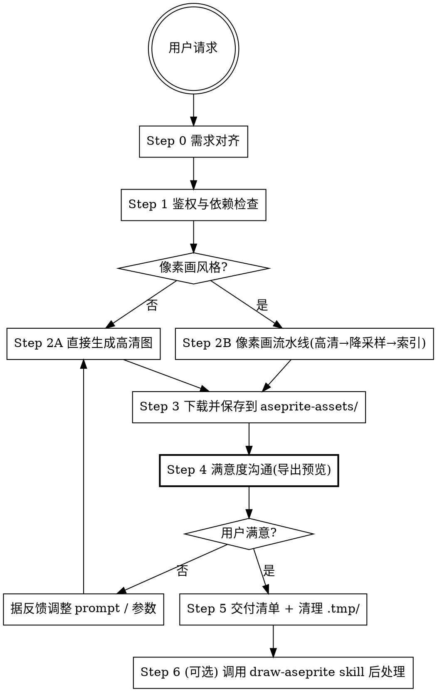

# Seedream Sprite

通过火山方舟 API 调用 **Doubao Seedream 5.0 pro** 生成 2D 游戏资产，并按需将高清输出转化为像素画素材。

## 0. 核心铁律（不可绕过）

| # | 铁律 | 说明 |
|---|------|------|
| 1 | **鉴权一律走 `ARK_API_KEY` 环境变量** | 项目根 `.env` 读取；**禁止**在脚本 / 文档 / git 中硬编码真实 Key（遵从项目宪法 §1.4 / §1.9） |
| 2 | **图片 URL 仅保留 24 小时** | 生成后**必须立即下载持久化**到 `aseprite-assets/source/` 或 `.tmp/` |
| 3 | **API 限流 500 RPM** | 同账号同模型每分钟 500 张；批量生成需做节流 |
| 4 | **像素画非 Seedream 原生** | 通用图像生成模型，像素画必须走 §3 的"生成→降采样→索引"流水线，**禁止**把高清图直接当像素精灵 |
| 5 | **临时预览必存 `.tmp/`** | 仅做 AI/用户反馈用的预览图存 `.tmp/`，任务结束必删（遵从项目宪法 P0-06） |
| 6 | **交付物必存 `aseprite-assets/`** | 与 `draw-aseprite` skill 一致（遵从项目宪法 P0-07） |

## 1. 前置检查

开始任何生成任务前**必须**完成：

1. **鉴权检查**：在 shell 中确认 `ARK_API_KEY` 已配置
   ```bash
   source ~/.zshrc && echo "${ARK_API_KEY:+OK}"   # macOS/Linux
   # 或从项目根 .env 读：grep -q '^ARK_API_KEY=' .env && echo OK
   ```
   未配置 → 用 `question` 工具告知用户「需先在 `.env` 配置 `ARK_API_KEY=<火山方舟控制台获取>`」后**立即停止**。

2. **Python 依赖检查**：
   ```bash
   python3 -c "import volcenginesdkarkruntime" 2>/dev/null || pip install 'volcengine-python-sdk[ark]'
   ```
   或使用 OpenAI 兼容路径：`pip install openai requests`（更轻量，推荐用于本 skill）。

## 2. 五种使用模式速查

| 模式 | 输入 | 典型游戏场景 |
|------|------|-------------|
| **文生图** | prompt | 概念图、原画探索、物品图标、UI 背景 |
| **单图生图** | prompt + 1 张参考图 | 基于已有草稿改写、风格迁移 |
| **多图融合** | prompt + ≤10 张参考图（总图数 + 生成数 ≤ 15） | 角色立绘 × 场景背景组合、参考素材融合 |
| **任意标记** | prompt + 带草图/涂鸦/圈选的参考图 | "在标记区域加杂志""右侧标记区放咖啡杯" |
| **坐标定位** ⭐ | prompt + `<point>`/`<bbox>` 标记 | 局部替换、跨图搬运、区域精修（**5.0 pro 独占**） |

后两者合称"交互编辑"，是 5.0 pro 的标志性能力。坐标定位详细写法见 [references/interactive-editing.md](references/interactive-editing.md)。

## 3. 工作流总览



### Step 0 · 需求对齐（智能触发，遵从全局 §1.5 / §1.6）

用户请求明确（已给主体 / 尺寸 / 风格 / 参考图）→ **复述确认即开生成**；信息缺失 → 仅就**缺失维度**用 `question` 工具以选项形式引导，发出后**立即停止**等待反馈。

**必须对齐的 5 个维度**：

| 维度 | 缺省值 | 示例选项 |
|------|--------|---------|
| 主体 | — | "哥布林战士""魔法卷轴" |
| 风格 | 概念写实 / 像素画 / 二次元 / 油画 | 像素画风格必须走 §3 流水线 B |
| 目标尺寸 | 1K（快速预览）/ 2K（成品） | 与最终用途挂钩 |
| 参考图 | 无（文生图）/ 有（图生图、多图融合、交互编辑） | 有则确认 URL 或本地路径 |
| 用途 | 立绘 / 图标 / 场景 / 概念 | 影响 prompt 关键词（"transparent background""full body""icon size"等） |

### Step 1 · 鉴权与依赖检查

按 §1 执行。失败 → 用 `question` 工具告知用户缺什么，发出后**立即停止**。

### Step 2A · 直接生成高清图（非像素画风格）

调用 [`scripts/seedream_gen.py`](scripts/seedream_gen.py)，常用形态：

```bash
# 文生图
python3 scripts/seedream_gen.py text2img \
  --prompt "..." --size 2K --out aseprite-assets/source/<name>.png

# 图生图
python3 scripts/seedream_gen.py img2img \
  --prompt "..." --image <url_or_path> --size 2K \
  --out aseprite-assets/source/<name>.png

# 多图融合
python3 scripts/seedream_gen.py blend \
  --prompt "..." --images img1.png img2.png --size 2K \
  --out aseprite-assets/source/<name>.png
```

**关键参数决策树**：

| 参数 | 高质量成品 | 实时预览 / 批量筛选 |
|------|-----------|---------------------|
| `--mode` | `standard`（默认） | `fast` |
| `--size` | `2K` | `1K` |
| `--format` | `png` | `jpeg` |

> 标准模式 + 2K + png 是最高画质组合；fast + 1K + jpeg 适合最低延迟。详见 [references/api-reference.md](references/api-reference.md) §2。

### Step 2B · 像素画专用流水线（像素画风格必走）

> **关键洞察**（来自 Wiki [[像素画AI生成工作流]]）：Seedream 是通用图像生成模型，**不是**原生像素画模型。社区共识是「generate-high-res → downscale → index-palette」。详见 [references/pixel-art-pipeline.md](references/pixel-art-pipeline.md)。

完整六步：

1. **像素画友好 prompt**：在普通 prompt 后追加像素画关键词（"pixel art style, 32x32 base, limited palette, clean edges, no anti-aliasing"），引导模型向像素画视觉靠拢。
2. **生成高清图**（仍按 §2A 调用，建议 2K + png + standard）。
3. **下载保存**：先存 `aseprite-assets/source/<name>_hires.png`。
4. **降采样**：用 `Pillow` 最近邻插值降到目标像素分辨率（32 / 64 / 128 / 256 px），保存 `<name>_pixel.png`。
5. **索引调色板**：用 `Pillow.quantize(colors=N, method=Image.MEDIANCUT)` 限制颜色数（如 16 / 32 色）。
6. **进入 Aseprite 后处理**（可选）：将 `<name>_pixel.png` 作为源调用 `draw-aseprite` skill 的 `import_image_as_layer` → 切帧 / 加动画 / 导出 spritesheet。

> 完整脚本示例与参数表见 [references/pixel-art-pipeline.md](references/pixel-art-pipeline.md)。

### Step 3 · 下载并保存

- **永久保存**：所有 AI 生成的源图（含高清原图 + 像素画降采样中间品）存到 `aseprite-assets/source/ai-generated/<task>/`（任务名 snake_case）。
- **24 小时铁律**：API 返回的 URL 24 小时后失效，**必须**当次任务内下载；脚本 `seedream_gen.py` 已封装自动下载，禁止只拿 URL 不落地。
- **命名规范**：`<subject>_<size>_<seq>.png`（如 `goblin_warrior_2k_01.png`）。

### Step 4 · 满意度沟通（强制关卡，遵从全局 §1.5 / §1.6）

每次生成后**必须**执行：
1. 把成品复制一份到 `.tmp/<name>_preview.png`（仅供视觉反馈，任务结束必删）。
2. 用 `question` 工具以选项形式询问用户：
   - ✅ 满意，继续交付
   - ❌ 不满意，调整（请说明方向：风格 / 构图 / 细节 / 色调）
3. 发出后**立即停止**等待反馈。

### Step 5 · 交付清单 + 清理 `.tmp/`

**必须交付**：

| # | 产物 | 位置 | 总是 |
|---|------|------|:---:|
| 1 | 高清原图（2K） | `aseprite-assets/source/ai-generated/<task>/<name>_hires.png` | ✅ |
| 2 | 像素画中间品（仅像素画任务） | `aseprite-assets/source/ai-generated/<task>/<name>_pixel.png` | 🎬 |
| 3 | prompt 记录（用于复现 / 迭代） | `aseprite-assets/source/ai-generated/<task>/prompt.md` | ✅ |

**清理**：删除 `.tmp/` 下本次任务产生的所有预览图（遵从 P0-06）。

### Step 6 · Aseprite 后处理（可选）

像素画任务建议把降采样结果交给 `draw-aseprite` skill 做后续编辑（切帧动画 / 加描边 / 调色板精修）。用 `aseprite_import_image_as_layer` MCP 工具把 `<name>_pixel.png` 导入到新建 `.aseprite` 工程。

## 4. 与其他 Skill 的协作

| 上游 | 当前 skill | 下游 |
|------|-----------|------|
| 用户需求 / 参考图素材 | `seedream-sprite` 生成高清或像素画素材 | `draw-aseprite`（像素画后处理：切帧 / 动画 / 索引）<br/>`sprite-analyzer`（分析既有精灵表结构） |

**互补关系**：
- `draw-aseprite` = LLM 通过 MCP 在 Aseprite 中**逐像素精确控制**绘制（适合小图标、精细动画、需要图层语义的场景）。
- `seedream-sprite` = 调用大模型**一次性生成**（适合有机形状、复杂构图、概念探索、大场景），但需要后处理才能变成像素画。

> 当用户要求"画一个简单的 32×32 像素图标"时**优先用 `draw-aseprite`**；当要求"生成一个写实风格的龙的概念图"或"基于这张草稿生成像素画"时**用 `seedream-sprite`**。

## 5. 限制速查（详情见 [references/api-reference.md](references/api-reference.md)）

| 项 | 值 |
|---|---|
| 支持格式 | jpeg / png / webp / bmp / tiff / gif / heic / heif |
| 宽高比 | ∈ [1/16, 16] |
| 单边像素 | > 14 px |
| 文件大小 | ≤ 30 MB |
| 总像素 | ≤ 6000×6000 = 36,000,000 |
| 参考图数量 | ≤ 10 张 |
| 参考图 + 生成数 | ≤ 15 |
| URL 保留时长 | **24 小时** |
| RPM 限流 | 500 张/分钟 |
| 自定义 size 总像素范围 | [921600, 4624220]（即 [1280×720, 2048×2048×1.1025]） |

## 6. 参考文件索引（按需加载）

- **[references/api-reference.md](references/api-reference.md)**：完整 API 字段、输出规格、提示词优化模式、Python / curl / OpenAI 兼容三种调用骨架、错误处理。
- **[references/pixel-art-pipeline.md](references/pixel-art-pipeline.md)**：像素画专用流水线（生成 → 降采样 → 索引）的完整 Python 脚本、参数决策表、与 Aseprite 衔接。
- **[references/interactive-editing.md](references/interactive-editing.md)**：5.0 pro 独占的交互编辑能力——归一化 0-999 坐标、`<point>` / `<bbox>` 写法、多主体 prompt 技巧、跨图编辑示例。

## 7. 完成自检

- [ ] `ARK_API_KEY` 已从环境变量读取，无硬编码
- [ ] 生成结果已下载落地（不依赖 24h 后失效的 URL）
- [ ] 像素画任务已走 §3 流水线 B（高清 → 降采样 → 索引），未直接把高清图当像素精灵
- [ ] 永久产物存到 `aseprite-assets/source/ai-generated/`，临时预览存到 `.tmp/` 并在交付后清理
- [ ] 满意度关卡已用 `question` 工具执行，用户确认满意前未宣告完成
- [ ] prompt 已记录到 `prompt.md` 便于复现
