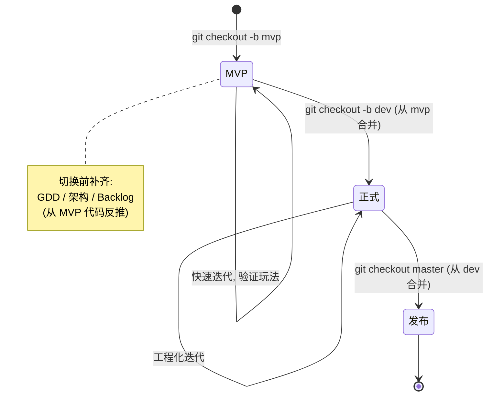
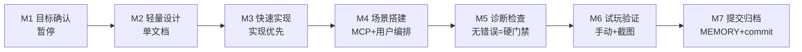

# 项目宪法

> 本文档为项目最高优先级指令，不可协商、不可绕过。用户指令优先级高于本文档。
> **本宪法为双阶段宪法**：规则按 git 分支自动路由（见 §一）。每次任务前**必须**先执行阶段识别协议（§1.2），据此加载 §三（MVP）或 §四（正式）专区。§二（共享基础）、§五（共享规范）、§六（违规清单）两阶段始终生效。

---

## 一、阶段路由（§0）

> 本节是双阶段宪法的核心枢纽。AI 每个任务开头**必须**先执行阶段识别，再加载对应专区。

### 1.1 分支 → 阶段映射

| 分支 | 阶段 | 目标 | 加载专区 |
|------|------|------|---------|
| `mvp` | MVP 阶段 | 快速验证玩法/技术可行性 | §三 MVP 专区 |
| `dev` | 正式开发阶段 | 工程化、全质量门禁 | §四 正式专区 |
| `master` | 稳定发布 | 只接受合并、修复 | §四 正式专区 |
| 其他分支 | 继承上游阶段 | 追溯 merge-base 最近的上游 `mvp`/`dev`/`master` | 同上游 |

### 1.2 阶段识别协议（AI 任务开头必执行）

1. 执行 `git branch --show-current` 获取当前分支
2. 按 §1.1 映射确定阶段：
   - 命中 `mvp`/`dev`/`master` → 直接映射
   - 其他分支 → 追溯其 `git merge-base` 最近的上游 `mvp`/`dev`/`master`，继承该阶段
3. 在任务首条消息声明：`[阶段识别] 当前分支=<分支>, 阶段=<MVP/正式/发布>, 加载规则=§三/§四`
4. 据此加载对应专区的代码标准 + 开发流程 + 交付件清单；§二/§五/§六 始终生效

### 1.3 阶段过渡协议



**MVP → 正式的硬性前置**（在 `dev` 分支首次任务开头执行，详见 §四 P1-0）：

1. 反推补齐缺失文档：GDD（`docs/01_gdd/`）、架构概要（`docs/03_arch/`）、Backlog（`docs/04_sprint/`）
2. 为 MVP 代码补齐测试（达到 ≥80% 覆盖率）
3. 静态分析达优秀、全量测试通过
4. 上述完成后才进入正式 Story 流程

### 1.4 用户口令（并行覆盖机制）

- `切换正式` / `切换 MVP`：用户可在任何时刻强制覆盖分支判断（适用临时跨阶段操作）。口令优先级 > 分支映射。

---

## 二、共享基础（§1）

> 两阶段**完全共用**的基础规则。AI 加载专区（§三 或 §四）时，本章节始终生效。

### 2.1 术语

| 术语 | 含义 |
|------|------|
| 用户任务 | 用户发出的一次完整请求，从接收到最终交付 |
| Story | Sprint 中的用户故事，包含多个 agent_task（正式阶段使用；MVP 用"迭代"代替） |
| 迭代 | MVP 阶段的开发单元，对应 M1-M7 流程（见 §三.3） |
| agent_task | Story/迭代内的子代理执行单元（如 `@godot-developer`） |
| 功能测试 | 通过按键模拟和截图验证的端到端测试（正式阶段强制，MVP 豁免） |
| 任务完成 | 代码已写入 + 测试通过 + lint 通过 + 用户已确认 |
| 确认模式 | AI 暂停等用户的策略。`交互式`：每个确认点单独暂停；`连续式`：授权 AI 连续执行低风险阶段、仅在关键节点暂停。默认 `连续式`，用户可随时切换 |

### 2.2 开发阶段

> 阶段流转与 git 分支对应关系见 §一。下表是**工作内容阶段**，与分支阶段（MVP/正式）正交。

| 阶段 | 触发条件 | 产出 | 适用分支阶段 |
|------|---------|------|------------|
| 初始化 | 项目首次创建 | 目录、工具配置 | 通用 |
| 游戏设计 | 收到游戏概念 | GDD、功能需求 | MVP 可轻量 / 正式完整 |
| 技术分析 | 设计文档就绪 | 可行性分析、性能分析 | MVP 可轻量 / 正式完整 |
| 架构设计 | 技术分析通过 | 架构概要、模块/状态机设计 | 正式（MVP 可后置） |
| 迭代开发 | 架构完成 + Backlog 就绪 | Story 拆分、编码、测试 | MVP 迭代（§三 M1-M7）/ 正式迭代（§四 S1-S21） |
| 交付 | 所有 Story 完成 | 复盘、归档 | 通用 |

### 2.3 环境变量

| 变量 | 用途 | 来源 |
|------|------|------|
| `GODOT_HOME` | Godot 编辑器路径 | OS 环境变量 |
| `FEISHU_APP_ID` | 飞书应用 ID | `.env` |
| `FEISHU_APP_SECRET` | 飞书应用 Secret | `.env` |
| `FEISHU_USER_ID` | 用户 open_id（`ou_` 开头） | `.env` |

> `.env` 缺失时**必须**先提醒用户配置。
>
> 注：`GODOT_HOME` 为系统级 OS 环境变量（Godot 编辑器路径，非 `.env`）；`FEISHU_*` 类凭证从 `.env` 读取。

### 2.4 工具标注

| 标注 | 含义 | 示例 |
|------|------|------|
| `[MCP]` | Godot MCP 工具 | `minimal-godot_get_diagnostics` |
| `[Skill]` | OpenCode Skill | `godot-best-practices`、`lark-im` |
| `[Agent]` | 子代理，通过 `task()` 调度 | `@godot-developer` |
| `[CLI]` | 命令行（Bash 工具执行） | `$GODOT_HOME -s addons/gut/gut_cmdln.gd` |

### 2.5 子代理

> 配置位于 `.opencode/agents/`，`hidden: true`，仅通过主代理 `task()` 调度。

| 代理 | 分类 | Skill | 权限 | 职责 |
|------|------|-------|------|------|
| `godot-ui-designer` | 开发 | `godot-ui` | 只读+文档 | UI 场景设计 |
| `godot-architect` | 开发 | `godot-architect` | 只读+文档 | 架构设计（仅文档，禁止输出代码） |
| `godot-developer` | 开发 | `godot-best-practices`+`godot-gdscript-patterns`+`tdd` | 全部 | TDD 编码（Red→Green→Refactor） |
| `godot-reviewer` | 质量 | `godot-code-review` | 只读 | 逐文件代码检视 |
| `godot-consistency-checker` | 质量 | `godot-best-practices` | 只读 | 代码↔设计文档一致性检查 |
| `godot-static-analyzer` | 质量 | `godot-static-analysis`+`tdd`+`godot-best-practices` | 读写+bash | 静态分析 + TDD 重构循环 |
| `godot-artifact-reviewer` | 验收 | — | 读写 | 生成物独立检视 |
| `godot-functional-tester` | 质量 | — | bash+写 | 按键模拟+截图功能测试 |
| `godot-notifier` | 验收 | `lark-im` | bash | 飞书收尾通知 |

**调度关系**：

```
build (主代理，默认直接执行并加载对应 Skill)
  │  满足 P0-17 条件（可并行 / 不同模型）时，按需调度下列子代理：
  ├─ godot-ui-designer         → S8 UI 设计方案（只读，不落地）
  ├─ godot-architect           → 3.5 功能流程架构设计 / S2 设计文档（仅文档，不输出代码）
  ├─ godot-developer           → S5-S7 TDD 编码
  ├─ godot-reviewer            → S15 代码检视
  ├─ godot-consistency-checker → S9/S16 一致性检查
  ├─ godot-static-analyzer     → S13 静态分析
  ├─ godot-functional-tester   → S12 功能测试
  ├─ godot-artifact-reviewer   → P1-25 生成物检视
  ├─ godot-notifier            → S21 飞书收尾通知（不含经验归档，归档由主代理在 S18 完成）
  ├─ explore (内置)            → 快速代码搜索
  └─ general (内置)            → 通用多步骤任务
```

### 2.6 Skill 分工矩阵

| 任务类型 | 必须使用的 Skill | 禁止用于 |
|---------|-----------------|---------|
| GDScript 代码编写 | `godot-best-practices` + `godot-gdscript-patterns` | Scene 搭建、UI 布局 |
| UI 场景设计 | `godot-ui` | 非 UI 逻辑代码 |
| 架构设计 | `godot-architect` | 代码实现（仅输出文档） |
| 非 UI 场景骨架 | `[MCP] godot-mcp_*` | — |
| 代码检视 | `godot-code-review` | — |
| 静态分析 | `godot-static-analysis` | — |
| 精灵图分析 | `sprite-analyzer` | — |

### 2.7 目录结构

```
assets/             (fonts, music, sounds, sprites)
scenes/{模块}/      (.tscn)
scripts/{模块}/     (.gd)
test/unit/{模块}/        (单元测试)
test/integration/{模块}/  (集成测试)
test/functional/{模块}/   (功能测试)
test/functional/screenshots/ (功能测试截图)
addons/
docs/               (按阶段分，交付件清单见 §三.4 / §四.3)
```

同一模块的子目录路径**必须**一致。

---

## 三、MVP 专区（§2）

> **加载条件**：当前分支阶段为 MVP（§1.1）。本专区规则与 §四正式专区**互斥**，MVP 阶段不执行 §四的放宽项以外的正式约束。

### 3.1 MVP 目标与边界

- **目标**：最快速度构建可玩原型，验证核心玩法循环与技术可行性
- **核心玩法循环**（本项目横版跳跃）：移动 + 跳跃 + 收集（金币/水果）+ 敌人（史莱姆）+ 胜利/失败
- **交付标准**：游戏可运行 + 核心循环可体验（手动试玩验证）

### 3.2 MVP 代码标准（对应正式 P0 的裁剪）

| 正式规则 | MVP 处理 | 说明 |
|---------|---------|------|
| P0-1~P0-9（SOLID/DRY/命名/注释/空行） | ✅ **保留全部** | 编码底线，即使 MVP 也不能烂 |
| P0-10 复用实例模式 | ✅ 保留 | |
| P0-11/11.5 TDD 逐类循环 | ⚠️ **放宽**：核心逻辑鼓励写单元测试；非核心允许"实现优先" | 不强制 Red→Green→Refactor |
| P0-12 BDD 验收场景 | ⚠️ **放宽**：改为"功能点 checklist"，不强制 Given-When-Then | |
| P0-13~P0-15 任务钩子（MEMORY/飞书） | ✅ 保留 | |
| P0-16 覆盖率 ≥80% | ❌ **豁免** | MVP 不设覆盖率门槛 |
| P0-17 子代理调度 | ✅ 保留 | |

> 各 P0 条款完整定义见 §四.1（正式专区），MVP 阶段按本表执行。

### 3.3 MVP 开发流程（M1-M7 七步）

正式的 S1-S21 在 MVP 精简为 **M1-M7**：



| 步骤 | 名称 | 关键动作 | 暂停 |
|------|------|---------|------|
| M1 | 目标确认 | 读 `MEMORY.md` → **总结本次迭代目标 + 功能点 checklist** → 暂停等确认 | 🔴 硬性 |
| M2 | 轻量设计 | 单文档：`docs/01_gdd/{序号}_MVP迭代_{名}.md`，含功能点 checklist + 实现要点（**可无状态机/无 BDD**） | 连续 |
| M3 | 快速实现 | 实现优先，核心逻辑辅以单元测试；非核心不补测试 | 连续 |
| M4 | 场景搭建 | MCP 搭骨架 + 字体/Theme → 暂停等用户可视化编排（sprite/碰撞/动画） | 🔴 硬性 |
| M5 | 诊断检查 | `minimal-godot_get_diagnostics` **无错误**（硬门禁）；静态分析从"优秀"降为"无错误"；不逐文件检视，改为主代理自查 | 连续 |
| M6 | 试玩验证 | 手动试玩 + 截图验证核心循环；关键逻辑可补单元测试 | 连续 |
| M7 | 提交归档 | 经验追加 `MEMORY.md` → git commit | 🔴 迭代间 |

**MVP 硬性暂停点**：M1（目标确认）、M4（场景编排）、M7（迭代间确认）。其余连续执行，不要求逐文件检视。

**MVP 确认模式**：默认连续式（仅硬性暂停点暂停）；用户可说"切换交互式"使每个步骤都暂停。

### 3.4 MVP 交付件清单

| 时机 | 交付件 | MVP 要求 |
|------|--------|---------|
| 设计 | 迭代说明 | `docs/01_gdd/{序号}_MVP迭代_{名}.md`（轻量，功能点+要点） |
| 测试 | 单元测试 | 仅核心逻辑，不强制覆盖率 |
| 测试 | 功能/集成测试 | ❌ **豁免**，手动试玩替代 |
| 文档 | 架构/状态机/模块设计 | ❌ **豁免**（留给 MVP→正式过渡时补齐，见 §1.3） |
| 文档 | 复盘 | ✅ `MEMORY.md` 追加 |

### 3.5 MVP 场景/技术约束（= §五 共用规范 + 豁免标注）

**全部保留**（Godot 正确性底线，MVP 违反会返工）：

- §五.1 目录规范（P2-1/P2-2）
- §五.5 Godot 技术约束（P2-18~P2-22：free/queue_free、.godot、.tscn 手写、状态模式、碰撞层）
- §五.4 编辑器/测试命令（P2-16/P2-17）
- §四.2 场景规范（P1-17~P1-21.5：骨架/根节点名/复用子场景/class_name/字体归属）

**MVP 唯一放宽**：§五.6 测试技术细则中，仅 P2-23（单元测试）可选执行，P2-24~P2-28（集成/功能测试）豁免。

### 3.6 MVP Git 提交检查链（简化版）

提交 `.gd` 前（每步通过后再执行下一步）：

1. 重载项目（刷新 .uid/LSP/索引）
2. `minimal-godot_get_diagnostics` 无错误
3. 运行**已有**测试（无测试则跳过）
4. commit

> 正式完整链（含 check_patterns）见 §五.3，MVP 不强制。

---

## 四、正式专区（§3）

> **加载条件**：当前分支阶段为正式/发布（§1.1）。本专区是**全规则**，MVP 专区（§三）是其裁剪子集。两专区互斥加载。

### 4.1 正式代码标准

#### P1-0 正式阶段前置门禁

进入 `dev` 分支首次正式 Story 前，**必须**完成（与 §1.3 过渡协议呼应）：

1. 反推补齐 GDD（`docs/01_gdd/`）、架构概要（`docs/03_arch/`）、Backlog（`docs/04_sprint/`）
2. MVP 代码补齐测试，覆盖率 ≥80%
3. 静态分析达优秀、全量测试通过
4. 上述完成后方可启动 S1

#### P0 代码标准（所有任务通用）

##### P0-1~P0-9 编码规范

- **P0-1** SOLID + DRY 原则
- **P0-2** 禁止语法错误
- **P0-3** 代码除注释外**禁止**中文
- **P0-4** 思考和交流**必须**中文
- **P0-5** 思考中**禁止**输出完整代码，仅描述关键决策要点
- **P0-6** `func`、`enum`/枚举值、`signal`、测试方法**必须**用 `##` 中文注释用途，放在上方一行
- **P0-7** 函数参数**禁止**与节点内置属性同名（用 `target_position` 而非 `position`）
- **P0-8** 枚举/变量命名必须精确反映用途，**禁止**包含未使用概念
- **P0-9** 方法间、方法与变量间**必须**两个空行分隔

##### P0-10 设计模式

- **P0-10** 复用实例模式：生命周期入口（如 `enter()`）**必须**调用 `_reset()`，子类 override `_reset()` 清理运行时变量

##### P0-11/11.5/12 TDD 流程

- **P0-11** 修改 `.gd` **必须** Red→Green→Refactor，**禁止**先实现后补测试。适用于**所有**阶段。每步（Red/Green/Refactor）完成后**必须**运行当前类测试确认结果
- **P0-11.5** **逐类循环**：按依赖排序（最少依赖优先），每次只做一个类的完整 Red→Green→Refactor 循环
- **P0-12** 写测试前**必须**先梳理所有 BDD 验收场景，确保每条 AC 有 ≥1 个测试覆盖；AC 不具体时先与用户澄清

##### P0-13~P0-16 任务钩子

| 时机 | ID | 动作 |
|------|-----|------|
| 任务开始前 | **P0-13** | 读取 `docs/06_postmortem/MEMORY.md`（不存在则跳过） |
| 任务完成后 | **P0-14** | 主代理提炼经验 → 追加到 `MEMORY.md`（**禁止**重复） |
| P0-14 后 | **P0-15** | 主代理 `[Skill: lark-im]` 飞书通知**任务级**完成状态（轻量；Story 级正式收尾通知见 S21）。凭证缺失则跳过并说明 |
| 代码变更后 | **P0-16** | 测试覆盖率 ≥ 80%（`[MCP] godot-ultimate_godot_get_test_coverage`），初始化阶段豁免。工具不可用时手动统计 |

##### P0-17 任务执行

- **P0-17** 子代理调度策略：
  - **默认**：主代理直接执行所有任务，加载对应 Skill 完成工作
  - **使用子代理的条件**（满足任一即可）：
    1. **可并行**：多个任务无依赖关系，并行调度可显著降低总执行时长
    2. **不同模型**：子代理配置了与主代理不同的 model，能提供差异化能力
  - 不满足上述条件时，主代理加载对应 Skill 直接执行，禁止不必要的子代理调度

### 4.2 正式开发流程

#### Story 标准流程（S1-S21）

> **必须**严格按 S1→S21 顺序执行，不得跳步或调换，除非用户明确指示。
>
> **确认模式**（详见 P1-6）：默认 `连续式`（S1/S8/S9/S16/S15 为硬性暂停点，两模式都必须暂停）；可切换 `交互式`（每个确认点单独暂停）。
>
> **执行者约定**：下表"代理"列指该步骤的**专业 Skill / 职责归属**，非固定执行人。实际执行者遵循 **P0-17**：默认由主代理加载对应 Skill 直接执行；仅当满足"可并行"或"不同模型"条件时，才调度对应子代理。冲突一律以 P0-17 为准。

| 步骤 | 名称 | 代理 | 关键动作 |
|------|------|------|--------|
| S1 | 开发前准备 | 主代理 | 读 `MEMORY.md` → **总结 Story 开发内容范围**（功能清单、影响模块/文件、预期产出、关键技术点与风险）→ **暂停等用户确认**（硬性暂停点，两模式都必须暂停；用户未确认前**禁止**进入 S2） |
| S2 | 设计文档 | `godot-architect` | 输出模块设计 + 状态机设计到 `docs/03_arch/`（连续式：不单独暂停，进入 S3；交互式：暂停确认） |
| S3 | 开发指导文档 | 主代理 | 输出开发指导文档到 `docs/05_guide/`（命名 `{序号}_{名}_开发指导.md`），包含 BDD 验收场景（Given-When-Then）、实现要点、关键技术决策等（连续式：不单独暂停，进入 S4；交互式：暂停确认） |
| S4 | 依赖分析与执行规划 | 主代理 | 将 AC 拆解为 agent_task → 分析任务间依赖关系 → 按依赖最少优先排序 → 输出依赖拓扑图（mermaid DAG）→ 标注可并行任务组（每组**最多 4 个**并行 task）→ **暂停等用户确认**（连续式下为 S1-S4 文档准备阶段统一确认点） |
| S5 | Red | `godot-developer` | **先输出测试用例表格再写测试代码**：① 对当前类按依赖拓扑顺序逐类输出测试用例表（列：场景分类 | 场景描述 | 是否正常场景 | 输入 | 期望输出 | 测试方法名），**必须**覆盖正常和异常场景 ② 按表格逐个编写测试代码，依赖最少优先；**同一依赖层级内无相互依赖的 task 可并行调度，并行度上限 4**（子代理执行，遵循 P0-17） |
| S6 | Green | `godot-developer` | 同 S5 并行策略，最小实现使测试通过 |
| S7 | Refactor | `godot-developer` | 同 S5 并行策略，优化结构保持测试通过 → 回 S5 直到所有类完成 |
| S8 | 场景搭建 | `godot-ui-designer` 出方案 | godot-ui-designer 输出 UI 设计方案/操作指导（权限只读，不直接落地） → **主代理**通过 MCP 搭建 .tscn 主体框架（节点树、脚本绑定、属性配置、字体/Theme 配置等） → **暂停等用户完成**可视化操作（sprite 位置、碰撞形状/位置、动画配置等，**不含字体配置**） |
| S9 | 一致性检查 | `godot-consistency-checker` | 代码↔设计文档 + 场景结构对比 → 有差异**暂停**等用户决定 |
| S10 | AC 覆盖分析 | 主代理 | 逐项对比 AC 与测试，补充缺失测试 |
| S11 | 全量测试 | 主代理 | `godot-ultimate_godot_run_tests` 全部通过 |
| S12 | 功能测试 | `godot-functional-tester` | 按键模拟 + 截图验证端到端行为 |
| S13 | 静态分析 | `godot-static-analyzer` | 质量须达优秀（见 P1-14），未达标回 S7 迭代 |
| S14 | 诊断检查 | 主代理 | `minimal-godot_get_diagnostics` 无语法错误 |
| S15 | 代码检视 | `godot-reviewer` | 总结开发内容 → 在编辑器中逐个打开文件，说明职责、修改关键点、检视关键点 → **每检视完一个文件后展示检视进度**（示例：`检视进度: [███░░░░] 3/7`，`✓` 已完成、`→` 当前、其余为待检视） → **逐文件暂停等用户检视结果**（见 P1-11、P1-6 硬性暂停点） |
| S16 | 设计对比 | `godot-consistency-checker` | 代码↔设计文档差异清单 → 用户确认处理方案 |
| S17 | 场景可视化验收 | 主代理 | 用户完成可视化操作后，AI 验收 .tscn 配置正确性 → 不符预期则指导修正 → **暂停等用户确认**（连续式：截图自动比对通过则不暂停，仅异常才暂停） |
| S18 | 经验归档 | 主代理 | 检视 + 静态检查问题 → 追加到 `MEMORY.md` |
| S19 | 更新 Backlog | 主代理 | `docs/04_sprint/01_backlog.md` 标记已完成 |
| S20 | Git 提交 | 主代理 | 工作区干净 → commit |
| S21 | 收尾通知 | 主代理（默认） | 飞书 Story 收尾通知（经验归档已在 S18 由主代理完成；通知执行遵循 P0-17，满足条件时可调度 `godot-notifier`） |

**约束**：Story 间**必须**暂停等用户确认（P1-2）；每 Story 完成后游戏**必须**可运行且有可玩内容（P1-3）。

#### Story 管理

- **P1-1** Story 开发前**必须**先输出设计文档 → **暂停等用户确认**
- **P1-2** 以 agent_task 为粒度，无依赖可并行，有依赖串行。Story 间**暂停等确认**
- **P1-3** 编排保证每 Story 完成后游戏可运行且有可玩内容
- **P1-4** 通过 `docs/04_sprint/01_backlog.md` 跟踪状态（待开发 / 进行中 / 已完成）
- **P1-5** 新 Story 前工作区**必须**干净（已 git commit）
- **P1-6** **确认模式**：Story 执行中 AI 暂停等用户的策略，默认 `连续式`，用户可随时切换为 `交互式`：
  - **连续式**：① S1 开发范围总结为硬性暂停点，确认通过后 S2→S3→S4 文档准备阶段连续产出，仅在 S4 末尾统一确认一次；② S17 场景验收用截图自动比对，通过则不暂停
  - **交互式**：每个确认点（S1/S2/S3/S4/S8/S9/S15/S16/S17）均单独暂停等用户
  - **切换**：用户在任一暂停点或任务中说出"切换交互式/连续式"即生效；Story 开始时默认连续式
  - **硬性暂停点（两模式均必须暂停，不因连续式跳过）**：S1（开发范围须用户确认后方可进入设计）、S8（需用户在编辑器完成可视化操作）、S9/S16（出现一致性差异时）、S15（代码检视须用户逐文件参与）、Story 间确认（P1-2）。安全/质量红线步骤不得自动放行

#### 测试与验收

- **P1-7** 标记已完成前：全量测试通过 + 逐项验证 AC，两者均通过方可标记
- **P1-8** 每 AC **必须**有功能测试（`test/functional/{模块}/`），按键模拟 + 截图验证，一一对应
- **P1-9** 每 Story **必须**有集成测试（`test/integration/{模块}/`）
- **P1-10** 代码开发与场景搭建完成后、检视前（即 S10 时点）：输出 AC 覆盖分析表（AC → 覆盖状态 → 测试方法名），补充缺失测试

#### 检视与一致性

- **P1-11** S15 代码检视：AI 逐文件展示变更摘要，**必须**与用户一起检视（逐文件暂停，两模式均强制用户参与，不得自动放行，见 P1-6 硬性暂停点）
- **P1-12** Story 文档**必须** BDD（Given-When-Then），至少一个场景
- **P1-13** Story 标记已完成前**必须**完成 S16 一致性对比，差异等用户确认
- **P1-14** 静态分析须达优秀，未达标则循环：`TDD 重构 → 补充测试 → 重新分析` 直到达标
- **P1-15** 检视和静态检查问题在 S18 追加到 `MEMORY.md`（**禁止**重复）
- **P1-16** 每个 agent_task 完成后：一致性报告（已实现/未实现/额外/不一致），第 2/3/4 类**暂停**等用户决定：① 补代码对齐设计 ② 更新设计反映代码 ③ 确认偏差并记录

#### 功能开发流程

> **与 Story 标准流程的关系**：本节是**总流程大纲**（架构→TDD→场景→测试→诊断）；Story 标准流程是大纲中"迭代开发"环节在单个 Story 内部的 **21 步细化**。本节为大纲，执行细节以 Story 标准流程为准。

```
主代理 [Skill: godot-architect]                        (S2 设计文档)
  → 主代理 [Skill: best-practices + gdscript-patterns]  (S5-S7 TDD 编码)
  → 主代理 [Skill: godot-ui] + [MCP] godot-mcp_*        (S8 场景搭建)
  → [MCP] lint + run_tests                              (S11 全量测试)
  → [MCP] minimal-godot_get_diagnostics                 (S14 诊断检查)
```

#### 场景规范

- **P1-17** AI 通过 MCP 搭建骨架 → 输出操作指导 → 用户在编辑器完成最终编排
- **P1-18** 场景搭建后**暂停**，询问用户是否介入，需要则输出指导后再次暂停
- **P1-19** 根节点名 = 文件名（PascalCase），**禁止** `root`（如 `player.tscn` → `Player`）
- **P1-20** 重复节点组合**必须**抽象为可复用子场景，实例化引用（DRY）
- **P1-21** `.gd` **必须**定义 `class_name`（Autoload 除外），通过 `class_name` 引用类型，**禁止**用 preload 变量作类型别名
- **P1-21.5** **字体/Theme 配置由主代理负责**（在 .tscn 中通过 MCP 完成），**不属于**用户可视化操作职责；用户仅负责 sprite 位置、碰撞形状/位置、动画、TileSet、材质等需编辑器交互的视觉资源编排

#### Skill 与职责

- **P1-22** Skill 映射见 [2.6 Skill 分工矩阵]
- **P1-23** `.gd` 与 `.tscn` 是独立职责，**禁止**混合处理

#### 其他

- **P1-24** 精灵图分析结果**必须**保存到 `docs/02_analysis/`（`{序号}_资源分析_{名}.md`），后续引用文档禁止重复分析
- **P1-25** 生成物**必须**经独立检视（文档：命名/目录/标题/mermaid/关联；代码：语法/SOLID·DRY/诊断）。S15（代码检视）/S16（设计对比）是其代码/设计维度的具体落地，P1-25 额外覆盖文档检视等场景。可并行时调度 `[Agent] artifact-reviewer`

### 4.3 正式交付件清单

| 阶段 | 交付件 | 命名格式 | 路径 |
|------|--------|---------|------|
| 游戏设计 | 游戏设计文档 | `01_游戏设计文档.md` | `docs/01_gdd/` |
| 游戏设计 | 功能需求 | `{序号}_功能需求_{名}.md` | `docs/01_gdd/` |
| 技术分析 | 可行性分析 | `{序号}_技术可行性分析_{主题}.md` | `docs/02_analysis/` |
| 技术分析 | 性能分析 | `{序号}_性能需求分析.md` | `docs/02_analysis/` |
| 架构设计 | 架构概要 | `01_架构概要设计.md` | `docs/03_arch/` |
| 迭代计划 | Backlog | `01_backlog.md` | `docs/04_sprint/` |
| 迭代计划 | Story | `{序号}_{名}.md` | `docs/04_sprint/02_story/` |
| 迭代计划 | Sprint 计划 | `{序号}_Sprint{N}.md` | `docs/04_sprint/03_plan/` |
| 迭代开发 | 模块设计 | `{序号}_模块设计_{名}.md` | `docs/03_arch/` |
| 迭代开发 | 状态机设计 | `{序号}_状态机设计_{名}.md` | `docs/03_arch/` |
| 开发指导 | 开发指导 | `{序号}_{名}_开发指导.md` | `docs/05_guide/` |
| 复盘总结 | 复盘 | `{序号}_{主题}_复盘.md` | `docs/06_postmortem/` |

---

## 五、共享操作规范（§4，原 P2）

> 本章节两阶段共用，个别规则标注阶段差异。`[通用]`=两阶段相同，`[MVP差异]`/`[正式差异]`/`[正式专用]`=按阶段区分。

### 5.1 目录 [通用]

- **P2-1** 严禁在规定目录外存放资产/脚本/测试
- **P2-2** 同一模块子目录路径**必须**一致（见 §2.7）

### 5.2 文档 [通用框架]

- **P2-3** 交付件清单：MVP 见 §三.4，正式见 §四.3
- **P2-4** 命名格式按所属清单，序号从 01 递增
- **P2-5** **必须**放在对应阶段目录，禁止 `docs/` 根目录
- **P2-6** `{xxx}` 为模板变量，固定文档不加后缀
- **P2-7** 架构/流程/状态**必须**用 mermaid 绘图
- **P2-8** 文档须：结构化标题（不跳级）、可追溯、图表优先、具体可执行、自包含
- **P2-9** 输出前自检：命名 ✓ 目录 ✓ 标题 ✓ mermaid ✓ 上游关联 ✓
- **P2-10** 设计文档**禁止**包含完整实现代码，**仅**定义：类名、方法签名（参数+返回值）、signal 签名、类间调用关系、职责描述。伪代码仅用于说明复杂算法逻辑（MVP 迭代说明可含要点伪代码，但不写完整实现）

### 5.3 Git 提交 [阶段差异]

- **P2-11** 提交 `.gd` 前检查链（每步通过后再执行下一步）：
  - **正式**：重载项目 → `get_diagnostics` → 运行测试 → `check_patterns`
  - **MVP**：重载项目 → `get_diagnostics`（无错误）→ 运行**已有**测试 → commit（见 §三.6，不强制 `check_patterns`）
- **P2-12** 修改 `.gd`/`project.godot` 后**必须**重载项目刷新 .uid/LSP/索引（含 `class_name` 变更；确保单实例运行）[通用]
- **P2-13** 通过提交前检查链后 commit [通用]
- **P2-14** 修改测试**必须**用 `[Skill] godot-best-practices` [通用]
- **P2-15** `.uid` **必须**提交（.tscn 除外）；缺失时提醒用户生成 [通用]

### 5.4 Godot 编辑器 [通用]

- **P2-16** 测试命令（POSIX）：`$GODOT_HOME -s addons/gut/gut_cmdln.gd -gexit`（Windows PowerShell：`& $env:GODOT_HOME -s addons/gut/gut_cmdln.gd -gexit`）
- **P2-17** 编辑器管理（命令以 POSIX 为主，括号内为 Windows PowerShell 等价）：
  - **单实例**：同时只允许 1 个（检测：`pgrep -f "Godot"` / 关闭：`pkill -f "Godot"`；Windows：`Get-Process "Godot*"` / `Stop-Process "Godot*" -Force`）
  - **启动策略**：需要编辑器时先检测是否已运行（`pgrep -f "Godot"`），已运行则直接使用，未运行则异步启动（POSIX：`nohup "$GODOT_HOME" --path <项目> >/dev/null 2>&1 &`；Windows：`Start-Process $env:GODOT_HOME --path <项目>`），**不阻塞等待**
  - **启动超时**：启动后最多轮询等待 **30 秒**（每 5 秒检测一次进程），超时仍未检测到进程则**放弃启动**，继续任务并提示用户手动启动
  - **LSP 降级**：编辑器不可用时跳过 `get_diagnostics`，改用 `scan_workspace_diagnostics`（不依赖 LSP），并在最终报告中标注"编辑器未启动，诊断可能不完整"
  - **启动优先级**：`[MCP] godot-mcp_launch_editor` > 异步启动命令（POSIX `nohup` / Windows `Start-Process`）
  - **无头模式**：`"$GODOT_HOME" --editor --path <项目>`（仅加载索引）

### 5.5 Godot 技术约束 [通用]

- **P2-18** `Resource`/`RefCounted` **禁止** `.free()`；`Node` **必须** `.free()`/`queue_free()`
- **P2-19** `.godot/` 目录**禁止**手动操作，缓存刷新通过编辑器重载（见 P2-12）
- **P2-20** .tscn 手写规则：骨架可手写；视觉资源（SpriteFrames/TileSet/材质）**必须**编辑器创建；子场景根路径用 `"."`
- **P2-21** 状态模式选型：状态基类用 `Resource`，状态机管理器用 `Node`
- **P2-22** 碰撞层/掩码**禁止**代码硬编码，**必须**在 .tscn 属性配置；代码仅允许读取

### 5.6 测试技术 [阶段差异]

- **P2-23** GUT 单元测试：`load()` + `.new()` 测试纯逻辑；`@onready` 需手动赋值；`move_and_slide()` 等物理方法**禁止**在 `.new()` 模式调用，**应使用**集成测试；`AnimatedSprite2D.new()` 需预注册动画名；`-gdir` 不递归需显式指定目录 [MVP 可选执行]
- **P2-24** 分层：单元 = 纯逻辑；集成 = 场景树依赖（动画/碰撞/输入）[正式强制，MVP 豁免]
- **P2-25** 功能测试：继承 `SceneTree`，`Input.parse_input_event()` 模拟，`get_viewport().get_texture().get_image()` 截图 [正式强制，MVP 豁免]
- **P2-26** 存放：`test/functional/{模块}/test_{名}_functional.gd`，截图 `test/functional/screenshots/` [正式强制，MVP 豁免]
- **P2-27** 功能测试**必须**在 S11 后执行；失败则主代理修复，从 S11 重跑 [正式专用]
- **P2-28** LSP 需 GUI 模式编辑器，`get_diagnostics` 前确认编辑器已启动 [通用]

---

## 六、严重违规清单（§5）

> 下表违规两阶段**完全不豁免**——它们是正确性底线。`通用`=MVP/正式/发布均强制。

| # | 违规 | 适用阶段 | 纠正 |
|---|------|---------|------|
| 1 | Singleton 文件含 `class_name` | 通用 | **停止 → 回滚 → 重新执行** |
| 2 | 代码含中文（除注释） | 通用 | |
| 3 | 未通过 `[MCP] minimal-godot_get_diagnostics` | 通用 | |
| 4 | 违反目录结构 | 通用 | |
| 5 | 未提交 .uid 文件 | 通用 | |

---

## 附录

- **A-1** 本文件（AGENTS.md）为项目规则唯一权威源，子代理配置与 Skill 须遵循，禁止重复定义
- **A-2** 双阶段宪法的阶段判定以 git 分支为准（§1.1），用户口令（§1.4）可临时覆盖
- **A-3** MVP 专区（§三）与正式专区（§四）互斥加载，当前未激活专区的条款不生效
