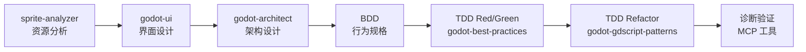

# 🏛️ 项目宪法

> 本文档为项目最高优先级指令，不可协商、不可绕过。

## ⚖️ 适用规则

- **每次执行任务前**，必须识别当前任务所处的开发阶段，遵守对应阶段的规则
- 本文档所有规则在所有阶段都**必须遵守**

## 环境变量索引
- [.env](.env)

---

# 🏛️ 核心原则

## ⭐ P0 - 核心原则

- **P0-1** 代码必须满足 SOLID + DRY 原则
- **P0-2** 禁止语法错误
- **P0-3** 代码除注释外**禁止**使用中文
- **P0-4** 思考过程和交流**必须**使用中文
- **P0-99** 每个任务执行后，**必须**事后总结经验教训，保存到 `docs/06_postmortem/MEMORY.md` （**禁止**输出重复的经验）
- **P0-100** 每个任务执行前，**必须**从 `docs/06_postmortem/MEMORY.md` 读取经验教训，避免重犯
- **P0-101** 测试覆盖率**不得低于** 80%，通过 `godot-ultimate_godot_get_test_coverage` 验证

## 🔴 跨阶段规范

### 功能开发全流程

- **P1-12** 功能开发流程：
  ```
  task(subagent_type="general") (使用 godot-ui 指导 UI 设计)
    → task(subagent_type="general") (使用 godot-architect 架构设计)
    → godot-mcp：AI 使用 MCP 工具创建场景基本框架
    → task(subagent_type="general") (使用 godot-best-practices + godot-gdscript-patterns 实现)
    → godot-ultimate_godot_lint_file / run_tests (验证)
    → minimal-godot_get_diagnostics (最终诊断)
  ```

### 资源分析文档化

- **P1-16** 使用 `sprite-analyzer` 分析游戏图片资源后，**必须**将分析结果以文档形式保存到 `docs/02_analysis/` 目录（命名格式：`{序号}_资源分析_{资源名}.md`），后续开发中**必须**直接引用该文档，禁止重复分析同一资源

### 任务执行粒度

- **P1-2a** 每个 Story 以单个 task 为粒度拆分开发。无依赖的 task 可并行执行，有依赖的 task **必须**串行执行。每个 Story 完成后**必须**暂停执行，等待用户确认后再继续下一个 Story
- **P1-2b** 每次开发的最小维度为 Story。**必须**通过 `docs/04_sprint/01_backlog.md` 文件跟踪每个 Story 的开发状态（待开发 / 进行中 / 已完成），每次 Story 状态变更时同步更新 backlog
- **P1-2c** 每个 Story 编写完成后，AI 和用户**必须**一起检视代码。AI 先逐文件展示变更摘要（文件路径、变更内容、设计意图），用户逐项确认或提出修改意见，双方达成一致后方可将该 Story 标记为已完成
- **P1-2d** 进入下一个 Story 开发前，**必须**确保当前所有代码已提交到 Git（工作区干净），否则禁止开始新 Story
- **P1-2e** Story 开发顺序**必须**按迭代开发方式编排：每个 Story 完成后，游戏都**必须**可运行且包含可游玩的内容。禁止出现某个 Story 完成后游戏无法启动或无可玩内容的编排

### 场景搭建分工

- **P1-14** Scene 由 AI 通过 MCP 工具搭建骨架（节点树结构、脚本挂载），完成后输出详细操作指导文档（节点属性、动画编排、布局参数等），由用户在 Godot 编辑器中手动完成最终编排
- **P1-15** 场景搭建后**必须**暂停执行，询问用户是否需要介入 Scene 编排。若用户确认需要，输出详细操作指导后再次暂停，等待用户操作完成并确认后，方可继续后续流程
- **P1-17** 场景的根节点名称**必须**与场景文件名保持关联（PascalCase 形式），**禁止**使用默认的 `root`。例如场景文件 `player.tscn` 的根节点名称应为 `Player`

### 生成物检视

- **P1-13** 所有文档和代码生成后，**必须**创建新的子 agent（`task(subagent_type="general")`）对生成物进行独立检视，并针对检视发现的问题进行修改修正。检视内容包括但不限于：
  - 文档：命名规范、目录位置、标题层级、mermaid 图形正确性、上游关联完整性
  - 代码：语法正确性、SOLID/DRY 合规、目录规范、`minimal-godot_get_diagnostics` 诊断通过


## 🟡 P2 - 操作流程

### 目录结构

```
assets/ (fonts, music, sounds, sprites)
scenes/ (.tscn，按模块分)
scripts/ (.gd，按模块分)
test/ (单元测试)
addons/
docs/ (设计文档，按阶段分)
```

- **P2-1** 严禁在目录外存放资产/脚本/测试
- **P2-2** 场景脚本按模块分目录

### 文档交付件规则

- **P2-9** 每个阶段完成后**必须**输出对应的设计文档，交付件清单如下：

| 阶段 | 交付件 | 命名格式 | 存档路径 |
|------|--------|---------|---------|
| 游戏设计 | 游戏设计文档 | `01_游戏设计文档.md` | `docs/01_gdd/` |
| 游戏设计 | 功能需求文档 | `{序号}_功能需求_{功能名}.md` | `docs/01_gdd/` |
| 技术分析 | 技术可行性分析 | `{序号}_技术可行性分析_{主题}.md` | `docs/02_analysis/` |
| 技术分析 | 性能需求分析 | `{序号}_性能需求分析.md` | `docs/02_analysis/` |
| 架构设计 | 架构概要设计 | `01_架构概要设计.md` | `docs/03_arch/` |
| 架构设计 | 模块设计 | `{序号}_模块设计_{模块名}.md` | `docs/03_arch/` |
| 架构设计 | 状态机设计 | `{序号}_状态机设计_{名称}.md` | `docs/03_arch/` |
| 迭代计划 | Backlog | `01_backlog.md` | `docs/04_sprint/` |
| 迭代计划 | Story | `{序号}_{Story名称}.md` | `docs/04_sprint/02_story/` |
| 迭代计划 | Sprint 计划 | `{序号}_Sprint{编号}.md` | `docs/04_sprint/03_plan/` |
| 开发指导 | 功能开发指导 | `{序号}_{功能名}_开发指导.md` | `docs/05_guide/` |
| 复盘总结 | 复盘文档 | `{序号}_{主题}_复盘.md` | `docs/06_postmortem/` |


- **P2-10** 文档文件名格式：`{两位序号}_{中文名称}.md`，序号从 01 递增
- **P2-11** 文档必须放在对应阶段目录中，禁止在 `docs/` 根目录直接放文件
- **P2-12** `{xxx}` 为模板变量，使用时替换为实际内容；固定文档（如 `01_游戏设计文档.md`）不加后缀
- **P2-13** 架构设计文档使用 mermaid 绘制图形

- **P2-14** 文档内容规则：
  - **结构化**：每个文档必须包含明确的标题层级（`#` → `##` → `###`），禁止跳级
  - **可追溯**：架构设计文档必须关联对应的功能需求文档（引用文档名或路径）
  - **图表优先**：涉及流程、架构、状态转换时**必须**使用 mermaid 绘制图形，禁止仅用文字描述
  - **具体可执行**：开发指导文档必须包含可直接执行的步骤，禁止模糊表述（如"适当优化"）
  - **自包含**：每个文档必须独立可读，包含必要的背景上下文，不依赖外部口头说明

- **P2-15** 文档输出前必须自检：
  - [ ] 文件名是否符合命名格式
  - [ ] 是否存放在正确阶段目录
  - [ ] 标题层级是否完整无跳级
  - [ ] mermaid 图形是否渲染正确（涉及流程/架构/状态时）
  - [ ] 是否关联了上游需求文档（架构设计、开发指导类）

### Git 提交

- **P2-3** 提交 .gd 后检查：
  ```
  minimal-godot_get_diagnostics (语法检查)
    → $GODOT_HOME -s addons/gut/gut_cmdln.gd -gexit (运行测试)
    → godot-ultimate_godot_check_patterns (模式检查)
  ```
- **P2-4** 与用户确认后再执行
- **P2-5** 修改测试必须使用 `godot-best-practices`
- **P2-6** .uid 文件必须提交（.tscn 除外）
- **P2-7** 缺少 .uid 时提醒用户生成

### 命令行

- **P2-8** 使用 `$GODOT_HOME` 环境变量：`$GODOT_HOME -s addons/gut/gut_cmdln.gd -gexit`

## 📋 严重违规清单

1. 未使用 `godot-best-practices` 或 `godot-gdscript-patterns` 技能指导编码
2. 未使用 `context7_resolve-library-id` + `context7_query-docs` 查询 API
3. Singleton 文件包含 `class_name`
4. 代码含中文（除注释）
5. 未通过 `minimal-godot_get_diagnostics` 检查
6. 违反目录结构
7. 未提交 .uid 文件
8. UI 界面未使用 `godot-ui` 指导即进入开发
9. 新功能未经过 `godot-architect` 架构设计即开始编码
10. 创建/修改功能前未使用 `brainstorming` 探索需求
11. 编写实现代码前未使用 `test-driven-development`
12. 涉及精灵图资源时未先由 `sprite-analyzer` 分析资源结构和动画帧信息

**纠正：停止 → 回滚 → 重新执行**

## 🔧 可用工具

### Godot MCP（场景与调试）
| 工具 | 用途 |
|------|------|
| `godot-mcp_run_project` | 运行项目并捕获输出 |
| `godot-mcp_stop_project` | 停止运行中的项目 |
| `godot-mcp_get_debug_output` | 获取当前调试输出 |
| `godot-mcp_get_godot_version` | 获取 Godot 版本 |
| `godot-mcp_list_projects` | 列出目录中的 Godot 项目 |
| `godot-mcp_get_project_info` | 获取项目元数据 |
| `godot-mcp_create_scene` | 创建新场景文件 |
| `godot-mcp_add_node` | 向场景添加节点 |
| `godot-mcp_load_sprite` | 加载精灵纹理 |
| `godot-mcp_save_scene` | 保存场景文件 |
| `godot-mcp_get_uid` | 获取文件 UID |
| `godot-mcp_update_project_uids` | 更新项目 UID 引用 |
| `godot-mcp_launch_editor` | 启动 Godot 编辑器 |
| `godot-mcp_export_mesh_library` | 导出场景为 MeshLibrary 资源 |

### Godot Ultimate（高级分析与开发）

| 工具 | 用途 |
|------|------|
| `godot-ultimate_godot_lint_project` | 全项目 Lint 质量报告 |
| `godot-ultimate_godot_lint_file` | 单文件 Lint 检查 |
| `godot-ultimate_godot_validate_project` | 综合项目验证 |
| `godot-ultimate_godot_validate_scenes` | 场景引用验证 |
| `godot-ultimate_godot_validate_game_data` | 游戏数据资源验证 |
| `godot-ultimate_godot_validate_inputs` | 输入映射验证 |
| `godot-ultimate_godot_validate_code` | GDScript 代码验证 |
| `godot-ultimate_godot_analyze_scene` | 深度分析 .tscn 场景文件 |
| `godot-ultimate_godot_analyze_shader` | 深度分析 .gdshader 文件 |
| `godot-ultimate_godot_analyze_dependencies` | 脚本依赖分析 |
| `godot-ultimate_godot_analyze_signal_flow` | 信号流分析 |
| `godot-ultimate_godot_analyze_resources` | 资源文件分析 |
| `godot-ultimate_godot_analyze_assets` | 资产优化分析 |
| `godot-ultimate_godot_analyze_autoloads` | Autoload 依赖分析 |
| `godot-ultimate_godot_complexity_heatmap` | 复杂度热力图 |
| `godot-ultimate_godot_detect_dead_code` | 死代码检测 |
| `godot-ultimate_godot_find_unused_files` | 未使用文件检测 |
| `godot-ultimate_godot_find_duplication` | 代码重复检测 |
| `godot-ultimate_godot_find_shaders` | 着色器搜索 |
| `godot-ultimate_godot_find_references` | 符号引用查找 |
| `godot-ultimate_godot_find_symbol` | 符号定义查找 |
| `godot-ultimate_godot_workspace_symbols` | 工作区符号搜索 |
| `godot-ultimate_godot_document_symbols` | 文件符号列表 |
| `godot-ultimate_godot_go_to_definition` | 跳转到定义 |
| `godot-ultimate_godot_smart_complete` | 智能代码补全 |
| `godot-ultimate_godot_generate_test` | 生成 GdUnit4 测试 |
| `godot-ultimate_godot_run_tests` | 执行 GdUnit4 测试 |
| `godot-ultimate_godot_run_test_file` | 执行单个测试文件 |
| `godot-ultimate_godot_get_test_coverage` | 测试覆盖率报告 |
| `godot-ultimate_godot_generate_feature` | 功能脚手架生成 |
| `godot-ultimate_godot_generate_from_template` | 模板代码生成 |
| `godot-ultimate_godot_generate_smart_code` | AI 智能代码生成 |
| `godot-ultimate_godot_format_file` | GDScript 格式化 |
| `godot-ultimate_godot_auto_fix` | 自动修复代码问题 |
| `godot-ultimate_godot_project_health` | 项目健康度评估 |
| `godot-ultimate_godot_env_doctor` | 环境健康检查 |
| `godot-ultimate_godot_lint_shader` | 着色器 Lint 检查 |
| `godot-ultimate_godot_lint_all_shaders` | 全项目着色器 Lint |
| `godot-ultimate_godot_shader_performance` | 着色器性能分析 |
| `godot-ultimate_godot_get_api_docs` | Godot API 文档查询 |
| `godot-ultimate_godot_get_game_patterns` | 游戏开发模式参考 |
| `godot-ultimate_godot_get_performance_guide` | 性能优化指南 |
| `godot-ultimate_godot_get_common_pitfalls` | GDScript 常见陷阱 |
| `godot-ultimate_godot_get_project_docs` | 项目文档提取 |
| `godot-ultimate_godot_get_shader_docs` | 着色器文档查询 |
| `godot-ultimate_godot_search_docs` | 文档搜索 |
| `godot-ultimate_godot_parse_ast` | GDScript AST 解析 |
| `godot-ultimate_godot_visualize_scene_tree` | 场景树可视化 |
| `godot-ultimate_godot_check_patterns` | 代码模式检查 |
| `godot-ultimate_godot_invoke_agent` | 调用专业化子代理 |
| `godot-ultimate_godot_list_agents` | 列出可用子代理 |
| `godot-ultimate_godot_get_agent_info` | 获取子代理信息 |
| `godot-ultimate_godot_plan_collaboration` | 多代理协作规划 |
| `godot-ultimate_godot_route_task` | 智能任务路由 |

### Godot 诊断
| 工具 | 用途 |
|------|------|
| `minimal-godot_get_diagnostics` | 检查单个 .gd 文件的错误/警告 |
| `minimal-godot_scan_workspace_diagnostics` | 扫描全项目 .gd 文件（开销大，慎用） |
| `minimal-godot_get_console_output` | 获取 Godot 调试控制台输出 |
| `minimal-godot_clear_console_output` | 清除控制台输出缓冲区 |

### 图片理解（zai-mcp-server）
| 工具 | 用途 |
|------|------|
| `zai-mcp-server_ui_to_artifact` | UI 截图转代码/设计规范 |
| `zai-mcp-server_extract_text_from_screenshot` | 从截图中提取文字 |
| `zai-mcp-server_diagnose_error_screenshot` | 分析错误截图 |
| `zai-mcp-server_understand_technical_diagram` | 理解技术架构图 |
| `zai-mcp-server_analyze_data_visualization` | 分析数据可视化图表 |
| `zai-mcp-server_ui_diff_check` | 对比 UI 差异 |
| `zai-mcp-server_analyze_image` | 通用图片分析 |
| `zai-mcp-server_analyze_video` | 视频内容分析 |

### API 文档查询
| 工具 | 用途 |
|------|------|
| `context7_resolve-library-id` | 将库名解析为 Context7 兼容 ID |
| `context7_query-docs` | 查询库的最新文档和代码示例 |

### 任务委托
```bash
# 通用委托模式
task(subagent_type="general", prompt="... 使用 godot-architect/godot-best-practices 等技能 ...")
# 后台探索
task(subagent_type="explore", prompt="...")
```

| 参数 | 说明 |
|------|------|
| `subagent_type` | `explore`（快速探索）/ `general`（通用任务）/ `tech-docs-writer`（文档生成） |
| 适用 Skill | `godot-architect`, `godot-best-practices`, `godot-gdscript-patterns`, `godot-ui`, `sprite-analyzer`, `brainstorming`, `test-driven-development`, `systematic-debugging`, `writing-plans` |

## 🎮 Skill 编排指南

项目使用 5 个专业化 Godot Skill + 7 个通用流程 Skill，各司其职、通过明确的工作流串联。

### 通用流程 Skill

| Skill | 职责 | 触发场景 |
|-------|------|---------|
| `brainstorming` | 需求探索和创意设计，**任何创建/修改功能前必须使用** | 新功能设计、组件构建、行为修改 |
| `writing-plans` | 多步骤任务计划编写，**接触代码前必须使用** | 有规格说明或需求的多步骤任务 |
| `test-driven-development` | TDD 微循环（Red → Green → Refactor），**编写实现代码前必须使用** | 功能实现、Bug 修复 |
| `systematic-debugging` | 系统化调试，**提出修复前必须使用** | Bug、测试失败、异常行为 |
| `verification-before-completion` | 完成前验证，**声称完成前必须使用** | 任务完成、修复确认 |
| `requesting-code-review` | 完成任务后请求 Code Review | 主要功能实现后、合并前 |
| `receiving-code-review` | 接收 Code Review 反馈时使用 | 收到 Code Review 意见 |

### Godot Skill

| Skill | 职责 | 触发场景 |
|-------|------|---------|
| `godot-architect` | 架构设计师，专注系统架构设计、场景结构规划、状态机架构设计和模块划分 | 设计新功能架构、规划场景树、设计状态机、模块划分 |
| `godot-best-practices` | GDScript 编码最佳实践，包括场景组织、信号、资源、状态机和性能优化 | 生成 GDScript 代码、创建场景、设计架构、实现状态机、对象池、存档系统 |
| `godot-gdscript-patterns` | GDScript 设计模式，包括信号模式、场景模式、状态机和性能优化 | 构建 Godot 游戏、实现游戏系统、GDScript 最佳实践 |
| `godot-ui` | UI 系统专家，包括 Control 节点、主题、样式、响应式布局 | 菜单、HUD、库存、对话系统等 Godot UI 开发 |
| `sprite-analyzer` | 精灵图资源分析，提取元数据、动画帧信息 | 分析 sprites/ 下的图片、识别精灵表内容 |

### 适用场景速查

| 场景 | 使用 Skill |
|------|-----------|
| 创建/修改功能前探索需求 | `brainstorming` |
| 多步骤任务编写计划 | `writing-plans` |
| 架构设计完成后编写行为规格 | BDD（Given/When/Then） |
| 编写实现代码 | BDD → TDD Red → TDD Green（`godot-best-practices`）→ TDD Refactor（`godot-gdscript-patterns`） |
| 遇到 Bug 或异常行为 | `systematic-debugging` |
| 设计新功能的系统架构 | `godot-architect` |
| 设计状态机 | `godot-architect` |
| 规划场景树结构 | `godot-architect` |
| 查询 GDScript 设计模式 | `godot-gdscript-patterns` |
| 实现 Signal/场景/状态机模式 | `godot-gdscript-patterns` |
| 创建游戏 UI（菜单/HUD/库存） | `godot-ui` |
| 主题和样式定制 | `godot-ui` |
| 响应式布局设计 | `godot-ui` |
| 分析精灵图资源 | `sprite-analyzer` |
| 任务完成前验证 | `verification-before-completion` |

### 标准开发工作流



#### 典型功能开发流程

```
1. sprite-analyzer       → 分析精灵图资源，提取元数据和动画帧信息
2. godot-ui              → 指导 UI 界面设计（Control 节点、主题、布局）
3. godot-architect       → 输出架构设计文档（模块划分、接口定义、状态机设计）
4. BDD                   → 编写行为规格（Given/When/Then），定义验收标准
5. TDD Red               → 根据行为规格编写失败的测试用例
6. TDD Green             → godot-best-practices + godot-gdscript-patterns 编写最小实现使测试通过
7. TDD Refactor          → 重构代码，确保测试仍通过
8. MCP 工具验证          → godot-ultimate_godot_lint_file / validate_project / run_tests
9. 诊断检查              → minimal-godot_get_diagnostics 确保无语法错误
```

### Skill 间协作规则

1. **架构先行**：新功能必须先经 `godot-architect` 设计，再编写行为规格
2. **BDD 定义行为**：架构设计完成后，使用 Given/When/Then 编写行为规格，定义验收标准
3. **TDD 驱动实现**：行为规格 → TDD Red（编写失败测试）→ TDD Green（`godot-best-practices` 最小实现）→ TDD Refactor（`godot-gdscript-patterns` 模式优化）
4. **UI 独立**：涉及 UI 界面时，必须先由 `godot-ui` 指导设计
5. **资源先行**：涉及精灵图资源时，先由 `sprite-analyzer` 分析资源结构
6. **单一职责**：每个 Skill 只做自己的事，不越界操作
7. **MCP 验证**：代码完成后必须使用 MCP 工具进行 Lint、验证和测试

## 📚 附录

- **A-1** AGENTS.md 不重复 CONTRIBUTING.md 内容
