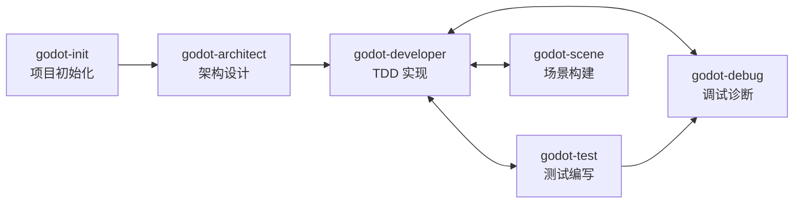

# 🏛️ 项目宪法

## ⭐ P0 - 核心原则
- **P0-1** 代码必须满足 SOLID + DRY 原则
- **P0-2** 禁止语法错误
- **P0-3** 代码除注释外禁止使用中文

## 🔴 P1 - 强制规范

### 开发流程
- **P1-1** 使用 `godot-developer` 技能 + TDD 微循环：
  ```
  godot-test (编写测试)
    → godot-developer (实现代码)
    → minimal-godot_get_diagnostics (语法检查)
    → $GODOT_HOME -s addons/gut/gut_cmdln.gd -gexit (运行测试)
    → godot-developer (重构优化)
  ```
- **P1-2** 使用 `context7` 工具查询 API 文档：`context7_resolve-library-id` → `context7_query-docs`

### 编码规范
- **P1-3** 优先 AnimationPlayer 节点
- **P1-4** Singleton .gd 文件禁止 `class_name`
- **P1-5** 禁止三元运算符，使用 `if...else`

### 测试规范
- **P1-6** 测试代码直接引用类，禁止 `load`/`preload`
- **P1-7** 测试子目录路径与功能代码一致
- **P1-8** GUT 测试必须使用命令行执行

### 代码检查
- **P1-9** 编辑 .gd 后必须检查：
  ```
  minimal-godot_get_diagnostics (GDScript 诊断)
    → lsp_diagnostics (LSP 诊断)
    → ast_grep_search (模式匹配检查)
  ```
- **P1-10** 检查未通过禁止提交

### 代码重构
- **P1-11** 重构前分析：
  ```
  lsp_symbols (理解文件结构)
    → lsp_find_references (查找所有引用)
    → ast_grep_search (搜索代码模式)
    → ast_grep_replace --dryRun (预览替换)
  ```

### 新增功能
- **P1-12** 功能开发流程：
  ```
  task(category="deep", load_skills=["godot-architect"]) (架构设计)
    → task(category="deep", load_skills=["godot-developer"]) (TDD 实现)
    → task(category="deep", load_skills=["godot-scene"]) (场景构建)
    → task(category="deep", load_skills=["godot-debug"]) (运行验证)
  ```

### 性能优化
- **P1-13** 性能优化流程：
  ```
  minimal-godot_get_diagnostics (排除语法问题)
    → minimal-godot_scan_workspace_diagnostics (全项目扫描)
    → ast_grep_search (定位性能模式，如 _process 中的对象创建)
    → godot-mcp_run_project + godot-mcp_get_debug_output (运行时分析)
  ```

### UI 开发
- **P1-14** UI 开发流程：
  ```
  task(category="visual-engineering", load_skills=["godot-scene"]) (场景构建与布局)
    → task(category="deep", load_skills=["godot-developer"]) (脚本实现)
    → godot-mcp_run_project + godot-mcp_get_debug_output (验证)
  ```

## 🟡 P2 - 操作流程

### 目录结构
```
assets/ (fonts, music, sounds, sprites)
scenes/ (.tscn，按模块分)
scripts/ (.gd，按模块分)
test/ (单元测试)
addons/
docs/ (设计文档，按阶段分)
```
- **P2-1** 严禁在目录外存放资产/脚本/测试
- **P2-2** 场景脚本按模块分目录

### 文档目录结构
```
docs/
├── 01_gdd/              # Game Design Document - 游戏设计文档
│   ├── 01_游戏设计文档.md
│   └── 02_功能需求_{功能名}.md
├── 02_analysis/          # Analysis - 分析文档
│   ├── 01_技术可行性分析_{主题}.md
│   └── 02_性能需求分析.md
├── 03_arch/              # Architecture - 架构设计
│   ├── 01_架构概要设计.md
│   ├── 02_模块设计_{模块名}.md
│   └── 03_状态机设计_{名称}.md
├── 04_sprint/            # Sprint - 迭代计划
│   ├── 01_backlog.md
│   ├── 02_story/
│   │   └── {序号}_{Story名称}.md
│   └── 03_plan/
│       └── {序号}_Sprint{编号}.md
├── 05_guide/             # Guide - 开发指导
│   └── {序号}_{功能名}_开发指导.md
└── 06_postmortem/        # Postmortem - 复盘总结
    └── {序号}_{主题}_复盘.md
```
- **P2-9** 文档文件名格式：`{两位序号}_{中文名称}.md`，序号从 01 递增
- **P2-10** 文档必须放在对应阶段目录中，禁止在 `docs/` 根目录直接放文件
- **P2-11** `{xxx}` 为模板变量，使用时替换为实际内容；固定文档（如 `01_游戏设计文档.md`）不加后缀
- **P2-12** 架构设计文档使用 mermaid 绘制图形

### Git 提交
- **P2-3** 提交 .gd 后检查：
  ```
  minimal-godot_get_diagnostics (语法检查)
    → $GODOT_HOME -s addons/gut/gut_cmdln.gd -gexit (运行测试)
    → ast_grep_search (模式检查)
  ```
- **P2-4** 与用户确认后再执行
- **P2-5** 修改测试必须用 `godot-developer`
- **P2-6** .uid 文件必须提交（.tscn 除外）
- **P2-7** 缺少 .uid 时提醒用户生成

### 命令行
- **P2-8** 使用 `$GODOT_HOME` 环境变量：`$GODOT_HOME -s addons/gut/gut_cmdln.gd -gexit`

## 🔧 可用工具

### Godot MCP（场景与调试）
| 工具 | 用途 |
|------|------|
| `godot-mcp_run_project` | 运行项目并捕获输出 |
| `godot-mcp_get_debug_output` | 获取当前调试输出 |
| `godot-mcp_stop_project` | 停止运行中的项目 |
| `godot-mcp_get_godot_version` | 获取 Godot 版本 |
| `godot-mcp_list_projects` | 列出目录中的 Godot 项目 |
| `godot-mcp_get_project_info` | 获取项目元数据 |
| `godot-mcp_create_scene` | 创建新场景文件 |
| `godot-mcp_add_node` | 向场景添加节点 |
| `godot-mcp_load_sprite` | 加载精灵纹理 |
| `godot-mcp_save_scene` | 保存场景文件 |
| `godot-mcp_get_uid` | 获取文件 UID |
| `godot-mcp_update_project_uids` | 更新项目 UID 引用 |
| `godot-mcp_launch_editor` | 启动 Godot 编辑器 |

### Godot 诊断
| 工具 | 用途 |
|------|------|
| `minimal-godot_get_diagnostics` | 检查单个 .gd 文件的错误/警告 |
| `minimal-godot_scan_workspace_diagnostics` | 扫描全项目 .gd 文件（开销大，慎用） |

### LSP（代码导航）
| 工具 | 用途 |
|------|------|
| `lsp_goto_definition` | 跳转到符号定义 |
| `lsp_find_references` | 查找符号所有引用 |
| `lsp_symbols` | 获取文件符号 / 工作区搜索 |
| `lsp_diagnostics` | LSP 级别的错误/警告 |
| `lsp_prepare_rename` | 检查重命名是否安全 |
| `lsp_rename` | 重命名符号（全工作区） |

### AST 模式匹配
| 工具 | 用途 |
|------|------|
| `ast_grep_search` | AST 感知的代码搜索（支持 25 种语言） |
| `ast_grep_replace` | AST 感知的代码替换（默认 dry-run） |

### API 文档查询
| 工具 | 用途 |
|------|------|
| `context7_resolve-library-id` | 将库名解析为 Context7 兼容 ID |
| `context7_query-docs` | 查询库的最新文档和代码示例 |

### 任务委托
```bash
# 通用委托模式
task(category="deep", load_skills=["godot-developer"], prompt="...", run_in_background=false)
# 后台探索
task(subagent_type="explore", load_skills=[], prompt="...", run_in_background=true)
```

| 参数 | 说明 |
|------|------|
| `category` | `visual-engineering` / `deep` / `quick` / `ultrabrain` 等 |
| `load_skills` | 技能列表：`godot-architect`, `godot-developer`, `godot-scene`, `godot-test`, `godot-debug` |
| `subagent_type` | `explore` / `librarian` / `oracle` / `metis` / `momus` |

## 📋 严重违规清单

1. 未使用 `godot-developer` 技能
2. 未使用 `context7_resolve-library-id` + `context7_query-docs` 查询 API
3. Singleton 文件包含 `class_name`
4. 代码含中文（除注释）
5. 未通过 `minimal-godot_get_diagnostics` 检查
6. 违反目录结构
7. 未提交 .uid 文件

**纠正：停止 → 回滚 → 重新执行**

## 🎮 Godot Skill 编排指南

项目使用 6 个专业化 Godot 4.x Skill，各司其职、通过明确的工作流串联。

### Skill 职责矩阵

| Skill | 职责 | 可修改文件 | 不可修改 |
|-------|------|-----------|---------|
| `godot-init` | 项目初始化 | `project.godot`, `.gitignore`, `.mcp.json`, `AGENTS.md`, `src/autoload/*.gd` | 已初始化的项目 |
| `godot-architect` | 架构设计（只读） | 无（仅输出设计文档） | 任何项目文件 |
| `godot-developer` | TDD 代码实现 | `.gd` 脚本文件 | `.tscn`, `project.godot` |
| `godot-scene` | 场景创建与修改 | `.tscn` 场景文件（通过 MCP） | `.gd` 业务逻辑 |
| `godot-test` | GUT 测试编写 | `test/**/*.gd` | 功能代码 |
| `godot-debug` | MCP 调试与诊断 | 无（只读诊断） | 任何项目文件 |

### 适用场景速查

| 场景 | 使用 Skill |
|------|-----------|
| 创建新 Godot 项目 | `godot-init` |
| 设计新功能的系统架构 | `godot-architect` |
| 设计状态机 | `godot-architect` → `godot-developer` |
| 编写 GDScript 实现代码 | `godot-developer` |
| 创建/修改场景 (.tscn) | `godot-scene` |
| 添加节点、连接信号 | `godot-scene` |
| 编写 GUT 单元测试 | `godot-test` |
| 调试运行时错误 | `godot-debug` |
| 截图验证 UI 布局 | `godot-debug` |
| 代码检查与诊断 | `godot-debug` (`minimal-godot_get_diagnostics`) |

### 标准开发工作流



#### 典型功能开发流程

```
1. godot-architect  → 输出架构设计文档（模块划分、接口定义、状态机设计）
2. godot-developer  → 基于设计文档，执行 TDD Red-Green-Refactor 循环
   ├── godot-test   → Red 阶段：编写失败测试
   ├── godot-developer → Green 阶段：最小实现
   ├── godot-developer → Refactor 阶段：重构优化
   └── godot-test   → Consolidate 阶段：强化测试覆盖
3. godot-scene      → 创建/修改场景文件，配置节点和信号
4. godot-debug      → 运行项目，捕获输出，验证功能正确性
5. godot-developer  → 修复发现的问题，回到步骤2
```

#### TDD 微循环（P1-1 详解）

```
godot-test (编写测试) → godot-developer (实现代码) → minimal-godot_get_diagnostics (语法检查)
                                                                    ↓
                                                          godot-debug (运行验证)
                                                                    ↓
                                                          godot-developer (重构优化)
```

### Skill 间协作规则

1. **设计先行**：新功能必须先经 `godot-architect` 设计，再由 `godot-developer` 实现
2. **测试驱动**：实现代码前必须先由 `godot-test` 编写测试
3. **场景分离**：`.tscn` 文件只通过 `godot-scene` 操作，`godot-developer` 禁止直接修改
4. **证据优先**：调试时必须先由 `godot-debug` 捕获输出，再定位修复
5. **单一职责**：每个 Skill 只做自己的事，不越界操作其他 Skill 的文件

## 📚 附录

- **A-1** AGENTS.md 不重复 CONTRIBUTING.md 内容
