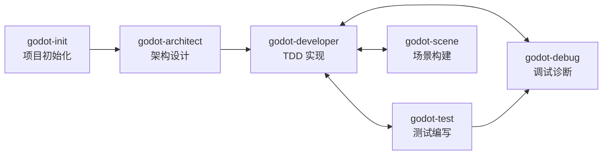

# 🏛️ 项目宪法

## ⭐ P0 - 核心原则
- **P0-1** 代码必须满足 SOLID + DRY 原则
- **P0-2** 禁止语法错误
- **P0-3** 代码除注释外禁止使用中文

## 🔴 P1 - 强制规范

### 开发流程
- **P1-1** 使用 `godot-developer` 技能 + TDD 微循环：`generate_test` → `godot-developer` 技能 → `lint_file` → `run_tests` → `minimal-godot_get_diagnostics`
- **P1-2** 使用 `context7` 工具查询 API 文档：`context7_resolve-library-id` → `context7_query-docs` 或 `get_api_docs` / `search_docs`

### 编码规范
- **P1-3** 优先 AnimationPlayer 节点
- **P1-4** Singleton .gd 文件禁止 `class_name`
- **P1-5** 禁止三元运算符，使用 `if...else`

### 测试规范
- **P1-6** 测试代码直接引用类，禁止 `load`/`preload`
- **P1-7** 测试子目录路径与功能代码一致
- **P1-8** GUT 测试必须使用命令行执行

### 代码检查
- **P1-9** 编辑 .gd 后必须 `minimal-godot_get_diagnostics` 检查：`minimal-godot_get_diagnostics` → `lint_file` → `check_patterns` → `get_complexity`
- **P1-10** 检查未通过禁止提交

### 代码重构
- **P1-11** 重构前分析：`get_complexity` → `find_duplication` → `analyze_dependencies` → `analyze_signal_flow`

### 新增功能
- **P1-12** 功能开发流程：`invoke_agent(architect)` / `route_task` → `invoke_agent(data-manager)` → `generate_from_template` / `generate_feature` → `generate_test`

### 性能优化
- **P1-13** 性能优化流程：`get_performance_guide` → `invoke_agent(performance)` → `complexity_heatmap` → `shader_performance` / `lint_shader`

### UI 开发
- **P1-14** UI 开发流程：`invoke_agent(ui-layout)` → `invoke_agent(ui-styling)` → `invoke_agent(ui-animation)`

### 战斗系统
- **P1-15** 战斗系统开发：`invoke_agent(battle-logic)` → `invoke_agent(battle-ai)` → `invoke_agent(battle-animation)`

## 🟡 P2 - 操作流程

### 目录结构
```
assets/ (fonts, music, sounds, sprites)
scenes/ (.tscn，按模块分)
scripts/ (.gd，按模块分)
test/ (单元测试)
addons/
```
- **P2-1** 严禁在目录外存放资产/脚本/测试
- **P2-2** 场景脚本按模块分目录

### Git 提交
- **P2-3** 提交 .gd 后检查测试：`run_tests` → `get_test_coverage` → `validate_project` → `detect_dead_code`
- **P2-4** 与用户确认后再执行
- **P2-5** 修改测试必须用 `godot-developer`
- **P2-6** .uid 文件必须提交（.tscn 除外）
- **P2-7** 缺少 .uid 时提醒用户生成

### 命令行
- **P2-8** 使用 `$GODOT_HOME` 环境变量：`$GODOT_HOME -s addons/gut/gut_cmdln.gd -gexit`

## 🔧 可用工具

### 专业代理（15）
**架构**: `architect` 系统架构 | `data-manager` 数据架构
**编码**: `code-quality` 代码质量
**测试**: `testing` 测试工程
**UI**: `ui-layout` 布局 | `ui-styling` 样式 | `ui-animation` 动画
**战斗**: `battle-logic` 逻辑 | `battle-ai` AI | `battle-animation` 动画
**系统**: `vera-ai` 伴侣 | `dialogue` 对话 | `quest` 任务
**资源**: `sprite` 精灵 | `audio` 音频
**优化**: `performance` 性能优化

### 分析与验证（6）
`analyze_scene` 场景 | `analyze_dependencies` 依赖 | `analyze_resources` 资源 | `analyze_signal_flow` 信号 | `analyze_autoloads` Autoload | `analyze_shader` 着色器

### 着色器（5）
`lint_shader` 检查 | `lint_all_shaders` 全项目 | `shader_performance` 性能 | `find_shaders` 查找 | `get_shader_docs` 文档

### 代码生成（5）
`generate_from_template` 模板 | `generate_feature` 功能 | `generate_smart_code` 智能 | `smart_complete` 补全 | `auto_fix` 自动修复

### 文档查询（6）
`get_api_docs` API | `get_project_docs` 项目 | `search_docs` 搜索 | `get_common_pitfalls` 陷阱 | `get_game_patterns` 模式 | `get_performance_guide` 性能

### 调试工具（5）
`find_symbol` 符号 | `find_references` 引用 | `go_to_definition` 跳转 | `document_symbols` 文档符号 | `workspace_symbols` 工作区符号

### 项目健康（4）
`env_doctor` 环境 | `project_health` 健康 | `find_unused_files` 未使用 | `analyze_assets` 资产

### 任务路由（5）
`route_task` 路由 | `invoke_agent` 调用 | `get_agent_info` 信息 | `list_agents` 列出 | `plan_collaboration` 协作

## 📋 严重违规清单

1. 未使用 `godot-developer` 技能
2. 未使用 `context7` 查询 API
3. Singleton 文件包含 `class_name`
4. 代码含中文（除注释）
5. 未通过 `get_diagnostics` 检查
6. 违反目录结构
7. 未提交 .uid 文件

**纠正：停止 → 回滚 → 重新执行**

## 🎮 Godot Skill 编排指南

项目使用 6 个专业化 Godot 4.x Skill，各司其职、通过明确的工作流串联。

### Skill 职责矩阵

| Skill | 职责 | 可修改文件 | 不可修改 |
|-------|------|-----------|---------|
| `godot-init` | 项目初始化 | `project.godot`, `.gitignore`, `.mcp.json`, `AGENTS.md`, `src/autoload/*.gd` | 已初始化的项目 |
| `godot-architect` | 架构设计（只读） | 无（仅输出设计文档） | 任何项目文件 |
| `godot-developer` | TDD 代码实现 | `.gd` 脚本文件 | `.tscn`, `project.godot` |
| `godot-scene` | 场景创建与修改 | `.tscn` 场景文件（通过 MCP） | `.gd` 业务逻辑 |
| `godot-test` | GUT 测试编写 | `test/**/*.gd` | 功能代码 |
| `godot-debug` | MCP 调试与诊断 | 无（只读诊断） | 任何项目文件 |

### 适用场景速查

| 场景 | 使用 Skill |
|------|-----------|
| 创建新 Godot 项目 | `godot-init` |
| 设计新功能的系统架构 | `godot-architect` |
| 设计状态机 | `godot-architect` → `godot-developer` |
| 编写 GDScript 实现代码 | `godot-developer` |
| 创建/修改场景 (.tscn) | `godot-scene` |
| 添加节点、连接信号 | `godot-scene` |
| 编写 GUT 单元测试 | `godot-test` |
| 调试运行时错误 | `godot-debug` |
| 截图验证 UI 布局 | `godot-debug` |
| 代码检查与诊断 | `godot-debug` (`minimal-godot_get_diagnostics`) |

### 标准开发工作流



#### 典型功能开发流程

```
1. godot-architect  → 输出架构设计文档（模块划分、接口定义、状态机设计）
2. godot-developer  → 基于设计文档，执行 TDD Red-Green-Refactor 循环
   ├── godot-test   → Red 阶段：编写失败测试
   ├── godot-developer → Green 阶段：最小实现
   ├── godot-developer → Refactor 阶段：重构优化
   └── godot-test   → Consolidate 阶段：强化测试覆盖
3. godot-scene      → 创建/修改场景文件，配置节点和信号
4. godot-debug      → 运行项目，捕获输出，验证功能正确性
5. godot-developer  → 修复发现的问题，回到步骤2
```

#### TDD 微循环（P1-1 详解）

```
godot-test (编写测试) → godot-developer (实现代码) → minimal-godot_get_diagnostics (语法检查)
                                                                    ↓
                                                          godot-debug (运行验证)
                                                                    ↓
                                                          godot-developer (重构优化)
```

### Skill 间协作规则

1. **设计先行**：新功能必须先经 `godot-architect` 设计，再由 `godot-developer` 实现
2. **测试驱动**：实现代码前必须先由 `godot-test` 编写测试
3. **场景分离**：`.tscn` 文件只通过 `godot-scene` 操作，`godot-developer` 禁止直接修改
4. **证据优先**：调试时必须先由 `godot-debug` 捕获输出，再定位修复
5. **单一职责**：每个 Skill 只做自己的事，不越界操作其他 Skill 的文件

## 📚 附录

- **A-1** AGENTS.md 不重复 CONTRIBUTING.md 内容
