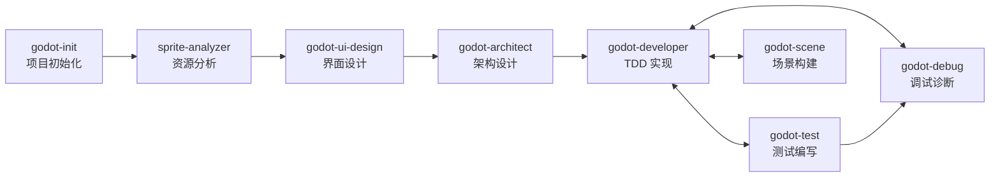

# 🏛️ 核心原则

> 跨所有开发阶段通用的核心原则、操作流程和工具参考。
> 阶段特定规则参见 `constitutions/01_~06_` 系列文件。

## ⭐ P0 - 核心原则

- **P0-1** 代码必须满足 SOLID + DRY 原则
- **P0-2** 禁止语法错误
- **P0-3** 代码除注释外**禁止**使用中文
- **P0-4** 思考过程和交流**必须**使用中文
- **P0-99** 每个任务执行后，**必须**事后总结经验教训，保存到 `docs/06_postmortem/MEMORY.md` （**禁止**输出重复的经验）
- **P0-100** 每个任务执行前，**必须**从 `docs/06_postmortem/MEMORY.md` 读取经验教训，避免重犯

## 🔴 跨阶段规范

### 功能开发全流程

- **P1-12** 功能开发流程：
  ```
  task(category="deep", load_skills=["godot-ui-design"]) (界面设计，涉及 UI 时必须)
    → task(category="deep", load_skills=["godot-architect"]) (架构设计)
    → godot-scene：AI 创建场景基本框架 + 输出操作指导到 tmp/ (不暂停，继续执行后续任务)
    → task(category="deep", load_skills=["godot-developer"]) (TDD 实现，可与场景框架创建并行)
    → Story 所有任务完成后，暂停等待用户在编辑器中编辑场景
    → 用户确认完成后，AI 检视 scene + 执行测试用例
    → task(category="deep", load_skills=["godot-debug"]) (运行验证)
  ```

### 任务执行粒度

- **P1-2a** 每个开发/测试任务以单个 task 为粒度，完成后**必须**暂停执行，等待用户确认后再继续下一个 task

### 生成物检视

- **P1-13** 所有文档和代码生成后，**必须**创建新的子 agent（`task(category="deep", ...)`）对生成物进行独立检视，并针对检视发现的问题进行修改修正。检视内容包括但不限于：
  - 文档：命名规范、目录位置、标题层级、mermaid 图形正确性、上游关联完整性
  - 代码：语法正确性、SOLID/DRY 合规、目录规范、`minimal-godot_get_diagnostics` 诊断通过
  - 设计稿（.pen）：节点层级合理性、布局无溢出/重叠、组件引用有效、变量/主题一致性、`pencil_get_screenshot` 截图验证视觉正确性

## 🟡 P2 - 操作流程

### 目录结构

```
assets/ (fonts, music, sounds, sprites)
scenes/ (.tscn，按模块分)
scripts/ (.gd，按模块分)
test/ (单元测试)
addons/
docs/ (设计文档，按阶段分)
```

- **P2-1** 严禁在目录外存放资产/脚本/测试
- **P2-2** 场景脚本按模块分目录

### 文档交付件规则

- **P2-9** 每个阶段完成后**必须**输出对应的设计文档，交付件清单如下：

| 阶段 | 交付件 | 命名格式 | 存档路径 |
|------|--------|---------|---------|
| 游戏设计 | 游戏设计文档 | `01_游戏设计文档.md` | `docs/01_gdd/` |
| 游戏设计 | 功能需求文档 | `{序号}_功能需求_{功能名}.md` | `docs/01_gdd/` |
| 技术分析 | 技术可行性分析 | `{序号}_技术可行性分析_{主题}.md` | `docs/02_analysis/` |
| 技术分析 | 性能需求分析 | `{序号}_性能需求分析.md` | `docs/02_analysis/` |
| 架构设计 | 架构概要设计 | `01_架构概要设计.md` | `docs/03_arch/` |
| 架构设计 | 模块设计 | `{序号}_模块设计_{模块名}.md` | `docs/03_arch/` |
| 架构设计 | 状态机设计 | `{序号}_状态机设计_{名称}.md` | `docs/03_arch/` |
| 迭代计划 | Backlog | `01_backlog.md` | `docs/04_sprint/` |
| 迭代计划 | Story | `{序号}_{Story名称}.md` | `docs/04_sprint/02_story/` |
| 迭代计划 | Sprint 计划 | `{序号}_Sprint{编号}.md` | `docs/04_sprint/03_plan/` |
| 开发指导 | 功能开发指导 | `{序号}_{功能名}_开发指导.md` | `docs/05_guide/` |
| 复盘总结 | 复盘文档 | `{序号}_{主题}_复盘.md` | `docs/06_postmortem/` |
| 界面设计 | 界面设计稿 | `{序号}_{界面名}.pen` | `docs/07_design/` |

- **P2-10** 文档文件名格式：`{两位序号}_{中文名称}.md`，序号从 01 递增
- **P2-11** 文档必须放在对应阶段目录中，禁止在 `docs/` 根目录直接放文件
- **P2-12** `{xxx}` 为模板变量，使用时替换为实际内容；固定文档（如 `01_游戏设计文档.md`）不加后缀
- **P2-13** 架构设计文档使用 mermaid 绘制图形

- **P2-14** 文档内容规则：
  - **结构化**：每个文档必须包含明确的标题层级（`#` → `##` → `###`），禁止跳级
  - **可追溯**：架构设计文档必须关联对应的功能需求文档（引用文档名或路径）
  - **图表优先**：涉及流程、架构、状态转换时**必须**使用 mermaid 绘制图形，禁止仅用文字描述
  - **具体可执行**：开发指导文档必须包含可直接执行的步骤，禁止模糊表述（如"适当优化"）
  - **自包含**：每个文档必须独立可读，包含必要的背景上下文，不依赖外部口头说明

- **P2-15** 文档输出前必须自检：
  - [ ] 文件名是否符合命名格式
  - [ ] 是否存放在正确阶段目录
  - [ ] 标题层级是否完整无跳级
  - [ ] mermaid 图形是否渲染正确（涉及流程/架构/状态时）
  - [ ] 是否关联了上游需求文档（架构设计、开发指导类）

### Git 提交

- **P2-3** 提交 .gd 后检查：
  ```
  minimal-godot_get_diagnostics (语法检查)
    → $GODOT_HOME -s addons/gut/gut_cmdln.gd -gexit (运行测试)
    → ast_grep_search (模式检查)
  ```
- **P2-4** 与用户确认后再执行
- **P2-5** 修改测试必须用 `godot-developer`
- **P2-6** .uid 文件必须提交（.tscn 除外）
- **P2-7** 缺少 .uid 时提醒用户生成

### 命令行

- **P2-8** 使用 `$GODOT_HOME` 环境变量：`$GODOT_HOME -s addons/gut/gut_cmdln.gd -gexit`

## 📋 严重违规清单

1. 未使用 `godot-developer` 技能
2. 未使用 `context7_resolve-library-id` + `context7_query-docs` 查询 API
3. Singleton 文件包含 `class_name`
4. 代码含中文（除注释）
5. 未通过 `minimal-godot_get_diagnostics` 检查
6. 违反目录结构
7. 未提交 .uid 文件
8. UI 界面未使用 `pencil` 设计即进入开发

**纠正：停止 → 回滚 → 重新执行**

## 🔧 可用工具

### Godot MCP（场景与调试）
| 工具 | 用途 |
|------|------|
| `godot-mcp_run_project` | 运行项目并捕获输出 |
| `godot-mcp_get_debug_output` | 获取当前调试输出 |
| `godot-mcp_stop_project` | 停止运行中的项目 |
| `godot-mcp_get_godot_version` | 获取 Godot 版本 |
| `godot-mcp_list_projects` | 列出目录中的 Godot 项目 |
| `godot-mcp_get_project_info` | 获取项目元数据 |
| `godot-mcp_create_scene` | 创建新场景文件 |
| `godot-mcp_add_node` | 向场景添加节点 |
| `godot-mcp_load_sprite` | 加载精灵纹理 |
| `godot-mcp_save_scene` | 保存场景文件 |
| `godot-mcp_get_uid` | 获取文件 UID |
| `godot-mcp_update_project_uids` | 更新项目 UID 引用 |
| `godot-mcp_launch_editor` | 启动 Godot 编辑器 |

### Pencil（界面设计）
| 工具 | 用途 |
|------|------|
| `pencil_get_editor_state` | 获取编辑器状态和设计信息 |
| `pencil_batch_design` | 批量设计操作（插入/复制/更新/替换/移动/删除） |
| `pencil_batch_get` | 批量获取节点信息 |
| `pencil_get_screenshot` | 获取节点截图验证 |
| `pencil_export_nodes` | 导出节点为图片文件 |
| `pencil_find_empty_space_on_canvas` | 查找画布空白区域 |
| `pencil_get_guidelines` | 获取设计指南和样式 |
| `pencil_get_variables` | 获取设计变量和主题 |
| `pencil_set_variables` | 设置设计变量和主题 |
| `pencil_open_document` | 打开 .pen 文件 |
| `pencil_snapshot_layout` | 检查布局结构 |

### Godot 诊断
| 工具 | 用途 |
|------|------|
| `minimal-godot_get_diagnostics` | 检查单个 .gd 文件的错误/警告 |
| `minimal-godot_scan_workspace_diagnostics` | 扫描全项目 .gd 文件（开销大，慎用） |

### LSP（代码导航）
| 工具 | 用途 |
|------|------|
| `lsp_goto_definition` | 跳转到符号定义 |
| `lsp_find_references` | 查找符号所有引用 |
| `lsp_symbols` | 获取文件符号 / 工作区搜索 |
| `lsp_diagnostics` | LSP 级别的错误/警告 |
| `lsp_prepare_rename` | 检查重命名是否安全 |
| `lsp_rename` | 重命名符号（全工作区） |

### AST 模式匹配
| 工具 | 用途 |
|------|------|
| `ast_grep_search` | AST 感知的代码搜索（支持 25 种语言） |
| `ast_grep_replace` | AST 感知的代码替换（默认 dry-run） |

### API 文档查询
| 工具 | 用途 |
|------|------|
| `context7_resolve-library-id` | 将库名解析为 Context7 兼容 ID |
| `context7_query-docs` | 查询库的最新文档和代码示例 |

### 任务委托
```bash
# 通用委托模式
task(category="deep", load_skills=["godot-developer"], prompt="...", run_in_background=false)
# 后台探索
task(subagent_type="explore", load_skills=[], prompt="...", run_in_background=true)
```

| 参数 | 说明 |
|------|------|
| `category` | `visual-engineering` / `deep` / `quick` / `ultrabrain` 等 |
| `load_skills` | 技能列表：`godot-architect`, `godot-developer`, `godot-scene`, `godot-test`, `godot-debug`, `godot-ui-design`, `sprite-analyzer` |
| `subagent_type` | `explore` / `librarian` / `oracle` / `metis` / `momus` |

## 🎮 Godot Skill 编排指南

项目使用 8 个专业化 Godot 4.x Skill，各司其职、通过明确的工作流串联。

### Skill 职责矩阵

| Skill | 职责 | 可修改文件 | 不可修改 |
|-------|------|-----------|---------|
| `godot-init` | 项目初始化 | `project.godot`, `.gitignore`, `.mcp.json`, `AGENTS.md`, `src/autoload/*.gd` | 已初始化的项目 |
| `godot-ui-design` | 界面设计（Pencil） | `docs/07_design/*.pen` | `.gd`, `.tscn`, `project.godot` |
| `godot-architect` | 架构设计（只读） | 无（仅输出设计文档） | 任何项目文件 |
| `godot-developer` | TDD 代码实现 | `.gd` 脚本文件 | `.tscn`, `project.godot` |
| `godot-scene` | 场景框架创建与操作指导 | 无（AI 创建基本框架，输出操作指导到 tmp/，由用户完成可视化操作） | `.gd` 业务逻辑、可视化属性 |
| `godot-test` | GUT 测试编写 | `test/**/*.gd` | 功能代码 |
| `godot-debug` | MCP 调试与诊断 | 无（只读诊断） | 任何项目文件 |
| `sprite-analyzer` | 精灵图资源分析 | 分析输出文档（.md） | `.gd`, `.tscn` 项目文件 |

### 适用场景速查

| 场景 | 使用工具 |
|------|---------|
| 创建新 Godot 项目 | `godot-init` |
| 设计游戏 UI 界面 | `godot-ui-design` |
| 设计新功能的系统架构 | `godot-architect` |
| 设计状态机 | `godot-architect` → `godot-developer` |
| 编写 GDScript 实现代码 | `godot-developer` |
| 创建/修改场景 (.tscn) | `godot-scene` |
| 添加节点、连接信号 | `godot-scene` |
| 编写 GUT 单元测试 | `godot-test` |
| 调试运行时错误 | `godot-debug` |
| 截图验证 UI 布局 | `godot-debug` |
| 代码检查与诊断 | `godot-debug` (`minimal-godot_get_diagnostics`) |
| 分析精灵图资源 | `sprite-analyzer` |

### 标准开发工作流



#### 典型功能开发流程

```
1. sprite-analyzer → 分析精灵图资源，提取元数据和动画帧信息
2. godot-ui-design → 使用 Pencil 设计 UI 界面，输出 .pen 设计稿
3. godot-architect  → 输出架构设计文档（模块划分、接口定义、状态机设计）
4. godot-scene      → AI 创建场景基本框架（节点树骨架）+ 输出操作指导到 tmp/
   ⚠️ 场景创建不需要暂停其他任务，可继续执行脚本开发
   ⚠️ 场景开发禁止在子agent 中执行
   → AI 继续执行 Story 中的脚本编写、测试等任务
   → Story 所有任务完成后，AI 暂停等待用户编辑场景
   → 用户在编辑器中完成可视化操作（图片加载、位置微调、布局调整）
   → 用户确认完成后，AI 检视 scene + 执行测试用例
5. godot-developer  → 基于设计文档，执行 TDD Red-Green-Refactor 循环
   ├── godot-test   → Red 阶段：编写失败测试
   ├── godot-developer → Green 阶段：最小实现
   ├── godot-developer → Refactor 阶段：重构优化
   └── godot-test   → Consolidate 阶段：强化测试覆盖
6. godot-debug      → 运行项目，捕获输出，验证功能正确性
7. godot-developer  → 修复发现的问题，回到步骤5
```

> **注意**：场景框架创建（步骤4）和脚本开发（步骤5）可并行执行，不需要等待用户编辑场景。当 Story 中所有任务完成后，统一暂停等待用户编辑场景。

### Skill 间协作规则

1. **资源先行**：涉及精灵图资源时，先由 `sprite-analyzer` 分析资源结构和动画帧信息
2. **设计先行**：新功能必须先经 `godot-architect` 设计，再由 `godot-developer` 实现
3. **界面必须设计**：涉及 UI 界面时，必须先由 `godot-ui-design` 设计，再进入后续流程
4. **测试驱动**：实现代码前必须先由 `godot-test` 编写测试
5. **场景分离**：`.tscn` 文件通过 `godot-scene` 由 AI 创建基本框架，输出操作指导到 `tmp/`，由用户在编辑器中完成可视化操作，AI 禁止直接修改可视化属性
6. **场景并行**：场景框架创建后不需要暂停，AI 可继续执行 Story 中的脚本开发和测试任务。当 Story 所有任务完成后，统一暂停等待用户编辑场景
7. **场景验证**：用户确认场景编辑完成后，AI 必须检视场景（节点树、信号连接、脚本挂载）并执行测试用例验证
8. **证据优先**：调试时必须先由 `godot-debug` 捕获输出，再定位修复
9. **单一职责**：每个 Skill 只做自己的事，不越界操作其他 Skill 的文件

## 📚 附录

- **A-1** AGENTS.md 不重复 CONTRIBUTING.md 内容
