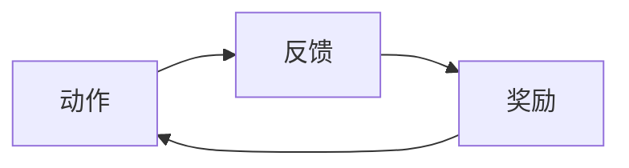

# GDD 游戏设计文档模板

> 游戏设计文档（Game Design Document）是游戏开发的蓝图，用于在团队、投资者与玩家间清晰沟通游戏愿景。
> **用途**：「阶段 1 · 创意探索」由 `brainstorming` Skill 产出后，依据本模板撰写。
> **存放位置**：`docs/01_创意探索/`；文件命名遵循项目宪法 §3.1（`{两位序号}_{中文名称}.md`）。
> **保持动态更新**：GDD 随开发进程不断迭代，不是一成不变的死文档。

---

## 文档信息

| 字段 | 内容 |
|------|------|
| 游戏名称 | |
| 当前版本 | v0.1 |
| 创建日期 | |
| 最后更新 | |
| 作者 | |
| 文档状态 | 草稿 / 评审中 / 已定稿 |

---

## 〇、设计三要素（对齐项目宪法，必填）

> 阶段 1 完成标志：GDD 文档经用户确认设计方向。三要素是确认评审的核心。

- **设计意图**：
  > 本游戏要解决什么问题？为什么做这个游戏？（1-3 句话）

- **约束**：
  > 时间 / 技术 / 预算 / 团队规模等硬性限制。

- **成功标准**：
  > 怎样算成功？给出可量化指标（如核心循环 fun factor、留存率、关卡数量等）。

---

## 一、项目概览 (Executive Summary)

> GDD 的「门面」，用最精炼的语言让读者迅速了解游戏全貌。

- **游戏名称**：
- **游戏类型**：> RPG / FPS / 策略 / 解谜 / ...
- **目标平台**：> PC / 主机 / 移动端 / Web
- **目标受众**：> 核心玩家画像：年龄、偏好
- **核心概念**：> 一两句话高度概括游戏是什么、独特魅力所在
- **独特卖点 (USP)**：> 区别于竞品的核心特色
- **竞品分析**：> 市场同类游戏及自身定位
- **项目范围**：> 整体规模与复杂度界定

---

## 二、游戏玩法与机制 (Gameplay & Mechanics)

> 技术核心：详细阐述玩家如何与游戏世界互动。创意核心应详写。

### 核心玩法循环

> 描述玩家反复进行的主要活动循环。**强烈建议配循环图**（Markdown 中用 Mermaid，遵循项目宪法 §3.4 / §3.5 校验工作流）。

### 游戏规则与目标

> 胜负条件、关卡目标、计分规则等。

### 控制方式

> 键鼠 / 手柄 / 触屏 的操作映射。

### 核心机制

> 战斗 / 建造 / 解谜 / 经济等具体系统的深入说明。

### 游戏流程与关卡设计

> 线性或非线性流程；各关卡的地图、挑战与节奏。

---

## 三、叙事与世界构建 (Story & Worldbuilding)

> 构建游戏的灵魂与血肉，为玩法提供情境和动机。无剧情游戏可精简本节。

- **故事梗概**：> 主线剧情
- **角色设定**：> 主要角色背景、性格、动机及在故事中的作用
- **世界观**：> 历史、地理、文化、种族等设定
- **环境叙事**：> 如何通过场景、物品等元素讲述故事

---

## 四、美术与音频 (Art & Audio)

> 定义视听风格，为美术与音效团队提供明确指引。

- **美术风格**：> 写实 / 卡通 / 像素 / ...
- **概念设计**：> 角色、场景、道具概念图（资产存放于 `assets/`，分析见 `docs/03_资产/`）
- **界面与用户体验 (UI/UX)**：> 菜单、HUD 等设计；详细原型见 `docs/04_高保真设计/`
- **音乐与音效**：> 音乐风格、音效设计思路

---

## 五、技术与开发 (Technology & Development)

> 从技术实现与项目管理角度规划。

- **技术规格**：> 引擎（Godot 4.x）、渲染管线、目标帧率、分辨率
- **开发计划**：> 里程碑、时间表、团队分工
- **资源清单**：> 程序 / 模型 / 音效等所需资源
- **盈利模式**：> 定价 / 内购 / 广告等商业化策略

---

## 撰写原则（提醒）

- **目标是沟通**：确保任何阅读者都能快速理解游戏是什么。
- **保持动态更新**：GDD 随开发进程不断迭代。
- **先有骨架，再填血肉**：可从单页说明书开始，逐步扩展成完整 GDD，避免一开始陷入无穷细节。
- **善用图表**：流程图、核心循环图、界面线框图往往比大段文字更清晰（图表用 Mermaid，见项目宪法 §3.4 / §3.5）。
- **详略得当**：创意核心（如核心玩法）详写，标准功能适当从简。
