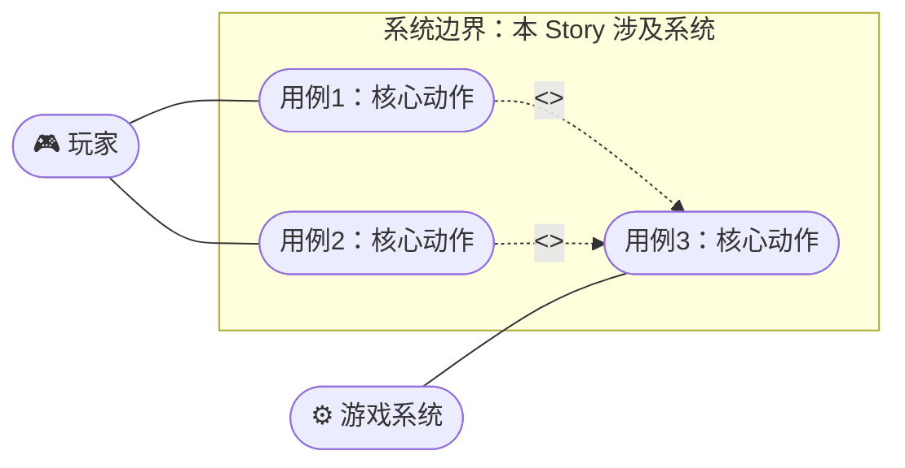

# Story 文档模板

> 本文档为只读文档。
> 用户故事（Story）是对需求的可执行拆分，每条 Story 必须带可测的验收标准（AC）。
> **用途**：「阶段 5 · 需求文档」依据 Feature（`docs/05_需求/`）拆分产出；其后贯穿阶段 6~10 的开发与验收。
> **存放位置**：`docs/06_story/`；文件命名遵循项目宪法 §3.1（`{两位序号}_{中文名称}.md`）。
> **状态追踪**：frontmatter `status` 为权威状态字段，每次阶段流转后**必须**同步更新，并回写 `docs/06_story/00_总表.md`（横切 C6）。

---

## frontmatter 约定（必填，复制后填入）

```yaml
---
id: STORY-001                       # 全局唯一编号
title:                              # 一句话标题
feature: FEAT-001                   # 关联 Feature 文档（docs/05_需求/）
status: draft                       # 见下方状态流转表
priority: P0                        # P0(必须) / P1(重要) / P2(可选)
estimate:                           # 故事点（可选，整数）
assignee:                           # 负责人（可选）
created: 2026-08-01                 # 创建日期
updated: 2026-08-01                 # 最后更新日期
gdd: docs/01_创意探索/01_xxx.md      # 关联 GDD（可选）
arch: docs/07_架构/01_xxx.md         # 关联架构方案（可选，阶段7 产出后补）
hifi: docs/04_高保真设计/01_xxx.md   # 关联高保真设计原型（可选，阶段4 产出后补）
---
```

### `status` 状态流转（对齐开发主流程）

| status | 含义 | 对应阶段 |
|--------|------|:--------:|
| `draft` | Story 草拟中，AC 未定稿 | 阶段 5 |
| `ready` | 需求冻结，AC 已定稿，可进入开发 | 阶段 5 完成 |
| `in-progress` | 开发进行中（架构→TDD→质量门禁） | 阶段 6~9 |
| `in-review` | 黑盒验收中，按 AC 逐条验证 | 阶段 10 |
| `done` | 所有 AC 验收通过，已交付 | 阶段 10 完成 |
| `blocked` | 被阻塞，需在正文记录原因与依赖 | — |

---

## 一、用户故事 (User Story)

> 经典格式：**As a** `<角色>`，**I want** `<能力>`，**so that** `<价值>`。

- **As a**：
- **I want**：
- **so that**：

---

## 二、背景与动机

> 为什么需要这个 Story？解决什么问题？关联 GDD 的哪个设计意图？
> （可选，简短即可）

---

## 三、用例图 (Use Case Diagram)

> 可视化参与者（Actor）与本 Story 涉及的用例及交互关系。**用 Mermaid 绘制**（遵循项目宪法 §3.4 / §3.5 校验工作流）。
> 椭圆节点 `([用例])` 表示用例；`subgraph` 表示系统边界；`---` 为关联，`-. "<<include>>" .->` / `-. "<<extend>>" .->` 为包含 / 扩展关系。



---

## 四、验收标准 (Acceptance Criteria · BDD)

> **采用 BDD（行为驱动开发）**：用 Gherkin 语法（Given / When / Then）描述可执行的行为场景。
> **强制可测**：每个 Scenario 都要能在阶段 10 被验证。
> **验收方式**：界面类用 `godot-web-verify`（web 导出 + playwright）；纯逻辑类用 headless GdUnit4。

### AC 速览

| AC# | 场景 | Given（前置） | When（动作） | Then（预期） | 验收方式 |
|:---:|------|--------------|-------------|-------------|---------|
| AC1 | | | | | web / GdUnit4 |
| AC2 | | | | | web / GdUnit4 |

### BDD 场景（Gherkin）

> 与上方速览表一一对应。`Scenario Outline` + `Examples` 用于参数化多组数据；纯逻辑场景可直接映射为 GdUnit4 测试用例。

```gherkin
Feature: <Feature 名称>（STORY-001）
  作为 <角色>
  我希望 <能力>
  以便 <价值>

  # ── AC1：正常路径 ──
  Scenario: <场景标题>
    Given <前置条件>
    When <动作>
    Then <预期结果>

  # ── AC2：参数化场景 ──
  Scenario Outline: <场景标题>
    Given 前置条件 <输入>
    When 执行 <动作>
    Then 得到 <输出>
    Examples:
      | 输入 | 输出 |
      | A    | X    |
      | B    | Y    |
```

---

## 五、任务拆解（关联开发主流程）

> 任务勾选对齐阶段 6~10；每个阶段完成后执行横切「收尾沉淀」（commit / MEMORY / qmd / 状态 / 飞书）。

- [ ] **阶段 6 · 启动准备**：查 `MEMORY.md` + LLM Wiki，确认可复用经验
- [ ] **阶段 7 · 架构设计**：产出架构方案（`docs/07_架构/`），方案通过评审后回填 frontmatter `arch`
- [ ] **阶段 8 · TDD 开发**：红 → 绿 → 重构（BDD 场景直接转化为测试用例）
  - [ ] 单元测试路径：`test/unit/...`（**必须镜像源码相对路径**）
  - [ ] 涉及脚本：`scripts/...`
  - [ ] 涉及场景：`scenes/...`（`.tscn` 用 MCP 生成，禁手写）
- [ ] **阶段 9 · 质量门禁**：`gdlint` / `gdformat` + GdUnit4 + code review（全过方可继续）
- [ ] **阶段 10 · 黑盒验收**：按上节 BDD 场景逐条验证，全过则 `status: done`

---

## 六、关联资源

- **GDD**：
- **架构方案**：
- **Feature 文档**：
- **高保真设计原型**：（阶段4 HTML 原型，`docs/04_高保真设计/`，验证视觉 / 动效 / 交互；可关联到具体 BDD 场景）
- **涉及脚本 / 场景 / 资源**：
- **单元测试**：

---

## 七、备注 / 风险 / 依赖

> 依赖的其他 Story、技术风险、待决策项等。（可选）

---

## 附：`docs/06_story/00_总表.md` 格式参考

> 总表汇总所有 Story 的状态，便于全局追踪（横切 C6）。每次 status 变更后**必须**同步本表。

```markdown
# Story 总表

| ID | 标题 | Feature | 优先级 | 状态 | 负责人 | 更新日期 |
|------|------|---------|:------:|:------:|--------|---------|
| STORY-001 | | FEAT-001 | P0 | draft | | 2026-08-01 |
```
