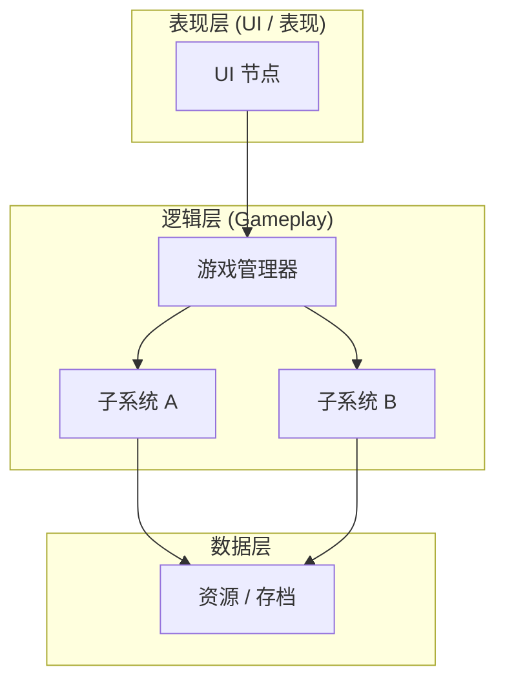
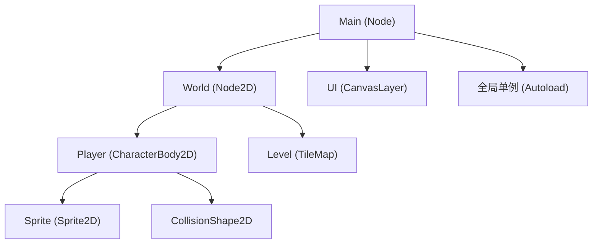
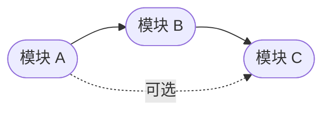

# 架构设计说明书模板

> 系统级架构设计文档，定义整体结构、技术选型、场景树与模块划分。
> **用途**：「阶段 8 · 架构与模块设计」由 `godot-architect` Skill 产出（**仅设计，不写代码**）。
> **存放位置**：`docs/07_架构/`；命名遵循项目宪法 §3.1（`{两位序号}_{中文名称}.md`）。
> **完成标志**：架构方案通过评审，方可进入阶段 9 TDD 开发。
> **承接关系**：上游 ← GDD（`docs/01_创意探索/`）/ Story（`docs/06_story/`）；下游 → 各模块的「模块设计说明书」。

---

## 文档信息

| 字段 | 内容 |
|------|------|
| 所属 Feature | |
| 文档版本 | v0.1 |
| 创建日期 | |
| 最后更新 | |
| 作者 | |
| 状态 | 草稿 / 评审中 / 已定稿 |
| 关联 GDD | |
| 关联 Story | |

---

## 一、设计目标与范围

> 本架构要解决什么问题？覆盖哪些系统？明确不做什么（非目标）。

- **设计目标**：
- **范围**：
- **非目标**：

---

## 二、系统架构总览

> 整体分层与子系统划分。**用 Mermaid 绘制**（遵循项目宪法 §3.4 / §3.5 校验工作流）。

---

## 三、场景树结构

> Godot 场景树节点层级设计。用 Mermaid `graph TD` 模拟父子层级。
> 场景文件放 `scenes/`，**禁手写 `.tscn`**（用 godot-mcp 或编辑器生成，遵循 `specs/02_场景开发规范.md`）。

> 全局单例在 `project.godot` 注册（脚本放 `scripts/autoloads/`）。

---

## 四、模块划分

> 子系统 / 模块清单及职责。每个核心模块对应一份「模块设计说明书」。

| 模块 | 职责 | 类型 | 模块说明书路径 | 状态 |
|------|------|------|---------------|:----:|
| | | 核心 / 支撑 / 工具 | | |

> 模块说明书模板见 `specs/08_模块设计说明书模板.md`。

---

## 五、模块依赖关系

> 模块间调用 / 依赖方向。箭头 = 依赖方向（A → B 表示 A 依赖 B）。

> **原则**：依赖单向、避免循环依赖；跨层依赖只能向下（表现层 → 逻辑层 → 数据层）。

---

## 六、技术选型

- **引擎**：Godot 4.x
- **节点方案**：> 如 CharacterBody2D / RigidBody2D 选型理由
- **信号机制**：> 模块解耦用 signal，遵循 `specs/01_GDScript开发规范.md`
- **数据驱动**：> `.tres` Resource 配置，实例放 `data/`，类定义放 `scripts/resources/`
- **其他**：

---

## 七、关键数据流

> 核心数据 / 事件在模块间的流转路径（可选，文字或 Mermaid `sequenceDiagram`）。

---

## 八、风险与权衡

> 技术风险、性能瓶颈、待决策项。（可选）

---

## 九、验收标准（架构层）

> 架构设计本身的验收点。全过方可进入阶段 9。

- [ ] 模块边界清晰，可独立测试
- [ ] 无循环依赖
- [ ] 场景树结构符合 `specs/02_场景开发规范.md`
- [ ] 各模块已有 / 计划有模块设计说明书
