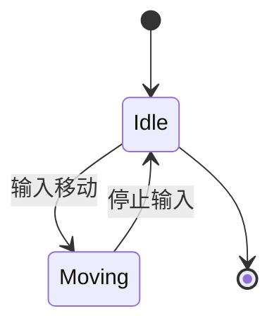
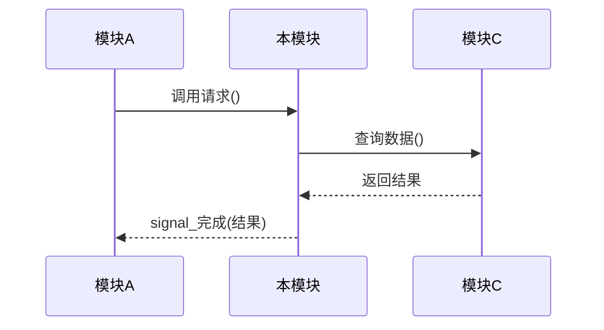

# 模块设计说明书模板

> 单个模块 / 子系统的详细设计文档，定义接口、内部实现、状态机与对外交互。
> **用途**：「阶段 8 · 架构与模块设计」由 `godot-architect` Skill 产出，承接「架构设计说明书」第四节模块划分。
> **存放位置**：`docs/07_架构/`；命名遵循项目宪法 §3.1（`{两位序号}_{中文名称}.md`）。
> **粒度**：一个模块一份说明书；模块划分见所属架构设计说明书。
> **完成标志**：模块设计通过评审，进入阶段 9 TDD 开发时据此实现。

---

## 文档信息

| 字段 | 内容 |
|------|------|
| 模块名称 | |
| 所属架构说明书 | |
| 文档版本 | v0.1 |
| 创建日期 | |
| 最后更新 | |
| 作者 | |
| 状态 | 草稿 / 评审中 / 已定稿 |

---

## 一、模块概述

> 模块做什么？单一职责描述。明确边界（管什么、不管什么）。

- **职责**：
- **边界**：

---

## 二、对外接口

> 其他模块如何使用本模块。**优先用 signal 解耦**（遵循 `specs/01_GDScript开发规范.md`）。

### 暴露的方法 / 属性（公开 API / @export）

| 名称 | 类型 | 说明 |
|------|------|------|
| | | |

### 暴露的信号（signal）

| 信号名 | 参数 | 触发时机 |
|--------|------|---------|
| | | |

---

## 三、依赖关系

- **依赖（本模块需要谁）**：
- **被依赖（谁需要本模块）**：

> 依赖单向，禁止循环依赖（详见架构设计说明书第五节）。

---

## 四、内部结构

> 内部节点 / 子组件 / 类设计。脚本放 `scripts/`，场景放 `scenes/`（**禁手写 `.tscn`**）。

| 组件 | 类型 | 文件路径 | 职责 |
|------|------|---------|------|
| | | | |

---

## 五、状态机（如有）

> 用 Mermaid `stateDiagram-v2` 绘制状态流转。

---

## 六、关键交互时序

> 与其他模块的交互流程（Mermaid `sequenceDiagram`）。

---

## 七、数据结构

> 本模块涉及的 Resource（`.tres`） / 数据结构定义。实例放 `data/`，类定义放 `scripts/resources/`。

---

## 八、错误与边界处理

> 异常场景、边界条件的处理策略。（可选）

---

## 九、测试策略

> 单元测试路径**必须镜像源码相对路径**（遵循 `specs/03_TDD测试规范.md`）。

- **测试路径**：`test/unit/...`
- **关键用例**：

---

## 十、验收标准（模块层）

- [ ] 对外接口实现完整（方法 / 属性 / signal）
- [ ] 状态机覆盖所有状态与转移
- [ ] 无循环依赖
- [ ] 单元测试通过（GdUnit4）
