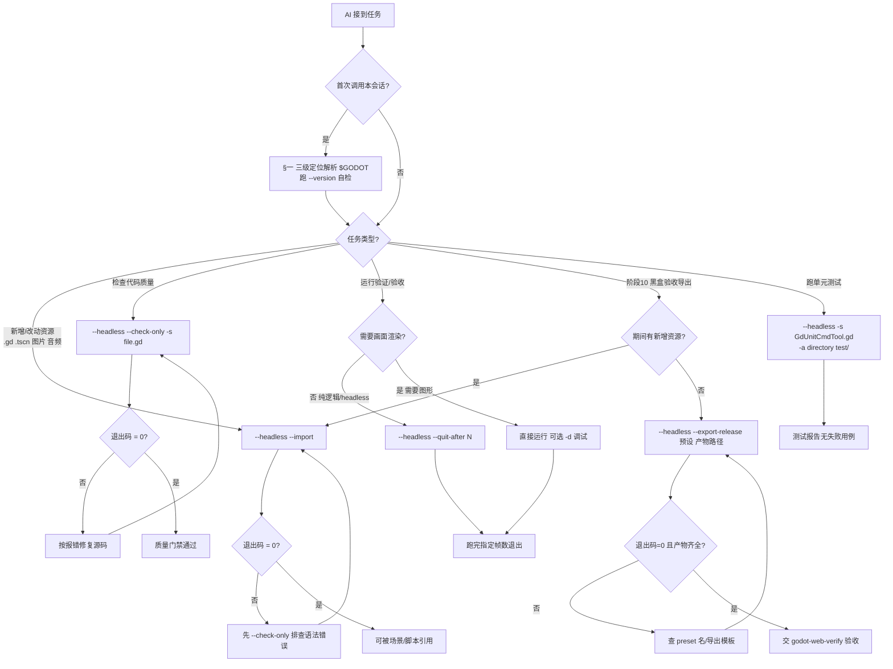

# Godot 环境与命令行手册

> 本文档为只读文档。
> Godot 4.x **可执行文件定位（环境变量获取）** + **常用 CLI 命令速查与详解**。
> AI 在 **阶段 7（架构设计）/ 8（TDD 开发）/ 9（质量门禁）/ 10（黑盒验收）** 需调用 Godot CLI 时**必须**加载并遵循本手册。
> 跨平台约定遵从全局宪法 §1.4：Windows 用 PowerShell，macOS/Linux 用 POSIX shell。

---

## 一、Godot 可执行文件定位

> **三级优先，命中即用**。每次会话首次调用 Godot 前，应先「定位 + 自检（`--version`）」，解析到一个变量后全程复用，避免重复探测与转义问题。

### 1. 优先级 1 — 显式环境变量 `GODOT_HOME`

**说明**：指向 godot 可执行文件**完整路径**（Windows 含 `.exe`）。最可靠，CI / 脚本首选，规避包装器与 PATH 歧义。

**读取方式（跨平台）**：

| 平台 | Shell | 读取命令 |
|------|-------|---------|
| Windows | PowerShell | `$env:GODOT_HOME` |
| macOS | zsh / bash | `$GODOT_HOME` |
| Linux | bash | `$GODOT_HOME` |

**正例**（✅，PowerShell）：
```powershell
if ($env:GODOT_HOME -and (Test-Path $env:GODOT_HOME)) {
    & $env:GODOT_HOME --version
}
```

**反例**（❌）：
```powershell
godot --version   # 未先定位，PATH 无 godot 时直接失败；包装器转义异常时静默出错
```

> **如何配置 `GODOT_HOME`**（用户一次性操作，非 AI 执行）：
> - **Windows**（PowerShell，永久写入用户级）：
>   `[Environment]::SetEnvironmentVariable("GODOT_HOME", "E:\Steam\steamapps\common\Godot Engine\godot.windows.opt.tools.64.exe", "User")`
> - **macOS**（`~/.zshrc`）：`export GODOT_HOME="/Applications/Godot.app/Contents/MacOS/Godot"`
> - **Linux**（`~/.bashrc`）：`export GODOT_HOME="$HOME/godot/Godot_v4.x-stable_linux.x86_64"`

### 2. 优先级 2 — PATH 直接调用 `godot`

**说明**：若 `godot` 已在 PATH（含包装器 `.bat` / symlink / 包管理器安装），直接调用最简洁。**当前本项目即此方式**（`D:\workspace\tools\godot.bat` 透传到 Steam tools 版）。

**探测命令**：

| 平台 | 探测命令 |
|------|---------|
| Windows (PowerShell) | `Get-Command godot -ErrorAction SilentlyContinue` |
| macOS / Linux | `command -v godot` |

**正例**（✅）：
```powershell
$g = Get-Command godot -ErrorAction SilentlyContinue
if ($g) { & $g.Source --version }
```

> ⚠️ **包装器陷阱**：Windows 常用 `godot.bat` 透传 `%*`，**绝大多数命令可用**；但涉及引号嵌套（如 `--export-release "Web" "build/index.html"`）时需测试转义是否正确。遇到诡异报错，**降级到优先级 1**（用 `GODOT_HOME` 直调 `.exe`）。

### 3. 优先级 3 — 降级探测常见安装路径

**说明**：前两级都失败时，按平台常见路径枚举探测，命中第一个用之。

```powershell
# Windows 常见路径
$candidates = @(
    "$env:GODOT_HOME",
    "$env:LOCALAPPDATA\Godot\godot.windows.tools.x86_64.exe",
    "E:\Steam\steamapps\common\Godot Engine\godot.windows.opt.tools.64.exe",
    "C:\Program Files\Godot\godot.exe"
)
$exe = $candidates | Where-Object { $_ -and (Test-Path $_) } | Select-Object -First 1
```

```bash
# macOS / Linux 常见路径
for c in "$GODOT_HOME" "/Applications/Godot.app/Contents/MacOS/Godot" \
         "$HOME/godot/Godot_v4.x-stable_linux.x86_64" "/usr/local/bin/godot"; do
    [ -x "$c" ] && GODOT="$c" && break
done
```

### 4. 推荐封装：会话内定位 + 自检

**说明**：封装一次解析到 `$GodotExe`，后续所有命令复用，统一错误处理。

```powershell
function Resolve-GodotExe {
    if ($env:GODOT_HOME -and (Test-Path $env:GODOT_HOME)) { return $env:GODOT_HOME }
    $g = Get-Command godot -ErrorAction SilentlyContinue
    if ($g) { return $g.Source }
    return $null
}
$GodotExe = Resolve-GodotExe
if (-not $GodotExe) { throw "未找到 Godot：请设置 GODOT_HOME 或将 godot 加入 PATH" }
& $GodotExe --version   # 自检：确认可用 + 打印版本
```

> 下文所有命令示例用 `$GODOT` 代表**已解析**的可执行路径（PowerShell 取 `$GodotExe`，POSIX 取 `$GODOT_HOME`）。

---

## 二、命令速查总表

| # | 场景 | 命令 | 适用阶段 |
|---|------|------|:---:|
| 1 | 查看版本 | `$GODOT --version` | 全 |
| 2 | 查看帮助 | `$GODOT --help` / `-h` | 全 |
| 3 | **导入资源**（资产 / GDScript / Scene）生成 `.uid`/`.import` | `$GODOT --headless --import` | 7·8 |
| 3a | 强制重新导入（无 `--reimport`） | 删 `.godot/imported/` 后跑 `$GODOT --headless --import` | 7·8 |
| 4 | 编辑器打开 | `$GODOT -e`（或 `--editor`） | 7 |
| 5 | 编辑器（指定项目） | `$GODOT --editor --path <dir>` | 7 |
| 6 | 运行主场景 | `$GODOT`（项目根目录） | 8·10 |
| 7 | 运行指定场景 | `$GODOT --scene res://path.tscn` | 8·10 |
| 8 | 调试运行 | `$GODOT -d`（或 `--debug`） | 8 |
| 9 | 跑 N 帧后退出 | `$GODOT --quit-after <N>` | 10 |
| 10 | **GDScript 语法检查** | `$GODOT --headless --check-only -s <file.gd>` | 9 |
| 11 | **导出（release）** | `$GODOT --headless --export-release "<preset>" <out>` | 10 |
| 12 | 导出（debug） | `$GODOT --headless --export-debug "<preset>" <out>` | 10 |
| 13 | 仅导出 pck | `$GODOT --headless --export-pack "<preset>" <out.pck>` | 10 |
| 14 | GdUnit4 headless 测试 | `$GODOT --headless -s res://addons/gdunit4/GdUnitCmdTool.gd -a directory <dir>` | 8·9 |
| 15 | 日志写文件 | `$GODOT --headless --log-file <file>` | 8·9·10 |
| 16 | 录制视频 | `$GODOT --write-movie <out.avi> --quit-after <N>` | 10 |

> **命令标记**（来自 `--help`，决定可用性）：`R`=通用可用 / `D`=仅 debug 模板 / `E`=仅 editor 构建 / `X`=仅 editor 构建（需 `disable_path_overrides=false`）。本项目使用 Steam **tools 版**（=editor 构建），上述命令**全部可用**。

---

## 三、命令详解（按用途分组）

### 3.1 资源导入（阶段 7/8 门禁）— `--import`

**说明**：Godot 4.x **统一导入机制**——任何放进 `res://`（项目目录）的资源，经 `--import` 扫描后自动生成索引。命令行**仅此一个导入参数**（`E` 标记 = editor 构建），**无** `--reimport` / `--scan`；重新导入靠删缓存（见 3.1.4）。**宪法阶段 8 门禁**：新增 / 改动 `.gd` / 图片 / 音频 / `.tscn` 后**必跑**。

**核心命令**：
```bash
$GODOT --headless --import                  # 在项目根目录（含 project.godot）执行
$GODOT --headless --import --path <dir>     # 不在根目录时指定项目路径
```

- `--headless`：不弹窗、不依赖 GPU，CI / 无显示环境可用。
- `--import`：启动编辑器、等待**所有**资源导入完成、退出。

**导入产物**（统一机制，按资源类型略有差异）：

| 产物 | 作用 | 适用资源 |
|------|------|---------|
| `.uid` 文件 | Godot 4.x 资源唯一 ID，用于稳定引用（重命名/移动不丢引用） | `.gd` / `.tscn` / 图片 / 音频 / 字体 / `.gdshader` 等几乎所有资源 |
| `.import` 文件 | 记录导入设置 + 缓存路径（与源文件同名） | 二进制资源（图片/音频/字体/3D）；**脚本/场景不生成** |
| `.godot/imported/` | 导入后的缓存（`.ctex`/`.ogg`/`.glb`…） | 二进制资源 |
| `.godot/global_script_class_cache.cfg` | 注册 `class_name` | `.gd` |

> `.godot/` 整个目录不应提交 git（已在 `.gitignore`）；`.uid` 与 `.import` **需提交**（团队共享引用与导入设置）。

#### 3.1.1 美术 / 媒体资产导入（png/jpg/svg/ogg/wav/ttf/glb…）

**流程**：把资产放入项目 `assets/` 对应子目录（`sprites/`/`audio/`/`fonts/`/`textures/`）→ 跑 `--headless --import`。

```powershell
# 假设新增 assets/sprites/player.png、assets/audio/jump.ogg
& $GodotExe --headless --import
```

**产物**：`player.png.import`、`player.png.uid`、`.godot/imported/player.png-*.ctex`。

> **导入设置**（压缩/过滤/mipmap/音频 loop 等）存于 `.import` 文件：命令行**只能用默认值导入**；改设置需编辑器「FileSystem → 双击资源 → Import 面板 → Reimport」，或预设 `.import` 模板；改后需再跑一次 `--import`。

#### 3.1.2 GDScript 脚本导入（.gd）

**流程**：把脚本放入 `scripts/` → 跑 `--headless --import`。

```powershell
# 假设新增 scripts/player_controller.gd
& $GodotExe --headless --import
```

**产物**：`player_controller.uid`；若脚本含 `class_name PlayerController`，注册到全局类缓存。

**注意**：
- `.gd` **不生成** `.import` 文件（非二进制资源）。
- 脚本有**语法错误**会让 `--import` 报错或部分失败 → 先用 `--check-only`（§3.3）排查。
- 场景中 `extends` / `preload` 一个尚未导入的 `.gd` 会报 uid 缺失 → **导入顺序**：先放 `.gd` → `--import` → 再引用。

#### 3.1.3 Scene 场景导入（.tscn）

**流程**：把场景放入 `scenes/` → 跑 `--headless --import`。

```powershell
# 假设新增 scenes/actors/player.tscn
& $GodotExe --headless --import
```

**产物**：`player.uid`；场景依赖的外部资源（脚本/纹理/子场景）被校验与索引。

**注意**：
- `.tscn` **不生成** `.import` 文件。
- 场景引用的资源必须**已导入**，否则报「uid not found」/「missing dependency」→ 先导入被依赖资源。
- 场景应**用 MCP / 编辑器生成，禁止手写**（宪法阶段 8 门禁），命令行只负责导入与校验。

#### 3.1.4 强制重新导入（命令行无 `--reimport`）

| 目的 | 操作 | 影响 |
|------|------|------|
| 重新导入**所有**二进制资源 | 删 `.godot/imported/` 后跑 `--import` | 保留导入设置（`.import`），重生成缓存 |
| 完全重置项目索引 | 删整个 `.godot/` 后跑 `--import` | 等同全新项目首次导入，耗时较长 |
| 重置**单个**资源的导入设置 | 删该资源的 `.import` 文件后跑 `--import` | 该资源导入设置回到默认 |

```powershell
# 重新导入所有二进制资源（保留设置）
Remove-Item -Recurse -Force .godot/imported
& $GodotExe --headless --import
```

#### 3.1.5 验证导入成功

```powershell
# 1. 退出码（必须用退出码判定，禁止靠文本猜测）
& $GodotExe --headless --import
if ($LASTEXITCODE -ne 0) { throw "导入失败" }

# 2. 检查产物生成
Test-Path scripts/player_controller.uid        # True（.gd）
Test-Path "assets/sprites/player.png.import"   # True（二进制资源）
Test-Path .godot/imported                      # True
```

#### 3.1.6 常见陷阱

| 现象 | 根因 / 解决 |
|------|------------|
| `.tscn` 引用报 `uid not found` | 被引用资源未导入 → 先放好所有 `.gd`/资产 → `--import` → 再建场景 |
| `--import` 部分失败 | 某 `.gd` 语法错误 → 先 `--check-only`（§3.3）修复 |
| 团队成员打开项目资源全紫（未导入） | `.import` 未提交，或对方未跑 `--import` |
| 导入很慢 | 大量/大体积资产；加 `-v` 观察进度，或只删 `.godot/imported/` 局部重导 |
| 新增字体/着色器不生效 | `.gdshader` / `.ttf` 同样需 `--import` 生成 `.uid` |

### 3.2 运行与调试（阶段 8/10）

**说明**：运行游戏用于本地试玩或自动化「跑若干帧后退出」验证。

```bash
$GODOT                              # 运行主场景（项目根）
$GODOT --scene res://levels/01.tscn # 运行指定场景
$GODOT -d                           # 调试模式（stdout 打印 + 调试器）
$GODOT --quit-after 60              # 跑 60 帧后自动退出（验收/录屏）
```

> `--quit-after 0` = 禁用；配合 `--write-movie` 可固定帧率导出视频。

### 3.3 GDScript 语法 / 类型检查（阶段 9 质量门禁）— `--check-only`

**说明**：**只解析不执行**，报告语法/类型错误后退出。CI 门禁首选（比真正运行快）。**必须配合 `-s`/`--script`**（`--help` 明确：use with `--script`）。

```bash
$GODOT --headless --check-only -s scripts/player_controller.gd
```

- `-s` / `--script` = 指定脚本（可用 `res://` 或文件路径）。
- `--check-only` 标记为 `X`（需 editor 构建），tools 版满足。
- 退出码：`0` = 无错误，`非 0` = 有错误（CI 用退出码判定门禁）。

**反例**（❌）：
```bash
$GODOT --check-only scripts/foo.gd   # 缺 -s，check-only 不生效
$GODOT --headless --check-only       # 缺 -s，什么也不会检查
```

### 3.4 导出（阶段 10 黑盒验收）

**说明**：将项目导出为目标平台产物。Web 导出是阶段 10 的核心（配合 `godot-web-verify` skill）。

```bash
# Release 导出（生产，阶段 10 用）
$GODOT --headless --export-release "Web" build/index.html

# Debug 导出（含调试符号，排错用）
$GODOT --headless --export-debug "Web" build/index.html

# 仅导出资源包（PCK / ZIP，按扩展名判定）
$GODOT --headless --export-pack "Web" build/game.pck
```

- **preset 名**必须与 `export_presets.cfg` 中 `name=` 一致（如 `"Web"`），不确定先查配置。
- 导出前若新增/改动资源，**先跑 `--headless --import`**（门禁 3.1）。
- Web 导出产物：`index.html` + `index.js` + `index.pck` + `index.wasm`（`index.wasm` > 10MB 视为成功）。
- `--export-patch <preset> <path>` + `--patches <list>` 可导增量补丁包。

### 3.5 Headless / CI 辅助参数

| 参数 | 作用 |
|------|------|
| `--headless` | 无显示模式（`--display-driver headless --audio-driver Dummy`），服务器/CI 必备 |
| `--quit` | 首帧后即退出 |
| `--quit-after <N>` | 跑 N 帧后退出 |
| `--log-file <file>` | 日志写入指定文件（绝对或相对项目目录） |
| `-v` / `--verbose` | 详细输出 |
| `--quiet` | 静默（错误仍打印） |
| `--no-header` | 不打印引擎版本头 |
| `--write-movie <file>` | 录制视频（`.avi`/`.png`，强制 `--fixed-fps`） |

### 3.6 编辑器与项目管理

```bash
$GODOT -e                           # 打开编辑器（当前项目）
$GODOT --editor --path <dir>        # 打开指定项目
$GODOT -p                           # 打开项目管理器
$GODOT --recovery-mode              # 恢复模式（禁插件/工具脚本，排启动崩溃）
```

### 3.7 用户参数透传

**说明**：游戏内读取自定义命令行参数用 `OS.get_cmdline_user_args()`，必须用 `--` / `++` 分隔，否则会被引擎消费。

```bash
$GODOT -- --level 2 --god-mode      # -- 之后整段透传给游戏
```

---

## 四、配套工具（独立于 Godot CLI，需单独安装）

> 以下为**阶段 9 质量门禁**依赖，非 Godot 引擎自带。

### 4.1 `gdformat` / `gdlint`（代码格式与静态检查）

**安装**（Python 包 `gdtoolkit`，提供 `gdformat` 与 `gdlint` 两个命令）：
```bash
pip install gdtoolkit
```

**用法**：
```bash
gdformat scripts/                  # 递归格式化 .gd
gdformat -c scripts/               # check 模式（CI：不改动，仅报告，有差异则非 0 退出）
gdlint scripts/                    # 静态检查（命名/警告等）
```

> 门禁：CI 中 `gdlint` 与 `gdformat -c` 均**退出码 0** 方算通过。

### 4.2 GdUnit4（单元 / 集成测试）

**前提**：项目 `addons/gdunit4` 已接入。**命令行用法以 GdUnit4 官方文档为准，接入时按实际版本校准**。

```bash
# headless 跑指定目录的测试
$GODOT --headless -s res://addons/gdunit4/GdUnitCmdTool.gd -a directory test/

# 常用选项（-a 后接测试目标：directory / suite / test）
#   -a directory <dir>     跑整个目录
#   -a suite <file.gd>     跑单个测试套件
#   --addl_cmdline <args>  透传额外参数
```

> `-s` 运行脚本；GdUnit4 的参数透传约定以其 README 为准。CI 门禁：测试报告无失败用例方算通过。

---

## 五、退出码与故障排查

| 现象 | 排查 |
|------|------|
| `godot: command not found` | 未在 PATH 且未设 `GODOT_HOME` → 按第一章三级定位 |
| `--check-only` 似乎无效 | 必须配合 `-s <file>`（见 3.3） |
| 导出报 `preset not found` | preset 名与 `export_presets.cfg` 的 `name=` 不一致 |
| 导出后 wasm 缺失 / < 10MB | 导出模板未安装 → 编辑器内安装对应版本模板 |
| 包装器 `.bat` 引号转义异常 | 降级用 `GODOT_HOME` 直调 `.exe`（见 1.2） |
| CI 上 `--import` 卡住 | 脚本有语法错误 → 先修 `--check-only`；或加 `--quit-after` 兜底 |

> **退出码约定**：成功 = `0`，失败 = `非 0`。CI / 脚本**必须**用退出码（`$LASTEXITCODE` / `$?`）判定门禁，**禁止**靠输出文本猜测。

---

## 六、最小可运行示例（PowerShell，项目根目录）

```powershell
# 0. 定位 + 自检
$GodotExe = if ($env:GODOT_HOME -and (Test-Path $env:GODOT_HOME)) {
    $env:GODOT_HOME
} else { (Get-Command godot -ErrorAction SilentlyContinue).Source }
& $GodotExe --version

# 1. 新增资源后导入（门禁）
& $GodotExe --headless --import

# 2. 语法检查（门禁）
& $GodotExe --headless --check-only -s scripts/main.gd

# 3. 导出 Web（阶段 10）
& $GodotExe --headless --export-release "Web" build/index.html
```

---

## 七、面向 AI 的操作指导与适用场景

> 本节专为 **AI Agent** 设计：以「任务驱动」给出**决策路径**与**操作 SOP**，命令语法细节见 §二/§三。
> 所有自动化**必须**遵循 §7.1 六条核心原则；跨平台示例遵从全局宪法 §1.4（Windows 用 PowerShell，macOS/Linux 用 bash/zsh）。
> 约定：`$GODOT` 代表**已按 §一 解析**的可执行路径（PowerShell 取 `$GodotExe`，POSIX 取 `$GODOT_HOME` 或 `command -v godot`）。

### 7.1 AI 调用 Godot CLI 的六条核心原则

| # | 原则 | 硬要求 | 违反后果 |
|:--:|------|--------|---------|
| 1 | **退出码判定** | 门禁结果**只看退出码**（POSIX `$?` / PowerShell `$LASTEXITCODE`），**禁止**靠 stdout 文本猜测「成功」 | 误判导入/导出成功，后续引用连锁报错 |
| 2 | **幂等可重跑** | `--import` / `--check-only` / `--export-release` 均可安全重复执行，无副作用；失败修复后直接重跑 | —（提示：不必担心重跑伤项目） |
| 3 | **无头优先** | 自动化一律加 `--headless`（不弹窗、不依赖 GPU、CI/服务器友好） | 无显示环境进程挂起或超时 |
| 4 | **及时导入** | 新增/改动 `.gd` / `.tscn` / 任何资源后**立即** `--headless --import`，**禁止攒批**（宪法阶段 8 硬门禁） | 后续场景/脚本引用报 `uid not found` |
| 5 | **路径先解析** | 每次会话首次调用前按 §一 三级定位解析到 `$GODOT`，全程复用；含空格路径（如 macOS `Application Support`）**必须加引号** | `command not found` 或空格路径断裂 |
| 6 | **禁止交互式** | 自动化**禁用** `-e` / `-p`（编辑器/项目管理器需人工操作）；长跑命令加 `--quit-after N` 兜底 | 进程挂起等待人类输入，CI 卡死 |

### 7.2 任务 → 命令决策树

> AI 接到任务后，沿此图定位「该用哪条命令 + 成功/失败如何分支」。命令标记（R/D/X/E）见 §二脚注。



### 7.3 宪法 10 阶段 × CLI 场景速查（AI 视角）

> AI 按当前所处阶段直接对号入座；「成功判定」列**必须**用退出码，不可靠文本。

| 阶段 | AI 典型任务 | 命令（`$GODOT` 已解析） | 成功判定 | 失败处理 |
|:----:|------------|----------------------|---------|---------|
| 7 架构 | 新建 `project.godot` / 首批 `.gd`/`.tscn` 后建索引 | `--headless --import` | 退出码=0 | `--check-only` 修语法后重跑 |
| 8 TDD | 每写一个 `.gd`/`.tscn` 立即导入 | `--headless --import` | 退出码=0 + `.uid` 生成 | 见 §3.1.6 陷阱表 |
| 8 TDD | 跑单测验证红/绿 | `--headless -s res://addons/gdUnit4/GdUnitCmdTool.gd -a directory test/` | 报告无失败用例 | 按失败用例修代码 |
| 9 门禁 | GDScript 静态检查 | `--headless --check-only -s <file.gd>` | 退出码=0 | 按报错修源码 |
| 9 门禁 | lint / 格式 | `gdlint scripts/` / `gdformat -c scripts/` | 退出码=0 | `gdformat` 修复后重检 |
| 10 验收 | 导出 Web 产物 | `--headless --export-release "Web" build/index.html` | 退出码=0 + `index.wasm` 齐全 | 查 preset 名 / 装导出模板 |
| 10 验收 | 跑若干帧录屏/采样 | `--headless --quit-after 60 [--write-movie out.avi]` | 退出码=0 | 加 `-v` 看进度 |
| 全 | 定位引擎 + 自检 | `--version` | 打印版本号 | 按 §一 三级定位 |

### 7.4 AI 操作 SOP（逐场景 · 三平台并重）

> 每个 SOP 含：**何时用 → 命令（POSIX / PowerShell 双版本）→ 成功判定 → 失败处理 → 易错点**。

#### 7.4.1 资源导入（阶段 7/8 硬门禁）

**何时用**：新增或改动 `.gd` / `.tscn` / 图片 / 音频 / 字体 / `.gdshader` 后，**立即**执行（禁止攒批）。

**命令**：
```bash
# POSIX（macOS / Linux）—— 注意含空格的 $GODOT_HOME 必须引号
"$GODOT" --headless --import                     # 在项目根目录（含 project.godot）
"$GODOT" --headless --import --path /abs/project # 不在根目录时指定项目路径
```
```powershell
# Windows PowerShell
& $GodotExe --headless --import
& $GodotExe --headless --import --path D:\proj   # 不在根目录时
```

**成功判定**：退出码=0；`ls scripts/xxx.uid`（或 `Test-Path`）确认 `.uid` 生成；二进制资源额外有 `.import` 文件。

**失败处理**：退出码≠0 → 多数是某 `.gd` 语法错误 → 先跑 §7.4.2 `--check-only` 逐个修复 → 再重跑 `--import`。

**AI 易错点**：①忘记加 `--headless`（无显示环境挂起）；②含空格路径未加引号（macOS Steam 路径 `Application Support`）；③攒批导入导致场景引用报 `uid not found`。

#### 7.4.2 GDScript 语法 / 类型检查（阶段 9 门禁）

**何时用**：质量门禁前逐文件检查；或 `--import` 失败时定位语法错误。

**命令**（**必须**带 `-s`/`--script`，否则 `--check-only` 不生效）：
```bash
# POSIX
"$GODOT" --headless --check-only -s scripts/player_controller.gd
```
```powershell
# Windows PowerShell
& $GodotExe --headless --check-only -s scripts/player_controller.gd
```

**成功判定**：退出码=0（无错误）；≠0 时 stdout 列出错误行号与原因。

**失败处理**：按报错定位行号修复源码 → 重跑本命令直至退出码=0。

**AI 易错点**：①漏写 `-s`（`--check-only` 单独使用什么也不检查）；②误以为会执行脚本（它**只解析不执行**）；③用 `--check-only` 替代导入（它不生成 `.uid`，导入仍需 §7.4.1）。

#### 7.4.3 运行验证（跑 N 帧退出，阶段 8/10）

**何时用**：自动化验证游戏逻辑（跑若干帧后退出），或录屏/像素采样。

**命令**：
```bash
# POSIX —— headless 跑 60 帧后退出（纯逻辑/CI 验证）
"$GODOT" --headless --quit-after 60
# 需要画面 + 调试输出（本地有显示环境）
"$GODOT" -d
# 录制视频（强制固定帧率，配合 --quit-after）
"$GODOT" --write-movie .tmp/out.avi --quit-after 120 --fixed-fps 60
```
```powershell
# Windows PowerShell
& $GodotExe --headless --quit-after 60
& $GodotExe --write-movie .tmp\out.avi --quit-after 120 --fixed-fps 60
```

**成功判定**：退出码=0；跑完指定帧数自动退出（不挂起）。

**失败处理**：进程不退出 → 检查是否漏 `--quit-after`；崩溃 → 加 `-d` 看堆栈，或 `--log-file .tmp/run.log` 落盘排查。

**AI 易错点**：①headless 环境漏 `--quit-after` 导致挂起；②想验证渲染却用了 `--headless`（headless 无画面，像素采样需有显示驱动）。

#### 7.4.4 导出 Web（阶段 10 黑盒验收前置）

**何时用**：阶段 10 导出 Web 产物，供 `godot-web-verify` 黑盒验收。

**命令**：
```bash
# POSIX —— preset 名必须与 export_presets.cfg 的 name= 一致
"$GODOT" --headless --export-release "Web" build/index.html
```
```powershell
# Windows PowerShell —— 产物目录需预先存在
New-Item -ItemType Directory -Force build | Out-Null
& $GodotExe --headless --export-release "Web" build/index.html
```

**成功判定**：退出码=0；`build/` 下生成 `index.html` + `index.js` + `index.pck` + `index.wasm`（`index.wasm` > 10MB 视为正常）。

**失败处理**：`preset not found` → 核对 `export_presets.cfg` 的 `name=`；wasm 缺失/过小 → 编辑器内安装对应版本导出模板；导出前若有新增资源 → **先**跑 §7.4.1 `--import`。

**AI 易错点**：①导出前未导入新资源（引用缺失）；②产物目录不存在（需预建）；③把 debug 导出当 release（`--export-debug` 含调试符号，体积/行为不同）。

#### 7.4.5 Headless 单元测试（GdUnit4，阶段 8/9）

**何时用**：Story 层 GdUnit4 单测/集成测试验收（headless）。

**命令**：
```bash
# POSIX
"$GODOT" --headless -s res://addons/gdunit4/GdUnitCmdTool.gd -a directory test/
```
```powershell
# Windows PowerShell
& $GodotExe --headless -s res://addons/gdunit4/GdUnitCmdTool.gd -a directory test/
```

**成功判定**：测试报告**无失败用例**（GdUnit4 退出码约定以其官方文档为准，AI 应以报告中失败计数=0 为准）。

**失败处理**：按失败用例定位 → 修代码或修测试 → 重跑。

**AI 易错点**：①误以为 `-a directory` 是引擎参数（实为 GdUnit4 工具脚本自解析）；②改动被测代码后忘记重跑导入导致测试引用旧 uid。

### 7.5 AI 自动化陷阱清单（红黑表）

| 场景 | ❌ 错误做法 | ✅ 正确做法 |
|------|-----------|-----------|
| 判定结果 | 靠 stdout 含 "SUCCESS" 猜成功 | **只看退出码**（`$?` / `$LASTEXITCODE`） |
| 首次调用 | 直接 `godot --import` | 先 §一 三级定位解析 `$GODOT` + `--version` 自检 |
| 含空格路径 | `"$GODOT" --import`（漏引号）→ macOS Steam 路径断裂 | `"$GODOT" --import`（**必须双引号**） |
| 导入时机 | 攒一批资源最后统一导入 | **每个**新增/改动后立即导入（宪法硬门禁） |
| 语法检查 | `--check-only foo.gd`（漏 `-s`） | `--check-only -s foo.gd` |
| 无显示环境 | `--import`（漏 `--headless`）→ 弹窗卡死 | 一律 `--headless` |
| 长跑命令 | 不加退出条件 → 进程挂起 | 加 `--quit-after N` 兜底 |
| 导出 preset | 猜 preset 名 | 核对 `export_presets.cfg` 的 `name=` |
| 导出产物 | 直接判定退出码=0 即成功 | 额外检查 `index.wasm` 等产物齐全 |
| 重新导入 | 用不存在的 `--reimport` | 删 `.godot/imported/` 后跑 `--import`（见 §3.1.4） |
| 用户参数 | `$GODOT --level 2`（被引擎吞） | `$GODOT -- --level 2`（`--` 后透传，见 §3.7） |
| 包装器转义 | Windows `.bat` 引号异常静默出错 | 降级用 `GODOT_HOME` 直调 `.exe`（见 §1.2） |

### 7.6 跨平台退出码判定速查

| 平台 | Shell | 取退出码 | 判定为成功 | 判定为失败 |
|------|-------|---------|-----------|-----------|
| macOS / Linux | bash / zsh | `$?` | `[ $? -eq 0 ]` | `[ $? -ne 0 ]` |
| Windows | PowerShell | `$LASTEXITCODE` | `$LASTEXITCODE -eq 0` | `$LASTEXITCODE -ne 0` |

**封装示例（POSIX）**：
```bash
"$GODOT" --headless --import || { echo "导入失败"; exit 1; }
```
**封装示例（PowerShell）**：
```powershell
& $GodotExe --headless --import
if ($LASTEXITCODE -ne 0) { throw "导入失败（退出码 $LASTEXITCODE）" }
```

### 7.7 高级 / 调试选项备忘（AI 按需用）

> 完整列表以 `$GODOT --help` 实时输出为准（本表基于 Godot 4.7）。下列为 AI 自动化**偶发**用到的高级项，日常 SOP 不涉及。

| 选项 | 标记 | AI 适用场景 |
|------|:----:|------------|
| `--log-file <file>` | R | 长跑/验收把日志落盘（`.tmp/run.log`）便于事后排查 |
| `-v` / `--verbose` | R | 导入慢/卡住时观察进度；`--gpu-index` 需配合 verbose 列设备 |
| `--remote-debug <uri>` | R | 远程调试（`tcp://127.0.0.1:6007`），AI 调试场景少用 |
| `--rendering-method <renderer>` | R | 指定 `forward_plus`/`mobile`/`gl_compatibility`，渲染异常时切换 |
| `--rendering-driver <driver>` | R | macOS 可选 `vulkan`/`metal`/`opengl3`，渲染后端排错 |
| `--convert-3to4` | E | 老 3.x 项目升级 4.x（一次性，非日常） |
| `--doctool [path]` | E | 导出引擎 API 文档（生成工具链，非游戏开发日常） |
| `--recovery-mode` | E | 启动崩溃时禁插件/工具脚本排查（交互式，AI 仅建议用户用） |
| `--debug-collisions` / `--debug-navigation` | D | 可视化碰撞/导航（需画面，本地调试） |

> **标记含义**（来自 `--help`）：`R`=通用可用 / `D`=仅 debug 模板 / `X`=仅 editor 构建（需 `disable_path_overrides=false`）/ `E`=仅 editor 构建。本项目用 Steam **tools 版**（=editor 构建），上述**全部可用**。

---

> **AI 使用入口**：接到 Godot CLI 相关任务时，先看 §7.2 决策树定位命令 → 按 §7.4 SOP 执行 → 用 §7.6 判定退出码 → 出错查 §7.5 陷阱表与 §五 故障排查。命令语法细节回查 §二/§三。
