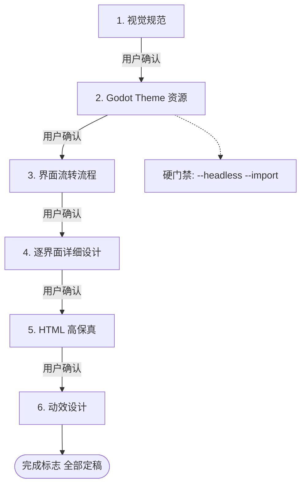

# 高保真设计规范

> 本文档为只读文档。
> Godot 4.x 游戏**阶段 4（高保真设计）**的规范与流程。AI 在进行视觉规范定稿、界面流转设计、逐界面高保真、动效设计、Godot Theme 资源生成时**必须**加载并遵循本规范。
> 本文档从 `AGENTS.md`「游戏迭代开发主流程 · 阶段 4」抽取细化；规范源仍以 `AGENTS.md` 为准，二者冲突时以 `AGENTS.md` 为准。

---

## 一、阶段定位

### 1. 目的

基于真实资产（阶段 3 产出的精灵资源文档）定稿以下内容，并沉淀为 Godot Theme 资源：

- 视觉规范
- 界面流转
- 逐界面设计
- 动效与可交互原型

### 2. 前置依赖

- 阶段 3「游戏资产分析」已完成，产出精灵资源文档（tile 网格 / 动画帧分组）
- `docs/03_资产/` 下已有可用游戏资产

### 3. 后置输出

- 设计产物归档到 `docs/04_高保真设计/`
- Godot Theme 资源 → `data/ui/`（Theme 生成脚本为过程临时脚本，放 `.tmp/`，不保存 / 不纳入版本管理）
- 为阶段 5「需求文档」与阶段 8「TDD 开发（UI 场景）」提供视觉与控件依据

---

## 二、强制 Skill 与工具

| 环节 | 强制 Skill / 工具 | 用途 |
|------|------------------|------|
| 视觉规范 / 界面流转 / 逐界面定稿 | `brainstorming`（启用 **Visual Companion** 浏览器伴侣，`--open`） | 与用户实时可视化定稿 |
| HTML 高保真 | `frontend-design` / `web-artifacts-builder` | 产出浏览器可预览的 HTML |
| 动效设计 | `gsap-*` 系列（`gsap-core` / `gsap-timeline` / `gsap-scrolltrigger` 等） | 界面转场、控件反馈、入场/退场、强调 |
| Godot Theme 资源 | 专用 `.gd` 脚本（代码动态生成） | 生成 `.tres` Theme 资源 |

> `using-superpowers` 为会话级 Skill，已在主流程中加载，此处不再赘述。

---

## 三、强制工作流（按序执行）

> **每一步都需用户确认后，方可进入下一步。** 禁止跳步、禁止攒批。

### 步骤 1 · 视觉规范

开启 `brainstorming` 的 **Visual Companion**（`--open`），与用户**一起**基于游戏资产定稿视觉规范：

- 配色：主 / 辅 / 强调 / 背景 / 文字，**含色值**
- 字体与字号阶梯
- 间距栅格
- 圆角 / 阴影 / 描边
- 控件样式：按钮 / 面板 / 输入框 / 滚动条等
- 图标与图示风格

### 步骤 2 · Godot Theme 资源

用**专用 `.gd` 脚本**（代码动态生成，**禁止手写 `.tres` 文本**）将上一步视觉规范参数化为 `Theme` 资源并保存为 `.tres`：

- 字体 / 图标引用游戏资产
- 生成脚本 → `.tmp/`（过程临时脚本，用完即弃，不保存）
- 资源 → `data/ui/`

> **硬门禁**：生成后**必须立即**跑 `--headless --import`（命令见 `specs/09_Godot环境与命令手册.md` §3.1.1），否则后续 UI 场景引用报 `uid not found`。

### 步骤 3 · 界面流转流程

与用户**一起**在 `Visual Companion` 中梳理全部界面（菜单 / 暂停 / HUD / 结算 / 设置等）及流转关系，绘制界面流转图（Mermaid `stateDiagram` / `flowchart`），标注：

- 触发条件
- 入口 / 出口
- 返回路径

> 界面流转图的 Mermaid 生成**必须**遵循全局宪法 §3.5「校验 → 导出 → 自检」工作流（`mmdc`）。

### 步骤 4 · 逐界面详细设计

对每个界面单独与用户定稿：

- 布局（线框）
- 信息层级
- 控件清单与状态
- 交互行为
- 引用的视觉规范条目

每个界面在 Visual Companion 中**可视化对比**多方案后定稿。

### 步骤 5 · HTML 高保真

用 `frontend-design` / `web-artifacts-builder` 为每个定稿界面产出**浏览器可预览的 HTML**。

> 颜色 / 字体 / 间距 / 控件**严格对齐**视觉规范与 Godot Theme 取值。

> **禁止占位符**：HTML 原型中的图片 / 字体 / 图标 / 纹理**必须**引用项目 `assets/` 下的真实游戏资产（精灵 / 字体 / 图标 / 纹理等），**禁止**使用纯色块、假图、外链占位图（如 Lorem Picsum）、emoji 代替图标等占位符。

### 步骤 6 · 动效设计

用 `gsap-*` 系列（`gsap-core` / `gsap-timeline` / `gsap-scrolltrigger` 等）为 HTML 原型叠加动效，并与用户在浏览器中定稿：

- 界面转场
- 控件反馈
- 入场 / 退场
- 强调

---

## 四、产物清单与归档规范

全部归档到 `docs/04_高保真设计/`：

| 产物 | 路径 | 要求 |
|------|------|------|
| 视觉规范 | `视觉规范.md` | 配色 / 字体 / 间距 / 控件样式数值表 |
| 界面流转 | `界面流转.md` | 嵌 Mermaid 流转图 |
| 各界面 HTML 高保真 | `<界面名>.html` | 浏览器可预览 |
| 各界面截图 | `<界面名>.png` | 浏览器渲染截取，按界面命名 |
| 设计说明 | `设计说明.md` | 逐界面说明，**必须内嵌**截图与 HTML 链接 |
| Godot Theme 资源 | `data/ui/theme_default.tres` | 由 `.tmp/` 临时脚本生成（脚本不保存） |

`设计说明.md` 内嵌格式（**必须**）：

- 截图：``
- HTML 链接：`[在线预览](./<界面名>.html)`

---

## 五、硬门禁

1. `.tres` **禁手写文本** —— 仅由 `.gd` 脚本生成
2. 每新增 `.tres` / `.gd` 后**必须立即** `--headless --import`（命令见 `specs/09_Godot环境与命令手册.md` §3.1.1），否则后续 UI 场景引用报 `uid not found`
3. 工作流六步**按序执行**，每步需用户确认，禁止跳步 / 攒批
4. HTML 高保真的颜色 / 字体 / 间距 / 控件**严格对齐**视觉规范与 Godot Theme 取值
5. 任何 Mermaid 图（界面流转图等）**必须**遵循全局宪法 §3.5「校验 → 导出 → 自检」工作流
6. 原型（HTML 高保真 / 动效）**必须**引用 `assets/` 下的真实游戏资产，**禁止**占位符（纯色块 / 假图 / 外链占位图 / emoji 代替图标等）

---

## 六、完成标志

全部满足方可视为阶段 4 完成：

- [ ] 视觉规范经用户确认定稿
- [ ] Theme 资源生成并通过 `--headless --import`
- [ ] 界面流转图经用户确认
- [ ] 全部界面 HTML 高保真 + 截图经用户逐项确认
- [ ] 动效经用户在浏览器中确认
- [ ] `设计说明.md` 内嵌的截图与 HTML 链接全部可访问
